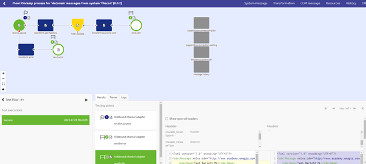
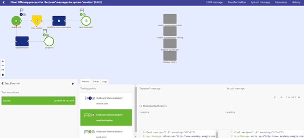

    

        <main class="micro-learning">
        <ul class="doc-nav">
            <li class="doc-nav__item"><a href="../../docs/microlearning/advanced-active-monitoring-index" class="doc-nav__link">Home</a></li>
            <li class="doc-nav__item"><a href="#intro" class="doc-nav__link">Intro</a></li>
            <li class="doc-nav__item"><a href="#theory" class="doc-nav__link">Theory</a></li>
            <li class="doc-nav__item"><a href="#practice" class="doc-nav__link">Practice</a></li>
            <li class="doc-nav__item"><a href="#solution" class="doc-nav__link">Solution</a></li>
        </ul>

##### Intro

# Retest based on conclusions drawn from runtime statistics

In a previous [microlearning](intermediate-active-monitoring-retest-based-on-received-error-message.md) we learned how we can retest based on a error message we received. In that microlearning, we learned that with the help given by eMagiz you as a user can retest with the help of our flow testing functionality. However to validate your conclusions on runtime level you need to deploy the solution and test from an external system as you want to mimic the exact settings (or as close as possible) under which the problem occurred. In this microlearning, we will focus on the part of retesting your flow(s) to validate that your change did indeed solve the error. We will use the flow testing functionality to perform these tests.

Should you have any questions, please contact academy@emagiz.com.

- Last update: November 15th, 2021
- Required reading time: 5 minutes

## 1. Prerequisites
- Basic knowledge of the eMagiz platform
- Basic knowledge of cloud management

## 2. Key concepts
This microlearning centers around retesting based on received error message
With retesting, we mean: Testing after a change has occurred whether the change in question resolves the given error.

- Retesting is a way to validate your assumptions
- If you have multiple scenarios that could happen within the context of your flow ensure to test them all for regression
- By retesting you deliver better quality to the client

##### Theory

## 3. Retest based on conclusions drawn from runtime statistics

In our previous microlearning, we learned about determining the cause of an error message. In that microlearning, we learned that with the help given by eMagiz you as a user can determine the cause of an error message. However to validate your assumption you need to test your change before announcing to the world the error has been fixed. In this microlearning, we will focus on the part of retesting your flow(s) to validate that your change did indeed solve the error. We will use the flow testing functionality to perform these tests.

In our previous microlearning, we fixed what we thought caused the issue. Now we will retest the flow(s) linked to the error to see if we were right. To do so navigate to the Create phase and open the flow in which you made a change. Open the test canvas within the flow designer. Here we adjust the expected message to state that we expect whatever value is in Onderdeel to end up in Component. After we have made the adjustment we run the flow test again to see whether or not our change ensures that the Component attribute is filled in. For detailed information on flow testing please check out the Crash Course Platform. As a result, we expect to see a blue background.

Now that we now we have a successful test we should use the expected message on the CDM level as input for a second test on the offramp level to see whether this message will pass the validation. Just so we can safely say we checked everything. To do so simply create a new test case in which you use an existing file as input for the starting point of your flow. For detailed information on flow testing please check out the Crash Course Platform. This one you should also run to see the results. Once again you are aiming for a blue background or at least that the message passes the validation component.

Now that we have passed the validation we can safely assume that our fix worked. The last thing to do is to give the flow in which we changed something a new version so we can deploy it to the proper environment(s). To do so simply navigate to the flow in question and ensure that a new version is created.

##### Practice

## 4. Assignment

Retest at least one flow within your (Academy) for which you have analyzed the cause in the previous microlearning. Subsequently provide a new version of the flow to Deploy.

## 5. Key takeaways

- Retesting is a way to validate your assumptions
- If you have multiple scenarios that could happen within the context of your flow ensure to test them all for regression
- By retesting you deliver better quality to the client

##### Solution

## 6. Suggested Additional Readings

There are no suggested additional readings on this topic.

## 7. Silent demonstration video

As this is a more theoretical microlearning, we have no video for this.

</main>

