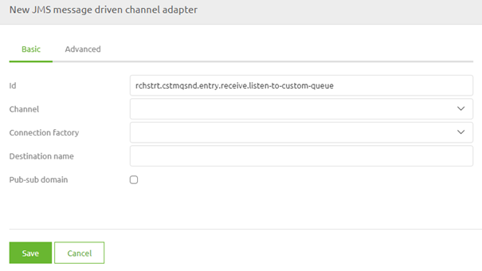
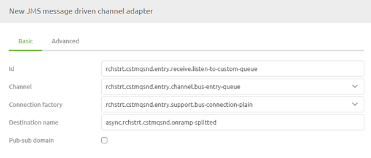

    

        <main class="micro-learning">
        <ul class="doc-nav">
            <li class="doc-nav__item"><a href="../../docs/microlearning/advanced-advanced-monitoring-index" class="doc-nav__link">Home</a></li>
            <li class="doc-nav__item"><a href="#intro" class="doc-nav__link">Intro</a></li>
            <li class="doc-nav__item"><a href="#theory" class="doc-nav__link">Theory</a></li>
            <li class="doc-nav__item"><a href="#practice" class="doc-nav__link">Practice</a></li>
            <li class="doc-nav__item"><a href="#solution" class="doc-nav__link">Solution</a></li>
        </ul>

##### Intro

# Interpreting wrapper.log on-premise
 
In some cases, there is a need to listen on a 'custom' queue for data. For example, when retrieving large amounts of data, you might need to place parts of the data on the queue to free up memory to process the complete batch of data. For those (and other) situations, it could be helpful to create 'custom' in-between queues. We need an additional listener on that 'custom' queue to ensure that data will be processed. 

Should you have any questions, please get in touch with academy@emagiz.com.

- Last update: November 1st, 2021
- Required reading time: 5 minutes

## 1. Prerequisites
- Advanced knowledge of the eMagiz platform
- Intermediate course on Orchestration of data packets

## 2. Key concepts
This microlearning centers around listening for data on a custom queue
With a custom queue, we mean: A queue that is manually defined by an eMagiz user instead of eMagiz itself as a result of an automated process

To start listening for data on a custom queue, you need:

- A JMS message-driven channel adapter within your flow that listens for data on the 'custom' queue
- The fully qualified name of the 'custom' queue on which to listen

##### Theory
  
## 3. listening for data on a custom queue

In some cases, there is a need to listen on a 'custom' queue for data. For example, when retrieving large amounts of data, you might need to place parts of the data on the queue to free up memory to process the complete batch of data. For those (and other) situations, it could be helpful to create 'custom' in-between queues. We need an additional listener on that 'custom' queue to ensure that data will be processed. 

To start listening for data on a custom queue, you need:

- A JMS message-driven channel adapter within your flow that listens for data on the 'custom' queue
- The fully qualified name of the 'custom' queue on which to listen

### 3.1 Setting up the listener

To set up the listener navigate to the flow in Create in which you want to listen for messages on the 'custom' queue and enter "Start Editing" mode. After doing so, add the JMS message-driven channel adapter to the canvas by dragging it on the canvas. Subsequently, double-click on the component to open it so you can edit it.

Here, you need to define the channel you want to place the messages you receive, the connection factory, and the queue name you want to listen on. Note that when there is no bus-connection-plain support object available within the context of your flow, copy + paste this component from another flow in which it is available.

The moment you are satisfied, you can press Save on the component. Now you have successfully ensured that you listen for messages on a 'custom' queue.

##### Practice

## 4. Assignment

Set up functionality to listen on a 'custom' queue from an eMagiz flow. This assignment can be completed with the help of the (Academy) project that you have created/used in the previous assignment.

## 5. Key takeaways

- A JMS message-driven channel adapter within your flow that listens for data on the 'custom' queue
- The fully qualified name of the 'custom' queue on which to listen
- When the support object named bus-connection-plain is missing, please add it via a copy+paste action

##### Solution

## 6. Suggested Additional Readings

If you are interested in this topic and want more information, please read the release notes provided by eMagiz.

## 7. Silent demonstration video

This video demonstrates how you could have handled the assignment and gives you some context on what you have just learned.

<iframe width="1280" height="720" src="../../vid/microlearning/advanced-orchestration-of-data-packets-listening-for-data-on-a-custom-queue.mp4" frameborder="0" allow="accelerometer; autoplay; clipboard-write; encrypted-media; gyroscope; picture-in-picture" allowfullscreen></iframe>

</main>

