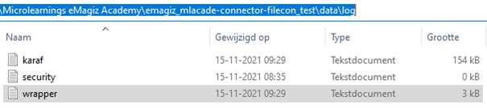

    

        <main class="micro-learning">
        <ul class="doc-nav">
            <li class="doc-nav__item"><a href="../../docs/microlearning/advanced-advanced-monitoring-index" class="doc-nav__link">Home</a></li>
            <li class="doc-nav__item"><a href="#intro" class="doc-nav__link">Intro</a></li>
            <li class="doc-nav__item"><a href="#theory" class="doc-nav__link">Theory</a></li>
            <li class="doc-nav__item"><a href="#practice" class="doc-nav__link">Practice</a></li>
            <li class="doc-nav__item"><a href="#solution" class="doc-nav__link">Solution</a></li>
        </ul>

##### Intro

# Interpreting wrapper.log on-premise
 
There is a need to see runtime level logging in cases where it is unclear whether that specific runtime has started up or not. In eMagiz, you won't receive logging if the start-up fails because no established connection can send logging to eMagiz. When this particular runtime runs on-premises, you can see that specific logging on the runtime in the wrapper.log. In this microlearning, we will learn how to find the wrapper log and search within the wrapper log to find the corresponding error and subsequently analyze that error.

Should you have any questions, please get in touch with academy@emagiz.com.

- Last update: November 15st, 2021
- Required reading time: 5 minutes

## 1. Prerequisites
- Advanced knowledge of the eMagiz platform

## 2. Key concepts
This microlearning centers around interpreting the wrapper.log for an on-premise runtime
With a wrapper.log, we mean: A file that holds start-up and shut down information on a specific runtime

In a wrapper log, you see the following information:

- Start-up information on JVM level
- Shutdown information on JVM level
- Errors on start-up or shutdown

##### Theory
  
## 3. Interpreting wrapper.log on-premise

There is a need to see runtime level logging in cases where it is unclear whether that specific runtime has started up or not. In eMagiz, you won't receive logging if the start-up fails because no established connection can send logging to eMagiz. When this particular runtime runs on-premises, you can see that specific logging on the runtime in the wrapper.log. In this microlearning, we will learn how to find the wrapper log and search within the wrapper log to find the corresponding error and subsequently analyze that error.

In a wrapper log, you see the following information:

- Start-up information on JVM level
- Shutdown information on JVM level
- Errors on start-up or shutdown

### 3.1 Where to find the wrapper.log

Before we can interpret the wrapper.log, the first action will be to find the wrapper.log. The wrapper.log is available within the data folder of each eMagiz runtime that is running on-premises. To see it, you first need to know the location where you saved and unpacked the runtime zips. Suppose you open the runtime you want to interpret the wrapper log and open the data folder. Within the data folder, there is a folder called log. You will see a file called wrapper which can be opened with a tool such as Notepad++.

### 3.2 Find additional information

When you open the wrapper.log file, you see all JVM-related logging. Here, you can also see whether things have broken down when starting the JVM or shutting it down. With the help of this information, you can quickly determine whether the start-up or shutdown process is not working as expected. Having this information will be the trigger to see, per the relevant stakeholders, what to do to fix these problems in a structured manner.

One way to do so would be to stop the runtime and delete the data folder without deleting the h2 folder. That would initiate a clean restart of the runtime to alleviate the problems. In case of structural issues, you should dive into the logging and analyze the issues in more detail.

##### Practice

## 4. Assignment

Run your own Academy project on your laptop (on-premise), so you can experiment a bit with analyzing the karaf.log on-premise. This assignment can be completed with the help of the (Academy) project that you have created/used in the previous assignment.

## 5. Key takeaways

- The karaf.log can be found within the folder called log under the folder data
- You can search the log with the help of tools such as Notepad++
- By looking at the timestamp in the eMagiz Manage Log, you can run a focused search

##### Solution

## 6. Suggested Additional Readings

No suggested additional readings for this microlearning.

## 7. Silent demonstration video

As this is a more theoretical microlearning, we have no video for this.

</main>

