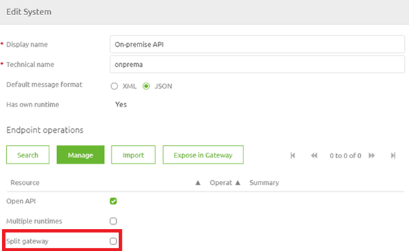
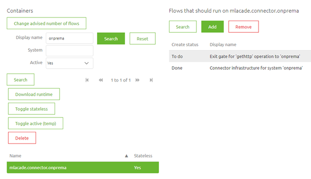
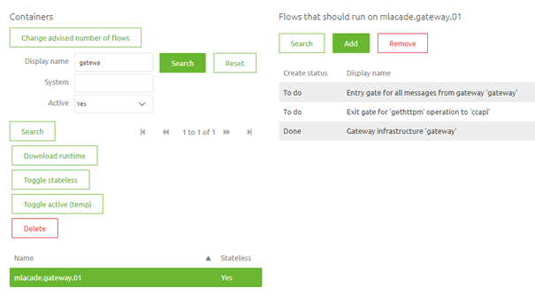

    

        <main class="micro-learning">
        <ul class="doc-nav">
            <li class="doc-nav__item"><a href="../../docs/microlearning/advanced-api-management-index" class="doc-nav__link">Home</a></li>
            <li class="doc-nav__item"><a href="#intro" class="doc-nav__link">Intro</a></li>
            <li class="doc-nav__item"><a href="#theory" class="doc-nav__link">Theory</a></li>
            <li class="doc-nav__item"><a href="#practice" class="doc-nav__link">Practice</a></li>
            <li class="doc-nav__item"><a href="#solution" class="doc-nav__link">Solution</a></li>
        </ul>

##### Intro

# Running (part of) your API Gateway solution on-premise
 
In our crash course on the API Gateway pattern, we have assumed the standard case of running your complete API Gateway in the eMagiz Cloud. However, there might be a valid reason why you want to run (part of) your API Gateway solution on-premise. This mainly occurs when the backend operations are part of your internal on-premise landscape and can only be accessed from a server running on-premise. In this microlearning, we will learn how you answer this question and can best configure your API Gateway solution to run (partly) on-premise.

Should you have any questions, please contact academy@emagiz.com.

- Last update: August 20th, 2021
- Required reading time: 6 minutes

## 1. Prerequisites
- Basic knowledge of the eMagiz platform

## 2. Key concepts
This microlearning centers around running (part of) your API Gateway solution on-premise.

By on-premise, we mean: Locally installed and run software on servers that are owned and operated by the client.

- Key questions are:
    - Can you reach the backend operation outside of the internal network?
    - Which backend operations are only reachable from within the clients network?
    - Do all systems that are linked to the backend operations need to run within the clients network?

##### Theory
  
## 3. Running (part of) your API Gateway solution on-premise

In our crash course on the API Gateway pattern, we have assumed the standard case of running your complete API Gateway in the eMagiz Cloud. However, there might be a valid reason why you want to run (part of) your API Gateway solution on-premise. This mainly occurs when the backend operations are part of your internal on-premise landscape and can only be accessed from a server running on-premise. In this microlearning, we will learn how you answer this question and can best configure your API Gateway solution to run (partly) on-premise.

- Key questions are:
    - Can you reach the backend operation outside of the internal network?
    - Which backend operations are only reachable from within the clients network?
    - Do all systems that are linked to the backend operations need to run within the clients network?

In the remainder of this microlearning, we will learn how you can answer these questions and define the steps necessary to implement your choice.

### 3.1 Determining validity of the demand

Before running off and doing what the client asks of you (i.e. running the API Gateway on-premise) it is wise to first ponder on a couple of questions to determine the validity of that demand. To do so you can see if you can answer a series of questions. Based on these answers you can determine whether or not (part of) the API Gateway should run on-premises. The first question we need to ask ourselves is: Can you reach the backend operation outside of the internal network?

What we mean by this question is that you need to determine via eMagiz (or outside tooling) whether the endpoint that is associated with a specific backend operation can (or cannot) be reached when executing the call from any other network apart from the network of the client. If you can indeed reach the endpoint without problems there is no need to run (part of) your API Gateway solution on-premises as you can easily reach the backend operation from the cloud. As you can imagine you need to do this check for every backend operation if you are in doubt whether it is reachable or not.

The easiest way to test whether an endpoint is reachable is by calling it and seeing if you get a response and if so what the response is. If you get an UnknownHostException or a timeout it probably means that the endpoint is not reachable. You still need to verify whether the same call can be successfully made from inside the network of the client. This to rule out the possibility that the endpoint in itself is simply not reachable.

To summarize, when the answer to this question is yes the inquiry can stop here. At this point, you have already established that your API Gateway solution can run in the cloud. If the answer is no, you know that (part of) your API Gateway solution should run on-premises. In that case, we need to continue with our next question.

The next question we ask ourselves is: Which backend operations are only reachable from within the clients network? Now that we have determined that some backend operations need to be called from within the network of the client the next question becomes which backend operations we are talking about. Identifying whether all backend operations of your API Gateway or part of them is needed to make the correct decisions in Design. As we will see later on in this microlearning there is an option in eMagiz that determines on system level whether the backend operations should run on-premise. By knowing upfront on a system basis whether it should run on-premise improves your decision making while implementing the solution.

The third and final question in this inquiry is: Do all systems that are linked to the backend operations need to run within the clients network? If this is the case you would need to take this into account for each system that is linked to the API Gateway solution. In those cases you need to define on each of the systems that you are running a split gateway.

To summarize, the first question determines whether it is necessary. The second and third questions are follow-up questions that are only relevant in case you have answered the first question in the affirmative. Now that we have learned how to determine whether or not (part of) your API Gateway solution should run on-premise it is time to learn how we could implement this in the eMagiz platform.

### 3.2 Implementing it in the platform

To implement the solution we need to change our Design settings on system level first. To do so navigate to the Design phase of eMagiz and double click on the system that represents the backend operations that should run on-premise. In here there is an option called Split Gateway. Activating this option tells eMagiz that you want to run your backend operations that are linked to this specific system on-premise.

In case you have an existing system that now needs to run on-premise please check out our release blog on how to execute the migration (https://www.emagiz.com/en/release-blog-en/160-split-decision/). In case the system is new you can add your backend operation(s) to Create and build your solution. The moment you transfer your exit gate to Deploy eMagiz will automatically assign the exit gate to the on-premise runtime instead of the API Gateway container.

Note that all other exit gates will remain on the API Gateway container that is running on the cloud. The API Gateway container that is running in the cloud is also the API Gateway container that should host the 'all entry'.

##### Practice

## 4. Assignment

Determine for five operations in your API Gateway landscape whether or not they should run on-premises. This to learn more about making the correct decision.
This assignment can be completed with the help of the (Academy) project that you have created/used in the previous assignment.

## 5. Key takeaways

- Key questions are:
    - Can you reach the backend operation outside of the internal network?
    - Which backend operations are only reachable from within the clients network?
    - Do all systems that are linked to the backend operations need to run within the clients network?
- Only run on-premises if it is necessary
- Always run the 'all entry' in the eMagiz cloud
- Don't forget to tell eMagiz to split your gateway on Design system level

##### Solution

## 6. Suggested Additional Readings

If you are interested in this topic and want more information on it please read the help text provided by eMagiz.

## 7. Silent demonstration video

This video demonstrates how you could have handled the assignment and gives you some context on what you have just learned. 

<iframe width="1280" height="720" src="../../vid/microlearning/advanced-api-management-running-part-of-your-api-gateway-solution-on-premise.mp4" frameborder="0" allow="accelerometer; autoplay; clipboard-write; encrypted-media; gyroscope; picture-in-picture" allowfullscreen></iframe>

</main>

