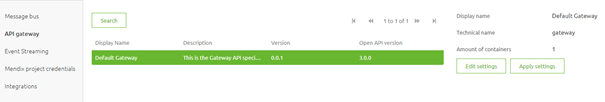
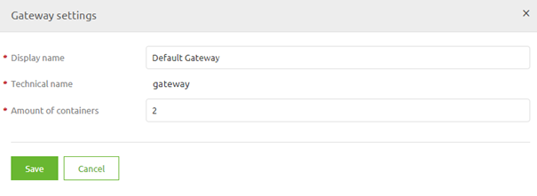
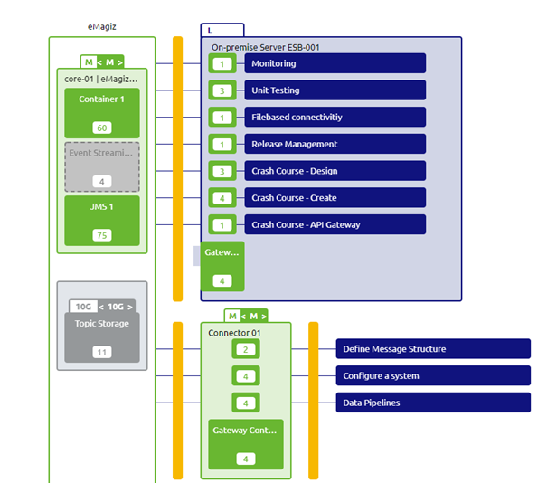

    

        <main class="micro-learning">
        <ul class="doc-nav">
            <li class="doc-nav__item"><a href="../../docs/microlearning/advanced-api-management-index" class="doc-nav__link">Home</a></li>
            <li class="doc-nav__item"><a href="#intro" class="doc-nav__link">Intro</a></li>
            <li class="doc-nav__item"><a href="#theory" class="doc-nav__link">Theory</a></li>
            <li class="doc-nav__item"><a href="#practice" class="doc-nav__link">Practice</a></li>
            <li class="doc-nav__item"><a href="#solution" class="doc-nav__link">Solution</a></li>
        </ul>

##### Intro

# Running (part of) your API Gateway solution on-premise
 
In our crash course on the API Gateway pattern, we have assumed the standard case of running your complete API Gateway in the eMagiz Cloud. However, there might be a valid reason why you want to run (part of) your API Gateway solution on-premise. This mainly occurs when the backend operations are part of your internal on-premise landscape and can only be accessed from a server running on-premise. In this microlearning, we will learn how you answer this question and can best configure your API Gateway solution to run (partly) on-premise.

Should you have any questions, please contact academy@emagiz.com.

- Last update: June 29th, 2021
- Required reading time: 6 minutes

## 1. Prerequisites
- Basic knowledge of the eMagiz platform

## 2. Key concepts
This microlearning centers around running (part of) your API Gateway solution on-premise.

By on-premise, we mean: Locally installed and run software on servers that are owned and operated by the client.

- Key questions are:
    - Can you reach the backend operation outside of the internal network?
    - Can you reach all backend operations from the same server?
    - How many backend operations need this special treatment?

##### Theory
  
## 3. Running (part of) your API Gateway solution on-premise

In our crash course on the API Gateway pattern, we have assumed the standard case of running your complete API Gateway in the eMagiz Cloud. However, there might be a valid reason why you want to run (part of) your API Gateway solution on-premise. This mainly occurs when the backend operations are part of your internal on-premise landscape and can only be accessed from a server running on-premise. In this microlearning, we will learn how you answer this question and can best configure your API Gateway solution to run (partly) on-premise.

- Key questions are:
    - Can you reach the backend operation outside of the internal network?
    - Can you reach all backend operations from the same server?
    - How many backend operations need this special treatment?

In the remainder of this microlearning, we will learn how you can answer these questions and define the steps necessary to implement your choice.

### 3.1 Determining validity of the demand

Before running off and doing what the client asks of you (i.e. running the API Gateway on-premise) it is wise to first ponder on a couple of questions to determine the validity of that demand. To do so you can see if you can answer a series of questions. Based on these answers you can determine whether or not (part of) the API Gateway should run on-premises. The first question we need to ask ourselves is: Can you reach the backend operation outside of the internal network?

What we mean by this question is that you need to determine via eMagiz (or outside tooling) whether the endpoint that is associated with a specific backend operation can (or cannot) be reached when executing the call from any other network apart from the network of the client. If you can indeed reach the endpoint without problems there is no need to run (part of) your API Gateway solution on-premises as you can easily reach the backend operation from the cloud. As you can imagine you need to do this check for every backend operation if you are in doubt whether it is reachable or not.

The easiest way to test whether an endpoint is reachable is by calling it and seeing if you get a response and if so what the response is. If you get an UnknownHostException or a timeout it probably means that the endpoint is not reachable. You still need to verify whether the same call can be successfully made from inside the network of the client. This to rule out the possibility that the endpoint in itself is simply not reachable.

To summarize, when the answer to this question is yes the inquiry can stop here. At this point, you have already established that your API Gateway solution can run in the cloud. If the answer is no, you know that (part of) your API Gateway solution should run on-premises. In that case, we need to continue with our next question.

The next question we ask ourselves is: Can you reach all backend operations from the same server? Now that we have determined that some backend operations need to be called from within the network of the client the next question becomes whether all of these backend operations are reachable from the same server. If so you only need one API Gateway container on-premise (for now). If not you need one per server. Note that one of these servers can also be a cloud connector within the eMagiz Cloud (as that is still the preferred option).

The third and final question in this inquiry is: How many backend operations need this special treatment? The moment you exceed the advised number of operations on one container (60) you should split the operations over multiple API Gateway containers. Depending on the actual number you can arrive at the correct amount of API Gateway operations.

To summarize, the first question determines whether it is necessary. The second and third questions are follow-up questions that are only relevant in case you have answered the first question in the affirmative. Now that we have learned how to determine whether or not (part of) your API Gateway solution should run on-premise it is time to learn how we could implement this in the eMagiz platform.

### 3.2 Implementing it in the platform

To implement the solution we need to change our Design settings at first. To do so navigate to the Design phase of eMagiz and enter the Settings page (located in the top left corner).

Here we click on the API Gateway settings. This will show the following page. Within this page, we can edit the number of API Gateway containers.

To do so please press Edit Settings and change the number of containers to the desired amount. In this example, I will change it to two. Note that when you Save it an information pop-up will be shown telling you that the settings are not automatically applied to Design Architecture. This to prevent weird situations in running environments.

This means that our next step is to navigate to our Design Architecture. Here we can press the Apply settings button to apply the settings on a **per** environment basis. After you have done so a second API Gateway container will appear. You can simply move the second gateway to the on-premise server. It should look something as follows:

When you are satisfied all that is remaining are the regular steps when you upgrade your number of containers in the Design phase. Do not forget to containerize (divide) your flows on a per-container basis to ensure that only the exit gates that need to run on-premise are running on-premise. All other exit gates should remain on the API Gateway container that is running on the cloud. The API Gateway container that is running in the cloud is also the API Gateway container that should host the 'all entry'.

##### Practice

## 4. Assignment

Determine for five operations in your API Gateway landscape whether or not they should run on-premises. This to learn more about making the correct decision.
This assignment can be completed with the help of the (Academy) project that you have created/used in the previous assignment.

## 5. Key takeaways

- Key questions are:
    - Can you reach the backend operation outside of the internal network?
    - Can you reach all backend operations from the same server?
    - How many backend operations need this special treatment?
- Only run on-premises if it is necessary
- Always try to run the 'all entry' in the eMagiz cloud
- Don't forget to containerize (divide) your flows on a per-container basis

##### Solution

## 6. Suggested Additional Readings

If you are interested in this topic and want more information on it please read the help text provided by eMagiz.

## 7. Silent demonstration video

As this is a more theoretical microlearning we did not provide a video for this one.

</main>

