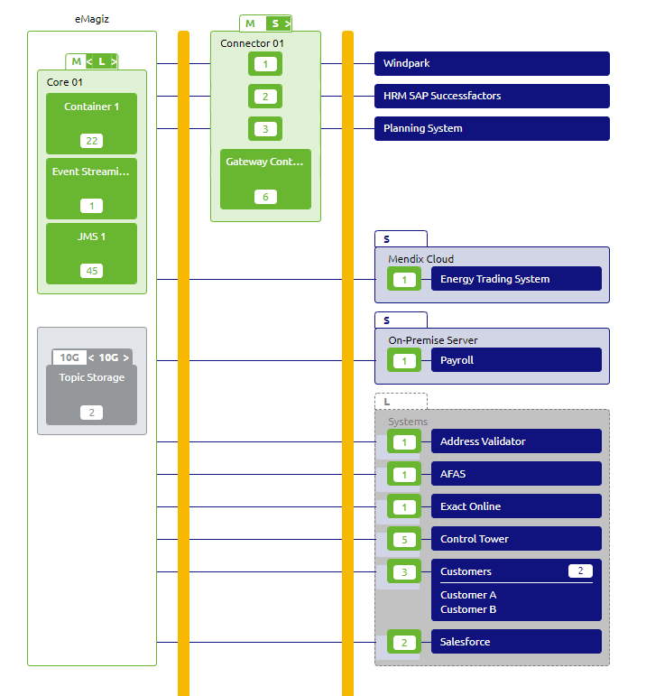
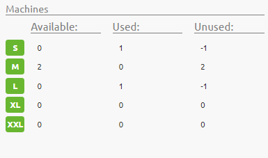

    

        <main class="micro-learning">
        <ul class="doc-nav">
            <li class="doc-nav__item"><a href="../../docs/microlearning/advanced-cloudmanagement-index" class="doc-nav__link">Home</a></li>
            <li class="doc-nav__item"><a href="#intro" class="doc-nav__link">Intro</a></li>
            <li class="doc-nav__item"><a href="#theory" class="doc-nav__link">Theory</a></li>
            <li class="doc-nav__item"><a href="#practice" class="doc-nav__link">Practice</a></li>
            <li class="doc-nav__item"><a href="#solution" class="doc-nav__link">Solution</a></li>
        </ul>

 
##### Intro

# Change the size of the eMagiz Cloud
 
In this microlearning, we will discuss how to change the size of the eMagiz Cloud.

Should you have any questions, please get in touch with academy@emagiz.com.

- Last update: November 2nd, 2021
- Required reading time: 5 minutes

## 1. Prerequisites
- Advanced knowledge of the eMagiz platform
- Completed the relevant microlearnings around Cloud Management till advanced
- Read the microlearning around the determing the required size of a machine in microlearning https://emagiz.github.io/docs/microlearning/expert-solution-architecture-determining-needed-memory#3-determining-needed-memory

## 2. Key concepts
With the eMagiz Cloud we mean the specific Cloud slot that is made available for an integration model so that the flows from that model can be deployed and made operational. The Cloud is a Virtual Private Cloud (VPC) is only available for that integration model and is secured properly. In that VPC a series interconnected machines are running.

##### Theory

## 3. Changing the size of the eMagiz Cloud

#### 3.1 T-Shirt sizing in eMagiz
eMagiz provides a mean to assess whether the current Cloud configuration is sufficient or not. In the figure below you can see the eMagiz Cloud machines denoted with the green boxes. On the top of each box you will find a T-shirt size indication ranging from S to XL. Each of these sizes corresponds to a specific machine specification where by the memory is the most import to note:
S - 2 Gb
M - 4Gb
L - 8Gb
XL - 16Gb

**Advised size**
The first T-shirt size in the box - white background - is the recommended sizing that eMagiz advices. This is based on the average memory consumption guideline that is explained in the microlearning as mentioned above. In the check size option available via the right click, you will find the sizing estimate for that machine and the reference based on flows. In the example above, an M is recommended for both.

**Actual size**
The second T-shirt size in the box - green background - is the actual machine size that is used for the Deployment phase. This is something that the user can select and using the toggle while editing the architecture can influence. In the example above an L and an S are configured.

**Approved size**
In the right-hand size, bottom, you will find the overview of the total machines allows according to your contract. This option can only be set by eMagiz administrators and will only be changed based on actual license agreements

#### 3.2 Changing the size considerations

In case a specific machine is overloaded / overcommitted, it is time to change the size of that machine. You can toggle to a higher size machine and effectuate in the Deploy Architecture - please check out the relevant microlearnings for that. 

However, the Cloud approval is a step that needs to be taken first and can only happen when the licensing agreement has been altered for that purpose. Please contact you partner manager to arrange such Cloud approvals. Bigger size machines will not be effectuated in Deploy Architecture.

##### Practice

## 4. Assignment

Ensure to you your environment to locate the toggle properly, find the overview bottom right to see the Cloud approvals. Check the sizing status once more.

## 5. Key takeaways

- Keep the Cloud sizing the same as the recommended size
- Check the size regularly to anticipate sizing changes in a timely manner. Use the check size options
- Validate the architecture with colleagues or ask a review by eMagiz Expert Services.

##### Solution

## 6. Suggested Additional Readings

If you are interested in this topic and want more information on it, please read the release notes provided by eMagiz

## 7. Silent demonstration video

There is no video available as this is more a theoretical microlearning.

</main>

