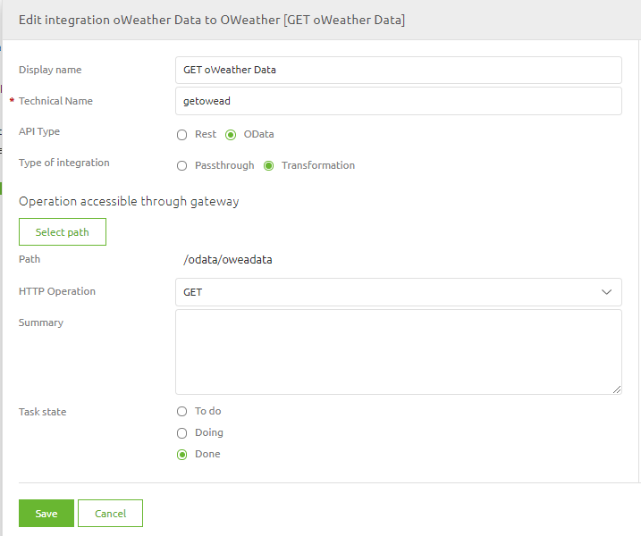
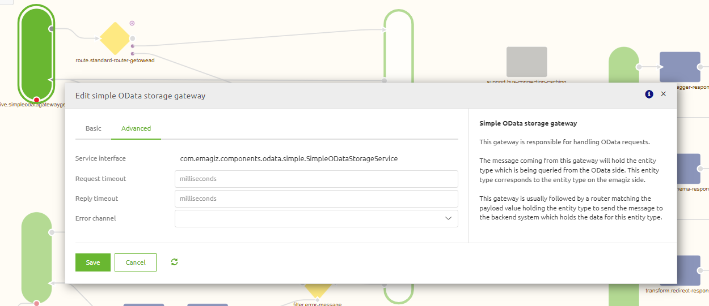

    

        <main class="micro-learning">
        <ul class="doc-nav">
            <li class="doc-nav__item"><a href="../../docs/microlearning/advanced-keyconcepts-apigateway-index" class="doc-nav__link">Home</a></li>
            <li class="doc-nav__item"><a href="#intro" class="doc-nav__link">Intro</a></li>
            <li class="doc-nav__item"><a href="#theory" class="doc-nav__link">Theory</a></li>
            <li class="doc-nav__item"><a href="#practice" class="doc-nav__link">Practice</a></li>
            <li class="doc-nav__item"><a href="#solution" class="doc-nav__link">Solution</a></li>
        </ul>

##### Intro

# Configuring OData in your API Gateway

In this microlearning you can see how to configure an OData based operation in an API Gateway.

Should you have any questions, please get in touch with academy@emagiz.com.

- Last update: December 2021
- Required reading time: 10 minutes

## 1. Prerequisites
- Advanced knowledge of the eMagiz platform
- Completed the relevant microlearnings Key Concepts API Gateway (level crash course to intermediate)

## 2. Key concepts
The OData protocol stands for the Open Data protocol and was launched by Microsoft in 2007. It allows to create a queryable and interoperable REST API's. The lastest version is OData v4 and has become a standard protocal via the Oasis organisation. In the context of eMagiz, it allows to send a OData request to the API Gateway which take the form of an OData query. The API Gateway has a component inside that allows to interpret this query and use that information to fetch or post data. OData based REST services use the similar HTTP operations such as GET, POST, etc. Please refer to section 6 in this microlearning for more details.

##### Theory
  
## 3. eMagiz configuration

### 3.1 Design
In the Design phase, you have the option to select the type of API for the operation to be configured. In the screenshot below you can see that OData is one of the API types. All other configurations in eMagiz will work exactly the same as for another API type. Such a creating the request & response messages for the Gateway and the API provider. Or setting the security for the API gateway. Please consult the relevant microlearnings on this topics.

### 3.2 Create
Once the Design phase is complete, the configuration can be added to the create phase. The exit gate will exactly the same in terms of how to configure that one. The All entry of the API Gateway will be updated according to the API type, in a sense that for this OData operation a specific inbound gateway is created (OData Storage Gateway). This component handles the translation from OData based queries to and from the exit gate. OData request will be transformed to a regular JMS message, and a response transformed into a OData readable format. 

##### Practice

## 4. Assignment

There is no assignment for now in this microlearning

## 5. Key takeaways

- Please note that eMagiz allows to publish a OData based API
- This functionality has been used in the context of the Mendix Data Hub 

##### Solution

## 6. Suggested Additional Readings

Take a moment to read the following links:
- https://en.wikipedia.org/wiki/Open_Data_Protocol
- https://www.odata.org/
- https://www.odata.org/getting-started/understand-odata-in-6-steps/

## 7. Silent demonstration video

As this is a more theoretical microlearning, we have no video that accompanies this microlearning. The screenshot would suffice for the moment.

</main>

