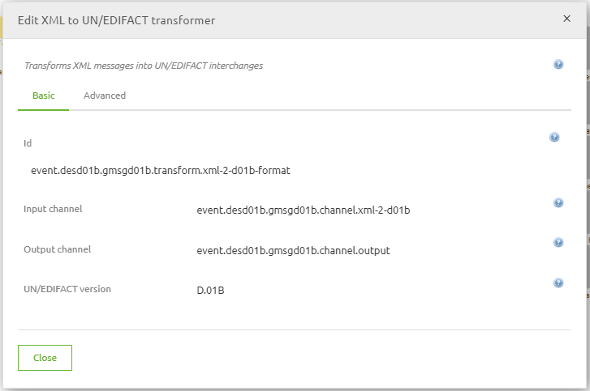
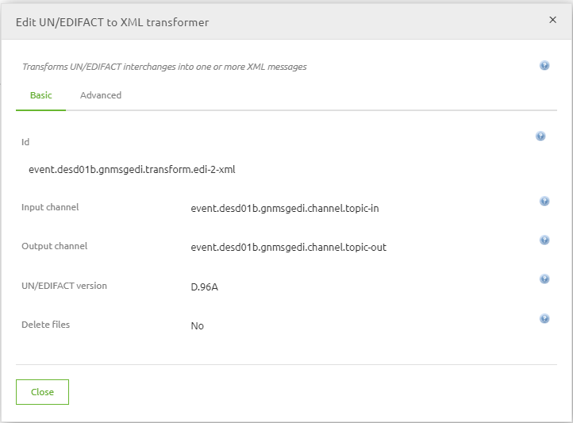
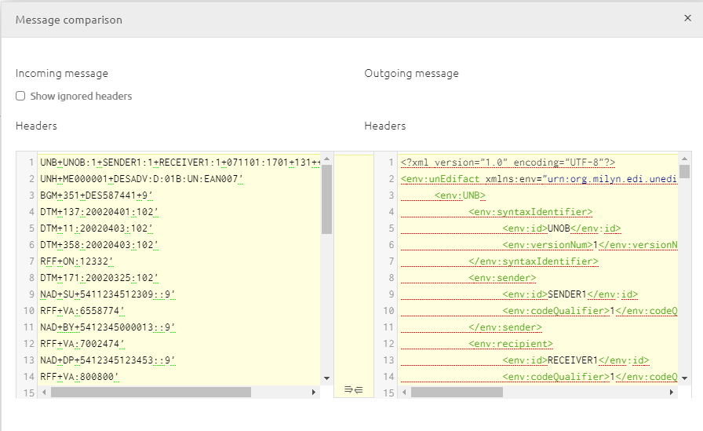

    

        <main class="micro-learning">
        <ul class="doc-nav">
            <li class="doc-nav__item"><a href="../../docs/microlearning/advanced-solution-architecture-index" class="doc-nav__link">Home</a></li>
            <li class="doc-nav__item"><a href="#intro" class="doc-nav__link">Intro</a></li>
            <li class="doc-nav__item"><a href="#theory" class="doc-nav__link">Theory</a></li>
            <li class="doc-nav__item"><a href="#practice" class="doc-nav__link">Practice</a></li>
            <li class="doc-nav__item"><a href="#solution" class="doc-nav__link">Solution</a></li>
        </ul>

##### Intro

# Introduction
This micro-learning will focus the tranformation from EDI to an XML message. EDI (Electronic Data Interchange) is a very specific format of a message that can be interpreted by some systems. Rather than providing XML tags or curly JSON brackets, you will find a flat file that is very well organized but used lots or abbreviations or tags to identify entities and attributes in the message. This microlearning will explain more around these structures and how to create such EDI messages when you have an XML prepared. 

Should you have any questions, please contact academy@emagiz.com.

- Last update: October 20th, 2021
- Required reading time: 10 minutes

## 1. Prerequisites
- Intermediate knowledge of the eMagiz platform
- Good working experience in the Create phase and transformations.

## 2. Key concepts
An example of an EDI message is listed below. Each line starts with a tag that indicates the meaning of the line, and each message starts with fixed starting tags (UNA) and fixed ending tags (UNZ).

There are a lot of different versions of EDI each indicated with version id. A commonly used version is D96A, while versions D01B, D95A, D01A, etc exists. It's important to understand upfront what the version used is from the client, allthough the EDI message itself contains that information. The example above is a D01B version - see 3rd line. Within each version of EDI there is a specific type of data exchanged. Such as orders, invoices, confirmations, etc. In the example above this is an ORDERS message. Each of the version and data type combination has a specific message definition that is required to obtain in order to create the System Message.

##### Theory

## 3. Transforming XML to EDI messages

### 3.1 XML to EDI transformation model component

The important part of generating the System Message for the EDI message that the XML structure of that specific EDI message type. eMagiz has standard model components in the create phase available that can convert an EDI mesasge to an XML message. Below the screenshots of the model component. The important parameter here is which EDI version is used here. Using that information and the message type inside the EDI message this component will create the associated XML structure for you. Once you have this, you can then use that XML as the basis for your System Definition. This is the basis for the System Message validation in your process.

Please note that you need to put the XML structure in the namespace of this transformation model component: urn:org.milyn.edi.unedifact.v41. The message type XML tag (DESADV, ORDER, etc) does not need to be prefixed.
<xsl:stylesheet xmlns:xsl="http://www.w3.org/1999/XSL/Transform" version="2.0">
	<xsl:output omit-xml-declaration="yes" indent="yes"/>
	<xsl:strip-space elements="*"/>
	<xsl:template match="node()|attribute()">
		<xsl:copy>
			<xsl:apply-templates select="node()|attribute()"/>
		</xsl:copy>
	</xsl:template>
	<xsl:template match="*[not(ancestor-or-self::DESADV)]">
		<xsl:element name="ns:{local-name()}" namespace="urn:org.milyn.edi.unedifact.v41">
			<xsl:apply-templates select="node()|attribute()"/>
		</xsl:element>
	</xsl:template>
</xsl:stylesheet>

### 3.2 EDI to XML transformation model component

As the previous section, but the other EDI model component needs to be selected. See below for a screenshot of that component.

### 3.3 Scenario incoming EDI with example

In the scenario where you want to define the System Message that is incoming, and you have the example EDI message that needs to be modeled, it is adviced to use a Flow Test in Create to learn what the XML structure is for that particular message. You would get only the required XML elements that correspond to the example messages. It is adviced to have several examples messages so that the optimal set can be determined. It would mean that you need to transfer the integration to Create before completing the Design phase.

### 3.4 Scenario incoming EDI without example

In this case, you can't predict the exact XML structure of the EDI message. You could rely on an XSD that is provided by the client or the XSDs that eMagiz provides in the eMagiz Store. Please note that you can download this structure but it contains a full model. Which effectively means that all possible attributes are included and in most cases 80% or more is not used by the EDI messages actually exchanged. Please take moment to create a subset of the full XSD before importing that XSD as System Message.

### 3.5 Scenario outcoming EDI with example

In the scenario where you want to define the System Message that is oucoming, and you have the example EDI message that needs to be modeled, it is adviced to use a Flow Test in Create to learn what the XML structure is for that particular message. You would get only the required XML elements that correspond to the example messages. It is adviced to have several examples messages so that the optimal set can be determined. 

It would mean that you need to transfer the integration to Create before completing the Design phase. And it means that you need to use the EDI to XML component as described above.

### 3.6 File type best practise

- In the event you receive an EDI, don't create any file to string alike transformation. Directly transform the file from EDI to XML

##### Practice

## 4. Assignment

Try to observe an EDI message like below. Put the contents below into a file, and move an integration into the Create phase. Add the required compontent to transform it to XML and see the actual result.

UNB+UNOB:1+SENDER1:1+RECEIVER1:1+071101:1701+131++INVOIC++1++1'
UNH+ME000001+DESADV:D:01B:UN:EAN007'
BGM+351+DES587441+9'
DTM+137:20020401:102'
DTM+11:20020403:102'
DTM+358:20020403:102'
RFF+ON:12332'
DTM+171:20020325:102'
NAD+SU+5411234512309::9'
RFF+VA:6558774'
NAD+BY+5412345000013::9'
RFF+VA:7002474'
NAD+DP+5412345123453::9'
RFF+VA:800800'
NAD+SH+5412345000105::9'
CPS+1'
PAC+2++201::9'
CPS+2+1'
PAC+1++201::9'
MEA+PD+AAB+KGM:263.2'
MEA+PD+WD+MMT:800'
MEA+PD+LN+MMT:1200'
PCI+33E'
GIN+BJ+354107380000001051'
PAC+20++CT'
LIN+1++5410738000152:SRV'
QTY+12:20'
CPS+3+1'
PAC+1++201::9'
MEA+PD+AAB+KGM:305.1'
PCI+33E'
GIN+BJ+354107380000001068'
PAC+20++CT'
LIN+2++5410738000169:SRV'
QTY+12:5'
LIN+3++5410738000176:SRV'
QTY+12:3'
LIN+4++5410738000183:SRV'
QTY+12:12'
CNT+2:4'
UNT+40+ME000001'
UNZ+2+131'

## 5. Key takeaways
eMagiz is able to transform messages from XML to EDI

- Use the proper components to transform the message to the right EDI format
- Leverage Flow Testing to see the actual outcome of an EDI message to help create the right System Message
- Validate the XML structure before it's transformed to an EDI message (outgoing)
- Transform the EDI message to XML before it's validated basedon the XML structure (incoming)

##### Solution

## 6. Suggested Additional Readings

There are no suggested additional readings on this topic

## 7. Silent demonstration video

There is no demonstration video of this functionality. 

##

</main>

