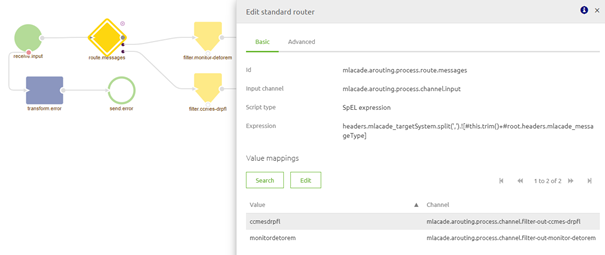
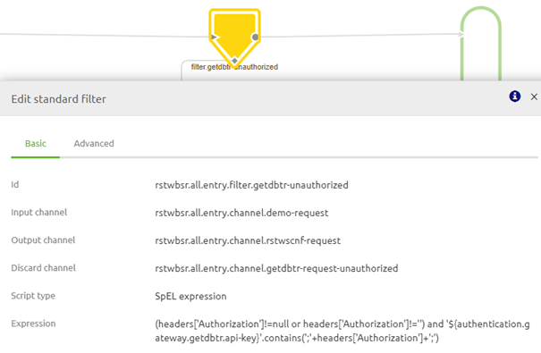
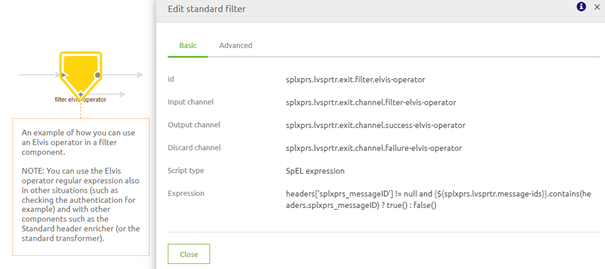

    

        <main class="micro-learning">
        <ul class="doc-nav">
            <li class="doc-nav__item"><a href="../../docs/microlearning/advanced-data-handling-index" class="doc-nav__link">Home</a></li>
            <li class="doc-nav__item"><a href="#intro" class="doc-nav__link">Intro</a></li>
            <li class="doc-nav__item"><a href="#theory" class="doc-nav__link">Theory</a></li>
            <li class="doc-nav__item"><a href="#practice" class="doc-nav__link">Practice</a></li>
            <li class="doc-nav__item"><a href="#solution" class="doc-nav__link">Solution</a></li>
        </ul>

##### Intro

# SpEL Expressions

The tools in eMagiz provide a wide range of options to build your integrations with. For example, in some of the building blocks in the model, capability can be extended using SpEL expressions. SpEL expressions are derived from the Spring Integration Framework, which stands for Spring Expression Language. SpEL expressions are potent and handy, yet basic knowledge of SpEL expressions is required to add or modify the behavior of specific flows in eMagiz. In this microlearning, we will focus on implementing SpEL expressions within the eMagiz tooling.

Should you have any questions, please get in touch with academy@emagiz.com.

- Last update: December 13th, 2021
- Required reading time: 6 minutes

## 1. Prerequisites
- Advanced knowledge of the eMagiz platform
- A (very) basic understanding of Java 

## 2. Key concepts
This microlearning centers around using SpEL expressions in eMagiz
By SpEL expressions, we mean A powerful expression language that supports querying and manipulating an object graph at runtime. It can be used with XML or annotation-based Spring configurations.

When using SpEL expressions within the eMagiz tool, follow these guidelines:
- Use annotations to describe the behavior of the SpEL expression. This is to ensure the maintainability of the flow.
- Don't make things too complicated when using SpEL expression. This is to ensure the readability of the flow

##### Theory

## 3. SpEL Expressions

The tools in eMagiz provide a wide range of options to build your integrations with. For example, in some of the building blocks in the model, capability can be extended using SpEL expressions. SpEL expressions are derived from the Spring Integration Framework, which stands for Spring Expression Language. SpEL expressions are potent and handy, yet basic knowledge of SpEL expressions is required to add or modify the behavior of specific flows in eMagiz. In this microlearning, we will focus on implementing SpEL expressions within the eMagiz tooling.

When using SpEL expressions within the eMagiz tool, follow these guidelines:
- Use annotations to describe the behavior of the SpEL expression. This is to ensure the maintainability of the flow.
- Don't make things too complicated when using SpEL expression. This is to ensure the readability of the flow

In the remainder of this microlearning, we take a look at some examples within the eMagiz tooling in which SpEL expressions could be used:

-   Executing a logical operation in which you validate whether a particular value equals an expected value.
-   Place the complete payload in a header. This is sometimes needed as you need to restore the original payload after performing another action.
-   Routing best-practice
-   To determine if a value in your message is listed in a list and use it as a filter. 
    -   The example we use is the authorization in an all-entry flow when using the API key security mechanism for securing your web service.
-   To create an if-statement using header values.

Before we delve into the examples, we first describe the SpEL notation.

### 3.1 SpEL notation

A message in eMagiz has two main parts, as you well know. One part is the payload, and the other part is the headers. Both are accessible via a SpEL expression. 

To retrieve data from a payload you can use the following notation in SpEL: #xpath(payload,'//*:uniqueIdentifier'). For more information on using SpEL as an XPath expression please see this [microlearning](advanced-create-your-transformations-xpath-advanced.md).

To retrieve data from a header, you can use one of the following notations:
- headers.nameOfHeader
- headers['nameOfHeader']

Below we describe the difference between both options:
- When it is required that the header is present, you can use "headers.nameOfHeader" (this will fail if the header is missing)
- When the header might be missing, you should use ""headers[''nameOfHeader'']"" (and then correctly handle ""null"" values)

### 3.2 Logical Operation

A very straightforward example of using SpEL to determine whether a message can continue is a logical operation. In the example described below, the message can only pass if the value stored in the header named error equals ''yes''. In all other cases, the message is not allowed to pass the filter and will be on the discard channel.

### 3.3 Payload in Header

A standard header enricher gives you the option to add information on top of the payload. In this example, a new header is added with the name "backup" and the value of the header is the complete payload of the current message, value = ''payload''. Take notice that ''Type'' is a SpEL expression. This expression is filled in on the tab ''Advanced''. 

### 3.4 Routing best-practice

Below you will find the best practice to build the routing flow in eMagiz. This best practice uses the standard router where you can use a SpEL Expression to route your message. That SpEL Expression looks like this: “headers.model_targetSystem.split(',').![#this.trim()+#root.headers.model_messageType]”.

The first part of the SpEL Expression looks at the ''model_targetSystem'' header. This header can contain multiple values separated by a comma. So a message can be routed to various target systems. The second part of the SpEL Expression looks at the ''model_messageType'' header. This SpEL expression can be multiple values since the message can have various ''model_targetSystem'' headers.

An example of how this works is detailed below.

- Header: model_targetSystem: TMS, FMS
- Header: model_messageType: Order

Will be routed to the following value mappings:
- TMSOrder
- FMSOrder

### 3.5 Api key authorization check

When using the API key method to authorize whether a client is indeed authorized, you can use a SpEL expression to validate the API key against a default list and provide feedback on whether the client is indeed authorized. Depending on the service you are hosting (REST or SOAP), you can implement it differently. This example will show the simplest way to implement this by using an excellent SpEL expression in a standard filter. An example of such a SpEL expression is:

(headers['Authorization']!=null or headers['Authorization']!='') and '${authentication.gateway.getdbtr.api-key}'.contains(';'+headers['Authorization']+';')

This SpEL expression validates whether the header called Authorization exists and whether the value in the header called Authorization is registered within the property called authentication.gateway.getdbtr.API-key.

### 3.6 If then else

With the help of a SpEL expression, you can also define an if then else statement (also known as an Elvis operator). In such a SpEL expression, you can determine based on specific criteria what to do. An example of how to implement this is depicted below:

headers['splxprs_messageID'] != null and {${splxprs.lvsprtr.message-ids}}.contains(headers.splxprs_messageID) ? true() : false()

This expression defines that when the header in question exists and the header's value can be found within a predefined property, the expression should return true(). In all other cases, it should return false().

##### Practice

## 4. Assignment

Try to spot various SpEL expressions within the project you are working on and see whether you can explain them. Furthermore, try to implement some of the examples in your (Academy) project and see what happens. This assignment can be completed with the help of the (Academy) project that you have created/used in the previous assignment.

## 5. Key takeaways

- There are multiple alternatives for using SpEL expressions within eMagiz
- When using SpEL expressions, explain your work for maintainability purposes
- Check out the microlearning and the suggested additional readings for examples and more clarity on the subject

##### Solution

## 6. Suggested Additional Readings

If you are interested in this topic and want more information on it, please read the release notes provided by eMagiz when implementing SpEL expressions, and please check out the following links:

- https://www.baeldung.com/spring-expression-language (great explanation on SpEL and its various applications)
- https://docs.spring.io/spring/docs/4.3.10.RELEASE/spring-framework-reference/html/expressions.html (more in-depth explanation of how SpEL expressions relate to the Spring framework)

## 7. Silent demonstration video

As this is a more theoretical microlearning, there is no video available.

</main>

