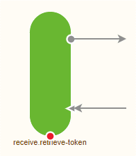
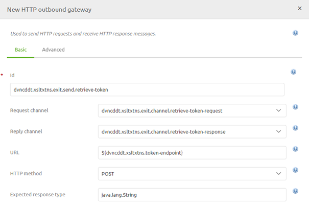
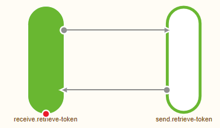
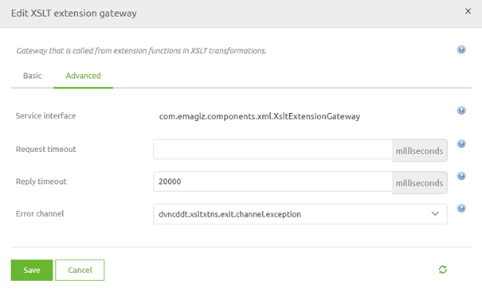
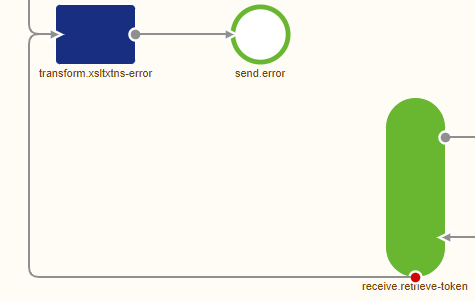
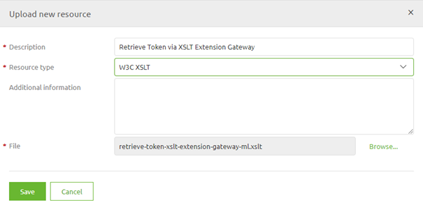
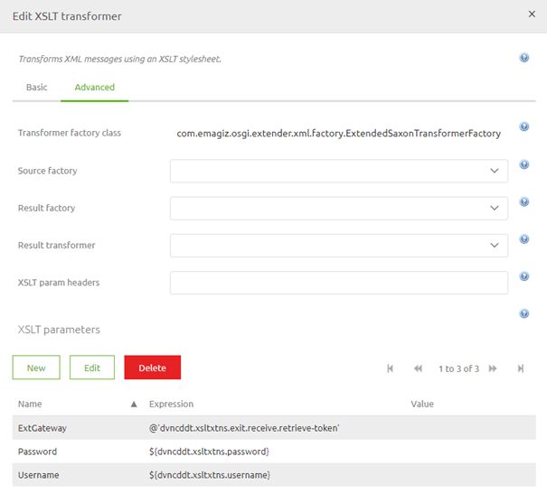

	

		<main class="micro-learning">
		<ul class="doc-nav">
			<li class="doc-nav__item"><a href="../../docs/microlearning/advanced-data-handling-index" class="doc-nav__link">Home</a></li>
			<li class="doc-nav__item"><a href="#intro" class="doc-nav__link">Intro</a></li>
			<li class="doc-nav__item"><a href="#theory" class="doc-nav__link">Theory</a></li>
			<li class="doc-nav__item"><a href="#practice" class="doc-nav__link">Practice</a></li>
			<li class="doc-nav__item"><a href="#solution" class="doc-nav__link">Solution</a></li>
		</ul>

##### Intro

# XSLT Extension Gateway

In this microlearning, we will focus on the XSLT extension gateway. 
The XSLT extension gateway is a component in eMagiz that helps you to enrich your output XML message by retrieving data from an outside source.

Should you have any questions, please contact academy@emagiz.com.

- Last update: March 22th, 2021
- Required reading time: 6 minutes

## 1. Prerequisites
- Advanced knowledge of the eMagiz platform
- Advanced knowledge of XSLT

## 2. Key concepts
This microlearning centers around the XSLT extension gateway component in eMagiz
By XSLT extension gateway we mean: A component within eMagiz that gives you the option to retrieve additional data while executing the transformation from an outside source

Via the XSLT extension gateway you can retrieve data from multiple sources (REST Webservice, SOAP Webservice, Database, etc.) as long as the outside source can supply a response in near real-time.

##### Theory

## 3. XSLT Extension Gateway

An XSLT Extension Gateway is a component within eMagiz that gives you the option to retrieve additional data while executing the transformation from an outside source.
Via the XSLT extension gateway you can retrieve data from multiple sources (REST Webservice, SOAP Webservice, Database, etc.) as long as the outside source can supply a response in near real-time.
This response is in turn used to enrich your output message with the correct information.

### 3.1 Setting up the XSLT Extension Gateway

The first step of setting up an XSLT Extension Gateway is to add the XSLT Extension Gateway component to your flow and create two channels (one for the request and one for the response).
You can do so by dragging the correct component on the canvas, creating the channels and linking the channels to the XSLT Extension Gateway.
An example of how this will look is shown below:

### 3.2 Connect to the outside source

As stated before, via the XSLT extension gateway you can retrieve data from multiple sources (REST Webservice, SOAP Webservice, Database, etc.) as long as the outside source can supply a response in near real-time.
In this example we will assume that you want to retrieve a Token from a REST Webservice that you need as part of your authorization when executing subsequent calls.

In this case we will have to call a certain endpoint via a POST method. In the body of our message we need to send the username and password that we have received from the outside source.
This outside source expects the body in XML.

To make this a reality in eMagiz we first need to add an HTTP Outbound Gateway to the canvas and fill in the details.

This automatically links the XSLT extension gateway to the HTTP oubound gateway, provided you selected the correct request and response channel.

### 3.3 Error handling

It could happen that something goes wrong while retrieving the relevant data from the outside will using the XSLT Extension Gateway. 
To ensure that the error handling does its work you need to link the XSLT Extension Gateway to the default error handling of eMagiz.

You can easily do so by opening the XSLT Extension Gateway component, navigating to the Advanced tab, selecting the correct Error channel and setting the Reply timeout.

The result of this action will be that the XSLT extension will send his errors to the standard error handling process of eMagiz.

### 3.4 Write the XSLT

To succesfully call an XSLT extension gateway your custom XSLT needs five things:

- A parameter that defines which component the XSLT extension gateway is within the flow
- A variable that calls the XSLT extension gateway and will hold the result
- A variable that defines what the input for your XSLT extension gateway will be
- A template match that copies your input
- A template match that ensures that the result of your XSLT extension gateway is correctly outputted

An example of such an XSLT is depicted below. Within the XSLT we have described which part is responsible for what exactly. 

<xsl:stylesheet xmlns:xsl="http://www.w3.org/1999/XSL/Transform"
    xmlns:ezx="http://www.emagiz.com/ns/xml/1.0/"
	version="2.0">
	<xsl:param name="Username"/>	
	<xsl:param name="Password"/>	
	
	<!-- This segment will house the parameter that will identify which component to call within the flow -->
	
	<xsl:param name="ExtGateway"/>	
	
	<!-- This segment will house the variable that will identify when you want to call the extension gateway, what the input of the extension gateway should be and what you want as a result -->
	
	<xsl:variable name="Token" select="if (exists(//ID) and //ID != '') then ezx:call-xslt-extension-gateway($ExtGateway, $RetrieveToken) else ''"/>
	
	<!-- This segment will copy the incoming message to the output -->
	
	<xsl:template match="@* | node()">
		<xsl:copy>
			<xsl:apply-templates select="@* | node()"/>
		</xsl:copy>
	</xsl:template>
	
	<!-- This segment will ensure that the Token will be filled in correctly -->
	
	<xsl:template match="Token">
			<Token>
				<xsl:value-of select="$Token"/>
			</Token>			
	</xsl:template>
	
	
	<!-- The variable defined below will be the input to retrieve the token from the outside source -->
	
	<xsl:variable name="RetrieveToken">
		<xsl:if test="exists(//ID) and //ID != ''">
			<root>
				<username><xsl:value-of select="$Username"/></username>
				<password><xsl:value-of select="$Password"/></password>
			</root>
		</xsl:if>
	</xsl:variable>
</xsl:stylesheet>

Now that we have an example of a custom XSLT that we can use we now need to make sure that this XSLT will work within the context of our flow.

### 3.5 Connect XSLT to flow

The first step we need to take is to link the resource to the flow. To do so you navigate to the tab Resources on flow level, while in "Start Editing" mode.
In this tab you have the option to Upload new resource

When you select this option you can upload your custom XSLT. Ensure that you select the correct resource type and give the resource a good descriptive name

Now that we have added the resource to the flow we can return to the flow overview and add a XSLT transformer component to the canvas and fill in the details

When you are finished with the basic config you can move to the Advanced section. In this section we need to define the values for our parameter(s).
The end result will look something like this:

As you can see the ExtGateway parameter refers to the ID of the XSLT extension gateway component within our flow. 
Now that we have set our XSLT transformer component up correctly the we have automatically linked the XSLT Transformer to the XSLT extension gateway.

With these steps you can successfully use the XSLT extension gateway component in eMagiz. Based on your use case the details of the configuration can differ.

##### Practice

## 4. Assignment

Create within your flow an XSLT extension gateway setup as depicted above. The linking of the XSLT transformer to the XSLT extension gateway can be skipped in the exercise.
This assignment can be completed with the help of the (Academy) project that you have created/used in the previous assignment.

## 5. Key takeaways

- An XSLT Extension Gateway is a component within eMagiz that gives you the option to retrieve additional data while executing the transformation from an outside source.
- Via the XSLT extension gateway you can retrieve data from multiple sources (REST Webservice, SOAP Webservice, Database, etc.) as long as the outside source can supply a response in near real-time.
- This response is in turn used to enrich your output message with the correct information.
- Setting up an XSLT extension gateway means several components need to work in perfect unison
- Don't forget about the error handling

##### Solution

## 6. Suggested Additional Readings

If you are interested in this topic and want more information on it please read the release notes provided by eMagiz that accompany the eMagiz Mendix Connector version you have selected.

## 7. Silent demonstration video

This video demonstrates how you could have handled the assignment and gives you some context on what you have just learned. 

<iframe width="1280" height="720" src="../../vid/microlearning/advanced-data-handling-xslt-extension-gateway.mp4" frameborder="0" allow="accelerometer; autoplay; clipboard-write; encrypted-media; gyroscope; picture-in-picture" allowfullscreen></iframe>

</main>

