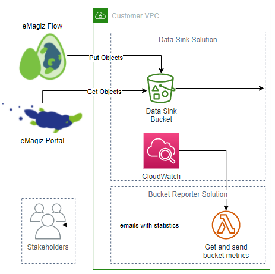
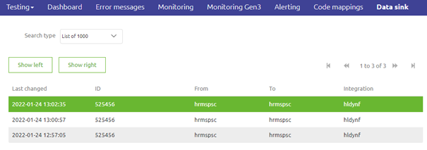
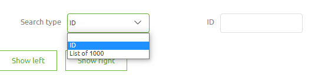
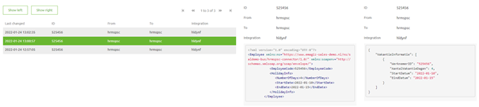

    

        <main class="micro-learning">
        <ul class="doc-nav">
            <li class="doc-nav__item"><a href="../../docs/microlearning/advanced-data-management-index" class="doc-nav__link">Home</a></li>
            <li class="doc-nav__item"><a href="#intro" class="doc-nav__link">Intro</a></li>
            <li class="doc-nav__item"><a href="#theory" class="doc-nav__link">Theory</a></li>
            <li class="doc-nav__item"><a href="#practice" class="doc-nav__link">Practice</a></li>
            <li class="doc-nav__item"><a href="#solution" class="doc-nav__link">Solution</a></li>
        </ul>

##### Intro

# Data sink via eMagiz

In this microlearning, we will learn how to implement data sink functionality on flow level in eMagiz. On top of that, we will learn conceptually how this data sink solution works, so you get a feeling of what happens underwater to safely and securely store your data.

Should you have any questions, please get in touch with academy@emagiz.com.

- Last update: January 27th, 2022
- Required reading time: 5 minutes

## 1. Prerequisites
- Advanced knowledge of the eMagiz platform
- A valid license to use data sink

## 2. Key concepts

- With this functionality, you can determine on flow level whether data needs to be placed in the data sink
- A working example is provided via the Store of how to implement the functionality in your flow
- A additional license is needed to enable this functionality
- Retrieving data can be executed via the Data Sink functionality in Manage

##### Theory
  
## 3. Data sink via eMagiz

In this microlearning, we will learn how to implement data sink functionality on flow level in eMagiz. On top of that, we will learn conceptually how this data sink solution works, so you get a feeling of what happens underwater to safely and securely store your data.

Before you can utilize this functionality, you need to secure an additional license on the platform. If you want more information or set up talks to require such an additional license, please get in touch with us at productmanagement@emagiz.com.

Once you have secured the additional license, we will configure your AWS cloud slot to enable data sink. Afterward, you can implement the functionality in the flow that will send the data to AWS to be archived.

### 3.1 Implementation in the flow

To implement the functionality in the flow, you can use the Store component called "eMagiz Data Sink" This store component will provide you with all the necessary components, including the correct configuration needed to set up the connection. Furthermore, you can only use this store component after acquiring the proper license. We will automatically fill in all relevant connection details needed to store the data correctly. Finally, follow the import wizard provided with the Store component to configure it properly.

The only thing left for you is determining when you want to send the data to the archive. Typically we see that the point of entry on the model and the point of exit of the model are the most desirable candidates for archiving. This way, you can prove when OPS questions arise that you received and subsequently send a specific message.

### 3.2 Data sink inner workings

Once your message is sent to the data sink solution, it will be sent to what we call a bucket. The data will remain in this bucket for a specific period determined based on the agreed-upon license. Typical values are ninety or one hundred eighty days. Within this timeframe, you can view the messages within the bucket to help analyze operational problems.

The whole process from beginning to end is monitored, and the model owner, alongside eMagiz support, will be notified if things go wrong within the solution. Furthermore, they will also be informed of the amount of data in various stages of the process. See below for a simplified version of how this works for you.

### 3.3 View the data via eMagiz

When you navigate to the Manage phase of your model in eMagiz, you will see a tab called "Data sink" once the license has been activated on your model. Here, you will see all messages sent within the time frame.

Here you can search on the Unique Identifier you defined in your flow or list the last 1000 objects within the bucket. 

Once you have the view you want, you can select a specific message from the list and press Show Left or Show Right. This way, you can compare two messages (input and output, for example) to each other. An example of how this can look is shown below.

##### Practice

## 4. Assignment

We have opted not to create an assignment because you need a specific license for this.

## 5. Key takeaways

- The long term archiving functionality is an expansion of the data sink functionality
- With this functionality, you can determine on flow level whether data needs to be placed in long term archiving
- A working example is provided via the Store of how to implement the functionality in your flow
- A additional license is needed to enable this functionality
- Retrieving data can only be executed via a ticket registered at the support organization

##### Solution

## 6. Suggested Additional Readings

If you are interested in this topic and want more information, please read the release notes and help texts provided by eMagiz.

## 7. Silent demonstration video

As this is a more theoretical microlearning, we have no video that accompanies this microlearning.

</main>

