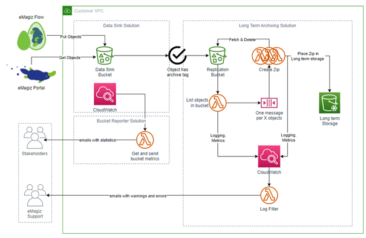

    

        <main class="micro-learning">
        <ul class="doc-nav">
            <li class="doc-nav__item"><a href="../../docs/microlearning/advanced-data-management-index" class="doc-nav__link">Home</a></li>
            <li class="doc-nav__item"><a href="#intro" class="doc-nav__link">Intro</a></li>
            <li class="doc-nav__item"><a href="#theory" class="doc-nav__link">Theory</a></li>
            <li class="doc-nav__item"><a href="#practice" class="doc-nav__link">Practice</a></li>
            <li class="doc-nav__item"><a href="#solution" class="doc-nav__link">Solution</a></li>
        </ul>

##### Intro

# Long term archiving via eMagiz

In our previous [microlearning](advanced-data-management-data-sink.md) we explained the data sink functionality that eMagiz provides. In this microlearning, we will expand our knowledge by learning how to adjust the flow suitable for data sink and send the data to the long-term archiving solution of eMagiz. On top of that, we will learn conceptually how this long-term archiving solution works, so you get a feeling of what happens underwater to safely and securely store your data.

Should you have any questions, please get in touch with academy@emagiz.com.

- Last update: January 27th, 2022
- Required reading time: 5 minutes

## 1. Prerequisites
- Advanced knowledge of the eMagiz platform
- A valid license to use long term archiving

## 2. Key concepts

- The long term archiving functionality is an expansion of the data sink functionality
- With this functionality, you can determine on flow level whether data needs to be placed in long term archiving
- A working example is provided via the Store of how to implement the functionality in your flow
- A additional license is needed to enable this functionality
- Retrieving data can only be executed via a ticket registered at the support organization

##### Theory
  
## 3. Long term archiving via eMagiz

In our previous [microlearning](advanced-data-management-data-sink.md) we explained the data sink functionality that eMagiz provides. In this microlearning, we will expand our knowledge by learning how to adjust the flow suitable for data sink and send the data to the long-term archiving solution of eMagiz. On top of that, we will learn conceptually how this long-term archiving solution works, so you get a feeling of what happens underwater to safely and securely store your data.

Before you can utilize this functionality, you need to secure an additional license on the platform. If you want more information or set up talks to require such an additional license, please get in touch with us at productmanagement@emagiz.com.

Once you have secured the additional license, we will configure your AWS cloud slot to enable long-term archiving. Afterward, you can implement the functionality in the flow that will send the data to AWS to be archived.

### 3.1 Implementation in the flow

To implement the functionality in the flow, you can use the Store component called "eMagiz Long term archiving" This store component will provide you with all the necessary components, including the correct configuration needed to set up the connection. Furthermore, because you can only use this store component after acquiring the proper license, we will automatically fill in all relevant connection details needed to store the data correctly. Finally, follow the import wizard provided with the Store component to configure it properly.

The only thing left for you is to determine when you want to send the data to the archive. Typically we see that the point of entry on the model and the point of exit of the model are the most desirable candidates for archiving. This way, you can prove, for years to come, that you received and subsequently send a specific message.

### 3.2 Long term archiving inner workings

Once your message is sent to the long-term archiving solution, it will be sent to what we call a staging bucket. On this bucket, a process will periodically check the objects in the bucket and create a message per X objects in the bucket. Each message will subsequently trigger a function that will retrieve all objects based on the IDs and zip the objects into one zip stored in Glacier for long-term archiving.

The whole process from beginning to end is monitored, and the model owner, alongside eMagiz support, will be notified if things go wrong within the solution. Furthermore, they will also be informed of the amount of data in various stages of the process. See below for a simplified version of how this works for you.

##### Practice

## 4. Assignment

We have opted not to create an assignment because you need a specific license for this.

## 5. Key takeaways

- The long term archiving functionality is an expansion of the data sink functionality
- With this functionality, you can determine on flow level whether data needs to be placed in long term archiving
- A working example is provided via the Store of how to implement the functionality in your flow
- A additional license is needed to enable this functionality
- Retrieving data can only be executed via a ticket registered at the support organization

##### Solution

## 6. Suggested Additional Readings

If you are interested in this topic and want more information, please read the release notes and help texts provided by eMagiz.

## 7. Silent demonstration video

As this is a more theoretical microlearning, we have no video that accompanies this microlearning.

</main>

