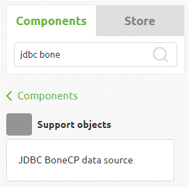
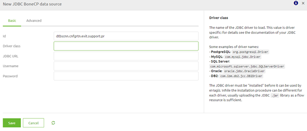
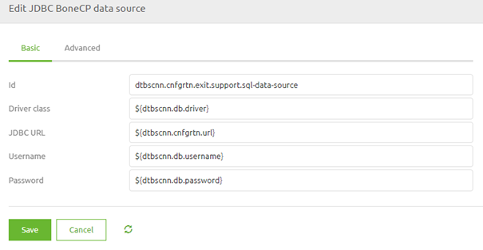
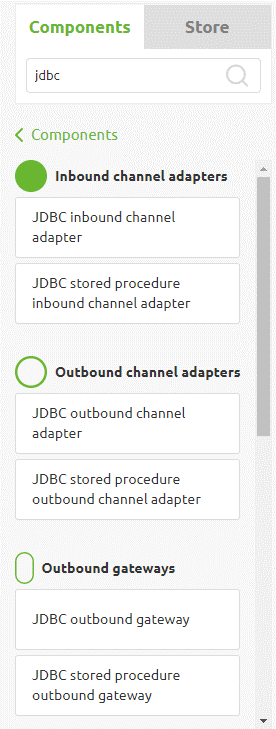
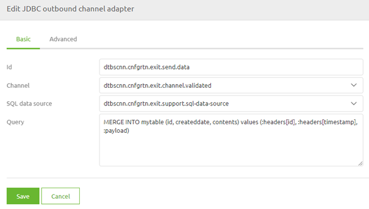

    

        <main class="micro-learning">
        <ul class="doc-nav">
            <li class="doc-nav__item"><a href="../../docs/microlearning/advanced-database-connectivity-index" class="doc-nav__link">Home</a></li>
            <li class="doc-nav__item"><a href="#intro" class="doc-nav__link">Intro</a></li>
            <li class="doc-nav__item"><a href="#theory" class="doc-nav__link">Theory</a></li>
            <li class="doc-nav__item"><a href="#practice" class="doc-nav__link">Practice</a></li>
            <li class="doc-nav__item"><a href="#solution" class="doc-nav__link">Solution</a></li>
        </ul>

##### Intro

# Database connectivity

In this microlearning, we will discuss how to ensure that you can connect with a database for writing or retrieving data. The focal point will lie on the Create phase of eMagiz and the configuration elements needed to configure the connectivity.

Should you have any questions, please get in touch with academy@emagiz.com.

- Last update: January 21st, 2022
- Required reading time: 6 minutes

## 1. Prerequisites
- Advanced knowledge of the eMagiz platform

## 2. Key concepts
The focus of this microlearning will be on the needed connectivity settings for communication between eMagiz and databases.

We mean the configuration needed to establish a connection between eMagiz and the database by connectivity.

There are three critical considerations when setting up the connectivity:

- Do you have a proper JDBC driver for the database type you want to connect to?
- Is the database URL known, or can it be determined?
- Is the authentication information known?

##### Theory
  
## 3. Database connectivity

In this microlearning, we will discuss how to ensure that you can connect with a database for writing or retrieving data. The focal point will lie on the Create phase of eMagiz and the configuration elements needed to configure the connectivity.

There are three critical considerations when setting up the connectivity:

- Do you have a proper JDBC driver for the database type you want to connect to?
- Is the database URL known, or can it be determined?
- Is the authentication information known?

### 3.1 Setting up the connection component

To set up a connection to the database, we need to configure a JDBC component to set up the connection between eMagiz and the database. This component can be added to your flow in the Create phase of eMagiz. You can easily find the correct piece by searching for "JDBC bone" on the Component level.

After you have added the component to the flow, you can provide a logical name and fill in the relevant information (with the help of properties). Please check the provided help text for additional guidance when configuring the connection component.

As the URL and the authentication will most likely differ between environments, we advise using properties when configuring the component in the Create phase. Note that the driver class, username, and password are general in nature and that the URL is specific for a table within the database. You can reflect this difference in the naming of the properties.

### 3.2 Adding the driver

Apart from configuring the connection component, you also need to add the jar file representing the JDBC driver to the flow in which you want to establish the connection between eMagiz and the database. Which driver is suitable for your specific implementation depends on the type of database and the version of the database with whom you are connecting. To add a resource, you can navigate to the Resources tab within the flow and press Upload new resource. In addition, you can select the right resource in the pop-up and give the resource a proper description. Note that you need to choose the Resource type called Other to store the driver correctly within the flow.

Now that we have added the driver, we can return to the flow for our final configuration step.

### 3.3 Entering the query

Once you have laid the groundwork for a stable connection between eMagiz and the database, the final step will define the correct SQL query. Depending on your specific activity, you need a different component. For example, like with web services and REST services, eMagiz offers various components to retrieve or write data. See below for the complete list.

We will use a simple outbound channel adapter to illustrate the functionality in this example. After adding the component to the flow, you need to ensure that the element is linked to the data source component and that you have added a query to write (or retrieve) data. An example of how this could work is displayed below. You can use the message payload and headers from the input message as parameters in the query by using the colon prefix notation.

##### Practice

## 4. Assignment

Build a database connection between eMagiz and a database. This assignment can be completed with the help of the (Academy) project that you have created/used in the previous assignment.

## 5. Key takeaways

- Do you have a proper JDBC driver for the database type you want to connect to?
- Is the database URL known, or can it be determined?
- Is the authentication information known?
- Don't forget to add the driver as a resource to the flow
- Define your query with the help of headers and the payload

##### Solution

## 6. Suggested Additional Readings

If you are interested in this topic and want more information, please read the release notes provided by eMagiz. Furthermore, check out the help text provided within the platform and see if the store can help you make the configuration a little bit easier.

## 7. Silent demonstration video

This video demonstrates a working solution and how you can validate whether you have completed the assignment.

<iframe width="1280" height="720" src="../../vid/microlearning/advanced-database-connectivity-configuration.mp4" frameborder="0" allow="accelerometer; autoplay; clipboard-write; encrypted-media; gyroscope; picture-in-picture" allowfullscreen></iframe>

</main>

