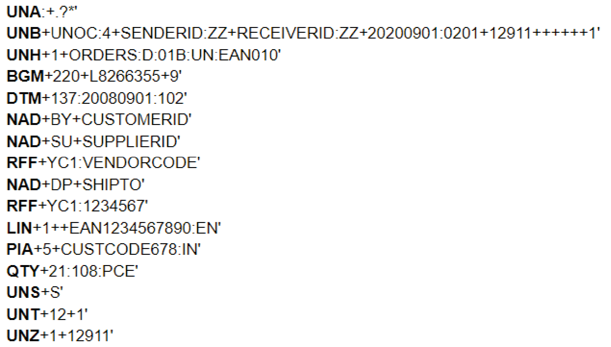

    

        <main class="micro-learning">
        <ul class="doc-nav">
            <li class="doc-nav__item"><a href="../../docs/microlearning/advanced-key-concepts-datamodeling-validation-index" class="doc-nav__link">Home</a></li>
            <li class="doc-nav__item"><a href="#intro" class="doc-nav__link">Intro</a></li>
            <li class="doc-nav__item"><a href="#theory" class="doc-nav__link">Theory</a></li>
            <li class="doc-nav__item"><a href="#practice" class="doc-nav__link">Practice</a></li>
            <li class="doc-nav__item"><a href="#solution" class="doc-nav__link">Solution</a></li>
        </ul>

 
##### Intro

# Understanding EDI modeling in context of eMagiz
 
This micro-learning will focus the tranformation from EDI to an XML message. EDI (Electronic Data Interchange) is a very specific format of a message that can be interpreted by some systems. Rather than providing XML tags or curly JSON brackets, you will find a flat file that is very well organized but used lots or abbreviations or tags to identify entities and attributes in the message. This microlearning will explain more around these structures and how to create such EDI messages when you have an XML prepared. 

Should you have any questions, please contact academy@emagiz.com.

- Last update: November 2nd, 2021
- Required reading time: 10 minutes

## 1. Prerequisites
- Advanced knowledge of the eMagiz platform
- Completed microlearning 

## 2. Key concepts
An example of an EDI message is listed below. Each line starts with a tag that indicates the meaning of the line, and each message starts with fixed starting tags (UNA) and fixed ending tags (UNZ).

There are a lot of different versions of EDI each indicated with version id. A commonly used version is D96A, while versions D01B, D95A, D01A, etc exists. It's important to understand upfront what the version used is from the client, allthough the EDI message itself contains that information. The example above is a D01B version - see 3rd line. Within each version of EDI there is a specific type of data exchanged. Such as orders, invoices, confirmations, etc. In the example above this is an ORDERS message. Each of the version and data type combination has a specific message definition that is required to obtain in order to create the System Message.

##### Theory
  
## 3. Modeling & validating EDI in eMagiz

##### Practice

## 4. Assignment

Review the release notes in the Portal, be sure to understand the release notes of each cloud template. And which are service affecting and which ones not.

## 5. Key takeaways

- Cloud templates can be rolled-out automatically via the upgrade options. Regardless of the type of environment (Test, Acceptance or Production)
- Double lane Cloud template upgrades are non-service affecting.
- Make sure to keep your Deploy architecture current - less risk of impact of Cloud template upgrade issues.

##### Solution

## 6. Suggested Additional Readings

If you are interested in this topic and want more information on it, please read the release notes provided by eMagiz

## 7. Silent demonstration video

There is no video available as this is more a theoretical microlearning.

</main>

