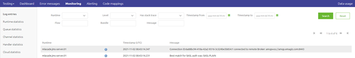

    

        <main class="micro-learning">
        <ul class="doc-nav">
            <li class="doc-nav__item"><a href="../../docs/microlearning/advanced-key-platform-concepts-index" class="doc-nav__link">Home</a></li>
            <li class="doc-nav__item"><a href="#intro" class="doc-nav__link">Intro</a></li>
            <li class="doc-nav__item"><a href="#theory" class="doc-nav__link">Theory</a></li>
            <li class="doc-nav__item"><a href="#practice" class="doc-nav__link">Practice</a></li>
            <li class="doc-nav__item"><a href="#solution" class="doc-nav__link">Solution</a></li>
        </ul>

##### Intro

# What data is stored on runtime level
 
A vital part of the eMagiz architecture is the runtime. The runtime holds all flows related to a particular process or system. Without runtimes to run your flows on, there would be no processing of data. In this microlearning, we will zoom in on the runtime level to discern what data is stored at the runtime level.

Should you have any questions, please get in touch with academy@emagiz.com.

- Last update: November 1st, 2021
- Required reading time: 5 minutes

## 1. Prerequisites
- Advanced knowledge of the eMagiz platform

## 2. Key concepts
This microlearning centers around what data is stored on runtime level
With a runtime, we mean: A container holds all flows related to a particular process or system

Relevant information on data stored on runtime level:

- Log information (what is happening on this runtime)
- Temporary data storage (H2, in case of messaging)
- 'State' of the flow (i.e., which flow version is running and which is active)

##### Theory
  
## 3. What data is stored on runtime level

A vital part of the eMagiz architecture is the runtime. The runtime holds all flows related to a particular process or system. Without runtimes to run your flows on, there would be no processing of data. In this microlearning, we will zoom in on the runtime level to discern what data is stored at the runtime level.

Relevant information on data stored on runtime level:

- Log information (what is happening on this runtime)
- Temporary data storage (H2, in case of messaging)
- 'State' of the flow (i.e., which flow version is running and which is active)

### 3.1 Log Information

The first aspect of data stored on the runtime level is the logging produced by the runtime and the flows running on the runtime. This logging is divided into three categories (INFO, WARNING, and ERROR). Each type of logging has a different meaning when looking at it. The logging is made available via the eMagiz platform within the Manage phase of eMagiz.

As learned in previous microlearnings, you can configure alerting on this logging so you (and others) get notified when something is not running as it should. Furthermore, you can zoom in on the relevant logging per runtime due to the various filter options.

### 3.2 Temporary data storage

When using the messaging pattern, you will, on default, have functionality in each entry that stores messages temporarily in the H2 database. This is done to let the H2 database act as a bridge between the queueing mechanism of eMagiz and the external party delivering data. For more information on how this works in detail please check out this [microlearning](intermediate-solution-architecture-function-of-h2-database.md). To secure the data in the H2 database, eMagiz uses the AES-128 encryption algorithm. These algorithms ensure that even if third parties could get to the data on that encrypted filesystem, they won't be able to read the data. That way, the data is kept confidential.

### 3.3 'State' of the flow

The third aspect of data stored on the runtime level is the 'state' of the flow. This means that each runtime knows which flows (including version) are active and not active within the runtime context. Consequently, to start over with a clean slate, you need to wipe the state of the flows on a runtime level. On the cloud level, you can do this via a reset runtime action. More info on that action can be found in this [microlearning](intermediate-emagiz-cloud-management-reset-runtime.md). You can achieve the same effect for on-premise deployments by wiping the data folder without touching the H2 folder (otherwise, you also throw away data).

##### Practice

## 4. Assignment

Analyze what you can learn from reading the logging that is produced on the runtime level. This assignment can be completed with the help of the (Academy) project that you have created/used in the previous assignment.

## 5. Key takeaways

- Log information (what is happening on this runtime)
- Temporary data storage (H2, in case of messaging)
- 'State' of the flow (i.e., which flow version is running and which is active)

##### Solution

## 6. Suggested Additional Readings

If you are interested in this topic and want more information, please read the release notes provided by eMagiz.

## 7. Silent demonstration video

As this is a more theoretical microlearning, we have no video that accompanies this microlearning.

</main>

