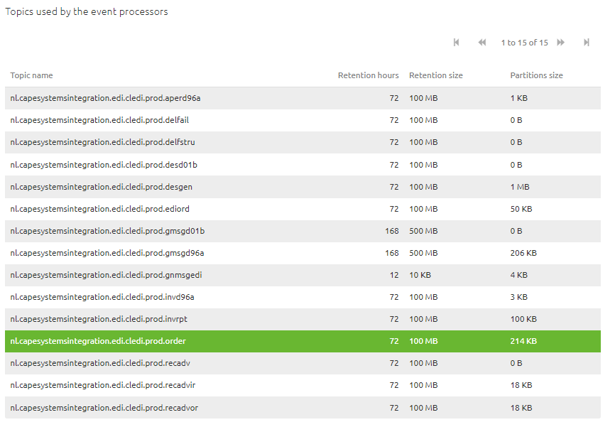

    

        <main class="micro-learning">
        <ul class="doc-nav">
            <li class="doc-nav__item"><a href="../../docs/microlearning/advanced-keyconcepts-eventstreaming-index" class="doc-nav__link">Home</a></li>
            <li class="doc-nav__item"><a href="#intro" class="doc-nav__link">Intro</a></li>
            <li class="doc-nav__item"><a href="#theory" class="doc-nav__link">Theory</a></li>
            <li class="doc-nav__item"><a href="#practice" class="doc-nav__link">Practice</a></li>
            <li class="doc-nav__item"><a href="#solution" class="doc-nav__link">Solution</a></li>
        </ul>

##### Intro

# Monitoring Topic size

Should you have any questions, please get in touch with academy@emagiz.com.

- Last update: November 1st, 2021
- Required reading time: 5 minutes

## 1. Prerequisites
- Advanced knowledge of the eMagiz platform
- Complete relevant Event Streaming microlearnings from Crash course to Intermediate

## 2. Key concepts

##### Theory
  
## 3. How to monitor topic sizing

##### Practice

## 4. Assignment

Take a moment to review your Event Streaming solution and find the Manage - Montoring section to see the topic statistics. Review if you can reproduce the numbers above.

## 5. Key takeaways

- Topic statistics are available in the Manage - Monitoring section and can be used to see the actual size of the topic
- Decisions around sizing of topics can be made using these monitoring data points to determine the optimal configuration of topics across environments

##### Solution

## 6. Suggested Additional Readings

If you are interested in this topic and want more information, please read the release notes provided by eMagiz.

## 7. Silent demonstration video

As this is a more theoretical microlearning, we have no video that accompanies this microlearning.

</main>

