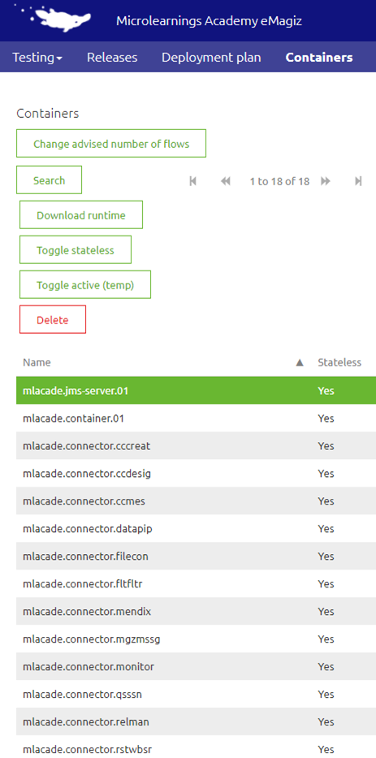
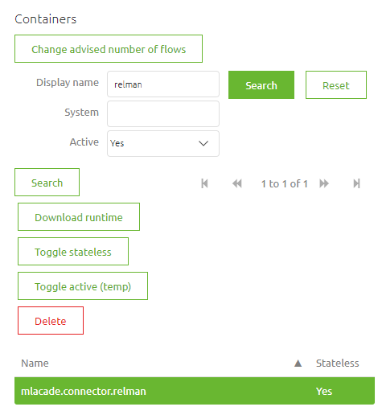
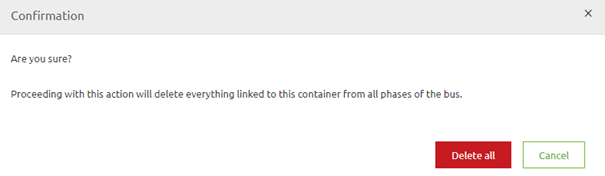
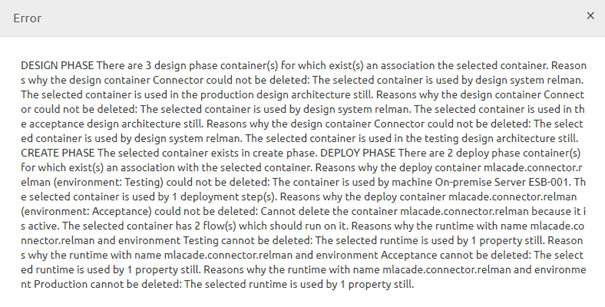
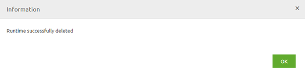

    

        <main class="micro-learning">
        <ul class="doc-nav">
            <li class="doc-nav__item"><a href="../../docs/microlearning/advanced-lifecycle-management-index" class="doc-nav__link">Home</a></li>
            <li class="doc-nav__item"><a href="#intro" class="doc-nav__link">Intro</a></li>
            <li class="doc-nav__item"><a href="#theory" class="doc-nav__link">Theory</a></li>
            <li class="doc-nav__item"><a href="#practice" class="doc-nav__link">Practice</a></li>
            <li class="doc-nav__item"><a href="#solution" class="doc-nav__link">Solution</a></li>
        </ul>

#####Intro

# Cleanup a deployed runtime
 
In this microlearning, we will focus on the last step of cleaning up a system (runtime). As we learned in previous microlearnings, the lifecycle management process starts in Manage and ends in Capture. Following that logic, the last step is to remove the integration from Capture (and potentially the system). Having said that, when you already have a running solution that you want to remove, there is an additional step needed after you have successfully deleted the last integration in Capture and the accompanying system. That step is the deletion of the runtime and is the focus of this microlearning.

Should you have any questions, please get in touch with academy@emagiz.com.

- Last update: August 20th, 2021
- Required reading time: 5 minutes

## 1. Prerequisites
- Advanced knowledge of the eMagiz platform
- Being a bus owner on at least one project

## 2. Key concepts
This microlearning is about cleaning up a deployed runtime.

By deployed runtime, we mean: A system that is/was part of an active release at some time and therefore was hosting flows.

There are two essential considerations before cleaning up a deployed runtime:

- Is the runtime deactivated on all three environments?
- Did you execute all previous steps correctly?

##### Theory
  
## 3. Cleanup a deployed runtime

In this microlearning, we will focus on the last step of cleaning up a system (runtime). As we learned in previous microlearnings, the lifecycle management process starts in Manage and ends in Capture. Following that logic, the last step is to remove the integration from Capture (and potentially the system). Having said that, when you already have a running solution that you want to remove, there is an additional step needed after you have successfully deleted the last integration in Capture and the accompanying system. That step is the deletion of the runtime and is the focus of this microlearning.

There are two essential considerations before cleaning up a deployed runtime:

- Is the runtime deactivated on all three environments?
- Did you execute all previous steps correctly?

When you know that you can delete a runtime, you have to notify the bus owner on your project to delete that runtime (system). In case you are the bus owner, you can skip this step. Following this, the bus owner should navigate to the Deploy phase of eMagiz and open the Container overview.

In this overview, you can search the runtime name to find the runtime you want to deactivate.

After you have found the runtime, you can deactivate it by pressing the toggle active button. Note that you should do so on all three environments before continuing with the next step, the actual cleanup of the deployed integration.

When you know you can delete the runtime, you can press the button Delete to clean up the deployed runtime. After you press the button, you will see a confirmation pop-up notifying you that going through with this will remove everything without there being any way of getting it back.

The moment you press the button Delete All in the confirmation pop-up, eMagiz will start deleting the runtime and cleaning up all relevant associations across the various phases of eMagiz. Note that when you have forgotten one of the previous steps of the cleanup, eMagiz will let you know. As a result, the runtime will **not** be deleted by eMagiz until you have appropriately executed those steps.

If you executed all previous steps correctly, eMagiz would notify you that the runtime is deleted correctly and you have successfully finished your runtime (system) cleanup.

Armed with this knowledge, you can make the correct decision in cases where you consider cleaning up the deployed runtime.

##### Practice

## 4. Assignment

Determine whether you can clean up a deployed runtime within your project. If so, execute the cleanup.
This assignment can be completed with the help of the (Academy) project that you have created/used in the previous assignment.

## 5. Key takeaways

- There are two essential considerations before cleaning up a deployed runtime:
    - Is the runtime deactivated on all three environments?
    - Did you execute all previous steps correctly?
- Before deletion, eMagiz will ask for confirmation
- Deletion means that you cannot get it back anymore

##### Solution

## 6. Suggested Additional Readings

If you are interested in this topic and want more information on it, please read the release notes provided by eMagiz

## 7. Silent demonstration video

This video demonstrates how you could have handled the assignment and gives you some context on what you have just learned. 

<iframe width="1280" height="720" src="../../vid/microlearning/advanced-lifecycle-management-cleanup-a-deployed-runtime.mp4" frameborder="0" allow="accelerometer; autoplay; clipboard-write; encrypted-media; gyroscope; picture-in-picture" allowfullscreen></iframe>

</main>

