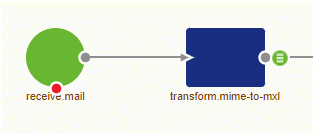

    

        <main class="micro-learning">
        <ul class="doc-nav">
            <li class="doc-nav__item"><a href="../../docs/microlearning/advanced-mail-based-connectivity-index" class="doc-nav__link">Home</a></li>
            <li class="doc-nav__item"><a href="#intro" class="doc-nav__link">Intro</a></li>
            <li class="doc-nav__item"><a href="#theory" class="doc-nav__link">Theory</a></li>
            <li class="doc-nav__item"><a href="#practice" class="doc-nav__link">Practice</a></li>
            <li class="doc-nav__item"><a href="#solution" class="doc-nav__link">Solution</a></li>
        </ul>

##### Intro

# Receive emails

We explained the MIME protocol in a previous [microlearning](advanced-mail-connectivity-whatis-mime.md). In this microlearning, we will expand our knowledge by learning how to receive emails with the help of MIME messages via the eMagiz platform.

Should you have any questions, please get in touch with academy@emagiz.com.

- Last update: January 27th, 2022
- Required reading time: 6 minutes

## 1. Prerequisites
- Advanced knowledge of the eMagiz platform
- Understanding of the MIME concept

## 2. Key concepts
- There are two options when retrieving emails (IMAP and standard)
- Use IMAP when you want to listen and wait for emails to be pushed to eMagiz
- Use standard mail when you actively want to poll for messages
- Both options have a MIME output that should be transformed to XML for further processing

##### Theory
  
## 3. Receive emails

We explained the MIME protocol in a previous [microlearning](advanced-mail-connectivity-whatis-mime.md). In this microlearning, we will expand our knowledge by learning how to receive emails with the help of MIME messages via the eMagiz platform.

When you want to receive emails from an email server, you have two options in eMagiz. The two options are IMAP and "standard" mail. The difference between the two is that you listen to a particular mailbox with the IMAP component and wait till email messages are pushed to you. However, the "standard" mail component allows you to actively poll at a frequency most suited to you to see whether there are new mails that need to be processed.

Regardless of which of the two options you end up choosing, note that both have a MIME message as output. To further process the information within the MIME message, you most likely will need a MIME to XML transformation. Exceptions to this might be any mail solution in which the attachments are significant for data processing. In those cases, you might need to consider a different approach.

In the remainder of this microlearning, we will zoom in on how you should configure both options within a flow in eMagiz.

### 3.1 IMAP

As stated above, the IMAP option allows you to listen to a specific mailbox and wait till mail messages are pushed to eMagiz. To configure this in eMagiz, we need to open a flow in eMagiz and enter "Start Editing" mode. The first component we need is an IMAP idle channel adapter. Search for the component by typing in IMAP to select the suitable component. Once you have found the component, please drag it onto the canvas.

Once you have added the component to the canvas, we need to add a channel to the flow that will serve as the output channel for our component. This is necessary because we want to transform the MIME message to XML before further processing the message.

Once you open the component, you will see a basic and advanced tab. For our configuration, we start at the basic tab. Here we need to select the proper output channel and define the Store URI. The Store URI describes which mailbox at which mail server you want to connect to and which username and password you need to authenticate yourself. Please check out the help text when configuring the component to identify the correct structure.

Once you have defined the correct information elements on the basic tab, it has become time to shift our attention to the advanced tab. In most cases, the default setting will suffice; however, it is good to know that you have specific options to customize the component's behavior when a message is processed. Below you see the default setting eMagiz provides you.

The help text will explain what the setting does for every option. Based on that explanation, you should be able to determine whether it is wise to deviate from the standard in your particular setup or not. Once you are satisfied with your chosen settings, press Save.

To ensure that we can validate and transform the mail message further upstream, we need to transform the MIME message to an XML message. Then, drag the "MIME message transformer to XML" on the canvas and select the correct input and output channel. As a result, your solution should look as follows.

### 3.2 "Standard" mail

As stated above, the "standard" mail option allows you to poll at your interval to check whether new messages have arrived. To configure this in eMagiz, we need to open a flow in eMagiz and enter "Start Editing" mode. The first component we need is a "Mail inbound channel adapter." Select the category inbound channel adapter and search for mail. Once you have the component, please drag it onto the canvas.

Once you have added the component to the canvas, we need to add a channel to the flow that will serve as the output channel for our component. This is required because we want to transform the MIME message to XML before further processing the message.

Once you open the component, you will see a basic and advanced tab. For our configuration, we start at the basic tab. Here we need to select the correct output channel, define the Store URI and define our poller. The Store URI describes which mailbox at which mail server you want to connect to and which username and password you need to authenticate yourself. Please check out the help text when configuring the component to identify the correct structure. Finally, the poller defines the frequency with which you will check the mailbox for new messages. Finally, we advise using the cron trigger option for the poller, as that gives you the flexibility to define this dynamically across environments.

Once you have defined the correct information elements on the basic tab, it has become time to shift our attention to the advanced tab. In most cases, the default setting will suffice; however, it is good to know that you have specific options to customize the component's behavior when a message is processed. Below you see the default setting eMagiz provides you.

The help text will explain what the setting does for every option. Based on that explanation, you should be able to determine whether it is wise to deviate from the standard in your particular setup or not. Once you are satisfied with your chosen settings, press Save.

To ensure that we can validate and transform the mail message further upstream, we need to transform the MIME message to an XML message. Drag the "MIME message transformer to XML" on the canvas and select the correct input and output channel. As a result, your solution should look as follows.

##### Practice

## 4. Assignment

Build two flows that can receive emails. One flow should use the IMAP configuration, and the other should use the "standard" configuration. This assignment can be completed with the help of the (Academy) project that you have created/used in the previous assignment.

## 5. Key takeaways

- There are two options when retrieving emails (IMAP and standard)
- Use IMAP when you want to listen and wait for emails to be pushed to eMagiz
- Use standard mail when you actively want to poll for messages
- Both options have a MIME output that should be transformed to XML for further processing

##### Solution

## 6. Suggested Additional Readings

If you are interested in this topic and want more information, please read the release notes and help texts provided by eMagiz. Furthermore, check out the following links:

- https://docs.spring.io/spring-integration/docs/2.1.x/reference/html/mail.html#mail-inbound
- https://docs.spring.io/spring-integration/reference/html/mail.html

## 7. Silent demonstration video

This video demonstrates a working solution and how you can validate whether you have completed the assignment.

<iframe width="1280" height="720" src="../../vid/microlearning/advanced-mail-connectivity-receive-email-mailserver.mp4" frameborder="0" allow="accelerometer; autoplay; clipboard-write; encrypted-media; gyroscope; picture-in-picture" allowfullscreen></iframe>

</main>

