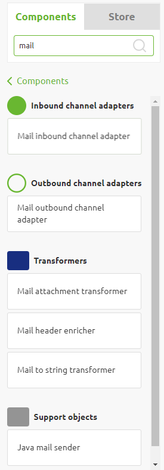
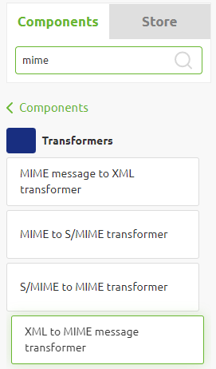
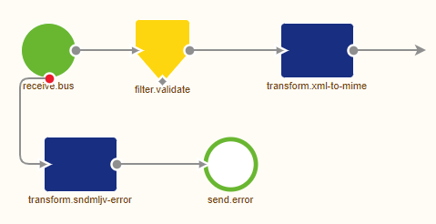
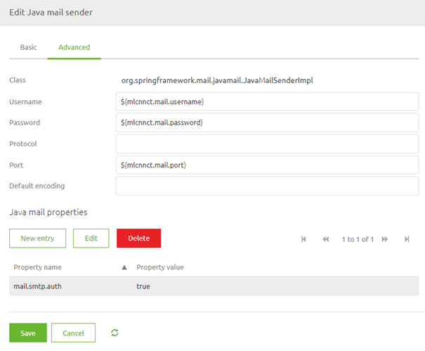
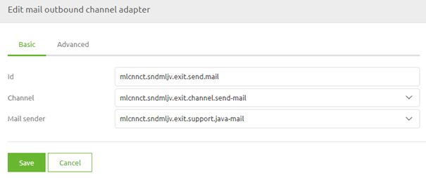

    

        <main class="micro-learning">
        <ul class="doc-nav">
            <li class="doc-nav__item"><a href="../../docs/microlearning/advanced-mail-connectivity-index" class="doc-nav__link">Home</a></li>
            <li class="doc-nav__item"><a href="#intro" class="doc-nav__link">Intro</a></li>
            <li class="doc-nav__item"><a href="#theory" class="doc-nav__link">Theory</a></li>
            <li class="doc-nav__item"><a href="#practice" class="doc-nav__link">Practice</a></li>
            <li class="doc-nav__item"><a href="#solution" class="doc-nav__link">Solution</a></li>
        </ul>

##### Intro

# Send MIME messages

We explained the MIME protocol in the previous [microlearning](advanced-mail-connectivity-whatis-mime.md). In this microlearning, we will expand our knowledge by learning how to send emails with the help of MIME messages via the eMagiz platform.

Should you have any questions, please get in touch with academy@emagiz.com.

- Last update: January 24th, 2021
- Required reading time: 5 minutes

## 1. Prerequisites
- Advanced knowledge of the eMagiz platform
- Understanding of the MIME concept

## 2. Key concepts
- Use the standard components of eMagiz for MIME messages
- Use the standard mail definition provided by eMagiz to structure your MIME message

##### Theory
  
## 3. Send MIME messages

We explained the MIME protocol in the previous [microlearning](advanced-mail-connectivity-whatis-mime.md). In this microlearning, we will expand our knowledge by learning how to send emails with the help of MIME messages via the eMagiz platform.

eMagiz provides you with a variety of mail-related components to send mail. See below for a snapshot of the current list of components offered by eMagiz with regards to mail. To send a mail, we need at least the support object called "Java mail sender" and the outbound channel adapter called "Mail outbound channel adapter" from the list below.

### 3.1 Setting up the MIME message

However, before sending a mail with the help of these components, we first need to make sure that the payload of our message is not just a string in JSON or XML form but is a message of the MIME type. For example, you can use a standard component in eMagiz called "XML to MIME message transformer" to achieve this. Note that when transforming your XML to MIME, eMagiz expects a specific structure. For example, the XSD belonging to this structure can be found in the Store under the Store item called: "Send Mail - Java."

So to transform our XML to MIME, we should prepare our XML with the help of the transformation tooling (i.e., message mapping) that eMagiz offers. In the case of messaging, you can define your system message to be equal to the structure as described in the Store item by importing the item from the Store. The same logic applies to the API Management and Event Streaming pattern in eMagiz.

If you want to build it by hand, make sure that the structure is perfect; otherwise, the standard component won't function.

Once you have defined the XML structure and have created the proper transformation, the next step would be to validate the message and afterward transform the XML to a MIME message. An example of how this can be implemented can be found below. 

Note that before you can correctly configure your "XML to MIME transformer," you first need to define your "Java mail sender" support object. In here, you need to fill in, at the minimum, a reference to the host and the port of the mail server to whom you want to connect. When setting up the connection, we will focus on this component in more detail.

### 3.2 Sending the email

We need to define a mail outbound channel adapter and link it to the Java mail sender to send the email. We also need to consider specific configurations for our Java mail sender, such as providing a username/password combination because the mail server expects an authenticated request. To define the username and password, open the Java mail sender component, navigate to the Advanced tab, define the username and password with the help of properties and define a Java mail property as specified in the help text. The result should look something as follows.

Note that there are many more java mail properties that could be defined. Which properties to define largely depends on the mail server you are setting up a connection with. An overview of some other java mail properties can be found [here](https://javaee.github.io/javamail/docs/api/com/sun/mail/smtp/package-summary.html).

Now that we have configured the Java mail sender, it is time to link the components together. To do so, please open the mail outbound channel adapter and select the correct mail sender from the dropdown list.

##### Practice

## 4. Assignment

Build a flow that can send emails. This assignment can be completed with the help of the (Academy) project that you have created/used in the previous assignment.

## 5. Key takeaways

- Setting up the message in MIME makes it easier to use the Java mail components
- Check out the Store for the relevant store item
- Verify the settings needed to connect to the external mail server before you start building the flow
- Make sure that the transformation to MIME and sending of the mail happens in one flow

##### Solution

## 6. Suggested Additional Readings

If you are interested in this topic and want more information, please read the release notes and help texts provided by eMagiz. Furthermore, check out the following links:

- https://docs.spring.io/spring-integration/docs/2.1.x/reference/html/mail.html#mail-outbound
- https://docs.spring.io/spring-integration/reference/html/mail.html

## 7. Silent demonstration video

This video demonstrates a working solution and how you can validate whether you have completed the assignment.

<iframe width="1280" height="720" src="../../vid/microlearning/advanced-mail-connectivity-using-mime.mp4" frameborder="0" allow="accelerometer; autoplay; clipboard-write; encrypted-media; gyroscope; picture-in-picture" allowfullscreen></iframe>

</main>

