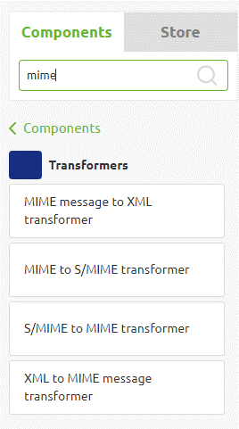

    

        <main class="micro-learning">
        <ul class="doc-nav">
            <li class="doc-nav__item"><a href="../../docs/microlearning/advanced-mail-based-connectivity-index" class="doc-nav__link">Home</a></li>
            <li class="doc-nav__item"><a href="#intro" class="doc-nav__link">Intro</a></li>
            <li class="doc-nav__item"><a href="#theory" class="doc-nav__link">Theory</a></li>
            <li class="doc-nav__item"><a href="#practice" class="doc-nav__link">Practice</a></li>
            <li class="doc-nav__item"><a href="#solution" class="doc-nav__link">Solution</a></li>
        </ul>

##### Intro

# MIME explained

In this microlearning, we will explain the MIME protocol. Within eMagiz, the MIME protocol can send (and receive) mails to external parties. Therefore it is helpful to learn what the MIME protocol is all about. 

Should you have any questions, please get in touch with academy@emagiz.com.

- Last update: January 24th, 2022
- Required reading time: 5 minutes

## 1. Prerequisites
- Advanced knowledge of the eMagiz platform

## 2. Key concepts
The focus of this microlearning will be learning about the MIME protocol.

- MIME (Multipurpose Internet Mail Extensions) extends the original Simple Mail Transport Protocol (SMTP) email protocol.

##### Theory
  
## 3. MIME explained

In this microlearning, we will explain the MIME protocol. Within eMagiz, the MIME protocol can send (and receive) mails to external parties. Therefore it is helpful to learn what the MIME protocol is all about. 

MIME (Multipurpose Internet Mail Extensions) extends the original Simple Mail Transport Protocol (SMTP) email protocol. It lets users exchange different data files, including audio, video, images, and application programs, over email.

Several advantages of MIME are:

- Users can send different kinds of binary attachments via email.
- Multiple attachments of different types can be included in the same email.
- There are no limits on message length.
- Multipart messages are supported.

Within eMagiz, there are several MIME-related components available. For a snapshot of the current list, please see below.

These components give you the option to transform from and to MIME (or S/MIME) messages. Once you have structured the message correctly, you can send an email or interpret the email someone sends you and use the XML representation to inform other systems of the info received via the email. For more information on how to exactly use these components, please check out the following microlearnings within this course.

### 3.1 MIME vs S/MIME

The main difference between MIME and S/MIME is that S/MIME is a more secure version of the MIME protocol that allows messages to be encrypted between sender and receiver. This encryption intends to prevent unauthorized parties from reading the content of the message. Note that to use the S/MIME component within eMagiz, you need the proper keys stored in the Keystore and truststore, and you will most likely need to transfer your XML message first to MIME before securing it.

##### Practice

## 4. Assignment

Take a moment to review your Event Streaming solution and find the Manage - Monitoring section to see the topic statistics. Review if you can reproduce the numbers above.

## 5. Key takeaways

- MIME is a protocol to send emails in a more extensive format compared to SMTP
- MIME has several advantages over standard SMTP messages
- When you need a more secure option, you can use S/MIME instead of MIME

##### Solution

## 6. Suggested Additional Readings

If you are interested in this topic and want more information, please read the release notes provided by eMagiz. Furthermore, please check out the following links:

- https://whatis.techtarget.com/definition/MIME-Multi-Purpose-Internet-Mail-Extensions
- https://en.wikipedia.org/wiki/MIME
- https://developer.mozilla.org/en-US/docs/Web/HTTP/Basics_of_HTTP/MIME_types
- https://www.encyclopedia.com/economics/encyclopedias-almanacs-transcripts-and-maps/mimesmime

## 7. Silent demonstration video

As this is a more theoretical microlearning, we have no video that accompanies this microlearning.

</main>

