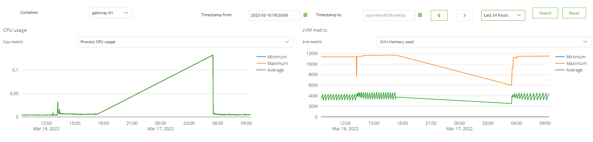

    

        <main class="micro-learning">
        <ul class="doc-nav">
            <li class="doc-nav__item"><a href="../../docs/microlearning/advanced-monitoring-apigateway-index" class="doc-nav__link">Home</a></li>
            <li class="doc-nav__item"><a href="#intro" class="doc-nav__link">Intro</a></li>
            <li class="doc-nav__item"><a href="#theory" class="doc-nav__link">Theory</a></li>
            <li class="doc-nav__item"><a href="#practice" class="doc-nav__link">Practice</a></li>
            <li class="doc-nav__item"><a href="#solution" class="doc-nav__link">Solution</a></li>
        </ul>

##### Intro

# Monitoring API Gateway runtime metrics
In your API Gateway solution, it is important to be able to review the API Gateway runtime metrics. These statistics are available in Generation 3 based runtimes, and available via the Manage phase --> Monitoring Gen3.

Should you have any questions, please get in touch with academy@emagiz.com.

- Last update: March 17th, 2022
- Required reading time: 5 minutes

## 1. Prerequisites
- Advanced knowledge of the eMagiz platform
- Complete relevant API Gateway microlearnings from Crash course to Intermediate

## 2. Key concepts
The runtime metrics are the data points stored around the use resources by the runtime. Resources such as storage, memory and CPU. In the runtime metrics view you will find the CPU usage and the JVM memory usage.

##### Theory
  
## 3. Monitoring runtime metrics

Navigate to the Manage phase and select Monitoring Gen3. Select the Container for which the investigation is needed, and the view will display the values for that container. The default time interval selected is 24 hours.

### 3.1 CPU Usage

In the CPU metrics section, you can find the cpu usage of the process which is in this case the runtime selected. Based on the time interval selected, the X-axis will show accordingly. The Y-axis shows the % of the CPU used for the selected process. Normally the CPU usage varies across time, yet is not high in percentage. In case there are some issue due to high memory used the %CPU usage will increase.

In the dropdown, there are several graphs that are explained below:
- Process CPU usage : displays the actual CPU usage for the process 
- System CPU Usage  : displays the actual CPU usage for the entire system where the process runs on. Several processes might be active on that system
- System CPU Count  : display the actual number of CPU's available

### 3.2 JVM memory

The JVM memory indicates the total memory used for the Java Virtual Machine (JVM) that the selected container/process needs. The JVM memory section contains several sections dedicated for java processes to run properly. eMagiz uses the native memory section (called non-heap or metaspace in previous pages of eMagiz) to load flows into, and the heap memory section to allows processing of messages. As a user, you can influence these heap and native memory settings under Deploy -> Architecture to create the best balance. eMagiz supports this by advising you on the desired setting per JVM (runtime).

As can be seen in the screenshot above, the average, minimum, and maximum values are displayed across the time interval selected. In the dropdown there are several options for displaying memory
- JVM memory used       : displays the actual total memory consumption of the process involved
- JVM memory committed  : displays the actual memory committed for installing the flows in that container process
- JVM memory max        : displays the maximum memory configured for this container process
- JVM Thread states     : displays the thread analysis for that container process. Each thread represents a task that is executed on that JVM. This could be the consumption of a message, the registration of a queue, etc. An ever-growing number of live threads indicates that there might be something wrong. 

### 3.3 Relation between the graphs
In this section, we will highlight how the graphs shown on this page are connected. This way you get a better picture of how the various parts are related.

- CPU usage and heap memory.
    - An increase in both heap memory as well as CPU is a strong indication that a lot of traffic (in MBs) is being processed. This could be the result of a lot of messages being processed or one or a few large ones.
    - A decrease in heap memory, from a high point, combined with a slight increase in CPU is a strong indication that garbage collection has kicked in.
    - An explosive increase in both heap memory as well as CPU is a strong indication that the runtime might be having memory problems.
    - A decrease in both heap memory, as well as CPU, is an indication that not a lot of messages are being processed

- CPU usage and the number of threads.
    - An increase in CPU usage and the number of threads means that more tasks are needed to handle the data that is being processed
    - A decrease in CPU usage and the number of threads means that fewer tasks are handled
    -0 A decrease in CPU and an increase in the number of threads is an indication that although more tasks are needed this has no impact on CPU usage

- Heap memory and number of threads
    - An increase in heap memory and the number of threads indicates that more tasks are taken up more memory
    - An decrease in heap memory and the number of threads indicates that fewer tasks take up less memory

##### Practice

## 4. Assignment

Take a moment to review your API Gateway solution and find the Manage - Montoring section to see the runtime metrics. Review if you can understand these values

## 5. Key takeaways

- The 2 key items to consider for runtime metrics are CPU usage and memory usage
- There are various graphs that can be used together to locate potential issues.

##### Solution

## 6. Suggested Additional Readings

If you are interested in this topic and want more information, please read the release notes provided by eMagiz.

## 7. Silent demonstration video

As this is a more theoretical microlearning, we have no video that accompanies this microlearning.

</main>

