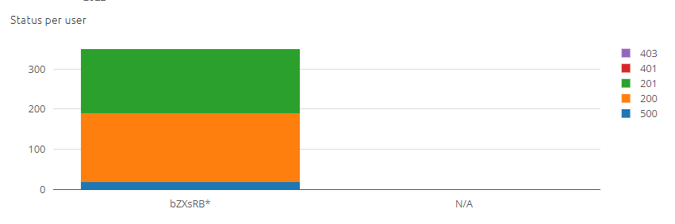

    

        <main class="micro-learning">
        <ul class="doc-nav">
            <li class="doc-nav__item"><a href="../../docs/microlearning/advanced-monitoring-apigateway-index" class="doc-nav__link">Home</a></li>
            <li class="doc-nav__item"><a href="#intro" class="doc-nav__link">Intro</a></li>
            <li class="doc-nav__item"><a href="#theory" class="doc-nav__link">Theory</a></li>
            <li class="doc-nav__item"><a href="#practice" class="doc-nav__link">Practice</a></li>
            <li class="doc-nav__item"><a href="#solution" class="doc-nav__link">Solution</a></li>
        </ul>

##### Intro

# Monitoring API Gateway statistics
In your API Gateway solution, it is important to be able to review the API Gateway statistics. These statistics are available in Generation 3 based runtimes, and available via the Manage phase --> Monitoring Gen3 

Should you have any questions, please get in touch with academy@emagiz.com.

- Last update: March 17th, 2022
- Required reading time: 5 minutes

## 1. Prerequisites
- Advanced knowledge of the eMagiz platform
- Complete relevant API Gateway microlearnings from Crash course to Intermediate

## 2. Key concepts
The API Gateway statistics are geared towards understanding the level of interaction between the API callers and the webservice of the API gateway. With the objective to understand the bredth and depth of the usage of the operations published

##### Theory
  
## 3. API gateway statistics

Navigate to the Manage phase and select Monitoring Gen3. On the left hand side select API Management Statistics which opens a page as below. Ensure to select for what environment you want to see these statics

### 3.1 API Requests
This section displays the total number of requests made to the API Gateway. Can be valuable to understand if in a give timeframe requests are made or not. It contains all the requests - other sections will illustrate which requests more specifically.

### 3.2 Static resource request
This shows the number of request made by the SwaggerUI which is considered a static resource. This can help to understand how often that SwaggerUI is used.

    
### 3.3 Status per user
This displays per application user what the HTTP response codes where. Based on that response code insight is provided around the behavior of that user such as unauthorized requests. Users are identified by part of their access credential (first part of API key or Client ID).

### 3.4 Resources per user
This displays per applciation user what resources are specifically used by that user. The colors indicate the resource which are listed as legend to the graph. By selecting a resource in the legend, you can toggle that resource to not display. The graph shows the total number of requests made.

### 3.5 Status per resource
This display shows the HTTP response codes for every resource/operation available. Could help to understand the health and/or the validity of the operation for the application users. 

    
### 3.7 Methods per resource
Shows what HTTP methods are used for every resource/operation

### 3.8 Status for status resource / methods per static resource
Shows the HTTP response codes and what HTTP methods are used by the Swagger UI

##### Practice

## 4. Assignment

Take a moment to review your API Gateway solution and find the Manage - Montoring section to see the API management metrics. Review if you can understand these values

## 5. Key takeaways

- The API Management statistics are geared towards understanding the actual use of the API gateway.
- That insight is handy to understand who does what and how often. Yet can also be used for trouble shooting.

##### Solution

## 6. Suggested Additional Readings

If you are interested in this topic and want more information, please read the release notes provided by eMagiz.

## 7. Silent demonstration video

As this is a more theoretical microlearning, we have no video that accompanies this microlearning.

</main>

