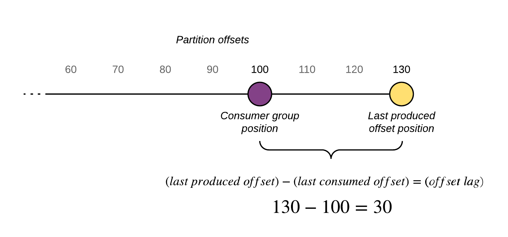

    

        <main class="micro-learning">
        <ul class="doc-nav">
            <li class="doc-nav__item"><a href="../../docs/microlearning/advanced-monitoring-eventstreaming-index" class="doc-nav__link">Home</a></li>
            <li class="doc-nav__item"><a href="#intro" class="doc-nav__link">Intro</a></li>
            <li class="doc-nav__item"><a href="#theory" class="doc-nav__link">Theory</a></li>
            <li class="doc-nav__item"><a href="#practice" class="doc-nav__link">Practice</a></li>
            <li class="doc-nav__item"><a href="#solution" class="doc-nav__link">Solution</a></li>
        </ul>

##### Intro

# Monitoring consumer lag in Event Streaming
In your Event streaming solution, the role of the consumers is important in several ways. One of them is to understand whether the consumer is actually consuming the messages on the topic or whether the consumer is falling behind in consumption.

Should you have any questions, please get in touch with academy@emagiz.com.

- Last update: November 1st, 2021
- Required reading time: 5 minutes

## 1. Prerequisites
- Advanced knowledge of the eMagiz platform
- Complete relevant Event Streaming microlearnings from Crash course to Intermediate

## 2. Key concepts
Consumer lag indicates the lag between Kafka producers and consumers. If the rate of production of data far exceeds the rate at which it is getting consumed, consumer groups will exhibit lag.

It can be understood very succinctly as the gap between the difference between the latest offset and consumer offset. In general, enterprises talk about Kafka but they are referring to the physical Kafka brokers - a server either physical or container that runs Kafka. Brokers are the physical repositories of logs that store and serve Kafka messages. Data storage inside a Kafka broker is done through topics. Topics are divided into partitions and brokers write data into specific partitions. As the broker writes data - it keeps track of the last offset and records it as the log end offset.

Just like Brokers keep track of their write position in each Partition, each Consumer keeps track of “read position” in each partition whose data it is consuming. It is the only way to keep track of the data that it has read.

##### Theory
  
## 3. Monitoring lag

Navigate to the Manage phase and select Monitoring. In the left hand menu you will find the Topic Statistics section which is the part we'll need to review the consumer lag. The view below shows an example of a topic where one of the consumer groups is lagging. The highlighted consumer bottom right section is 1292 messages behind which may indicate that this consumer has not yet consumed the messages. Based on the first offset of the partition it can be observed that the consumer can still catch up to read all the data from the topic.

##### Practice

## 4. Assignment

Take a moment to review your Event Streaming solution and find the Manage - Montoring section to see the topic statistics. Review if you can understand the consumer lag in your case
## 5. Key takeaways

- Consumer lag shows how many message the Consumer is falling behind in Consumption
- As part of the daily monitoring, topic Statistics are available to help you understand whether there is consumer lag or not

##### Solution

## 6. Suggested Additional Readings

If you are interested in this topic and want more information, please read the release notes provided by eMagiz.

## 7. Silent demonstration video

As this is a more theoretical microlearning, we have no video that accompanies this microlearning.

</main>

