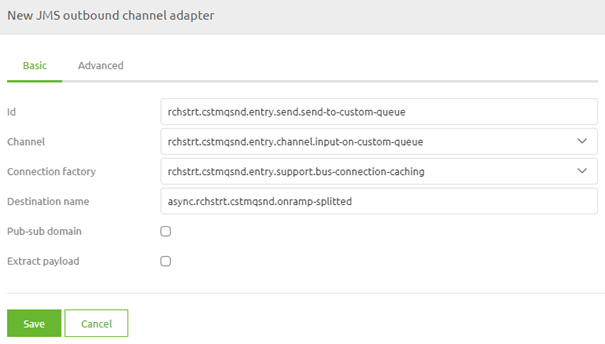

    

        <main class="micro-learning">
        <ul class="doc-nav">
            <li class="doc-nav__item"><a href="../../docs/microlearning/advanced-orchestration-of-data-packets-index" class="doc-nav__link">Home</a></li>
            <li class="doc-nav__item"><a href="#intro" class="doc-nav__link">Intro</a></li>
            <li class="doc-nav__item"><a href="#theory" class="doc-nav__link">Theory</a></li>
            <li class="doc-nav__item"><a href="#practice" class="doc-nav__link">Practice</a></li>
            <li class="doc-nav__item"><a href="#solution" class="doc-nav__link">Solution</a></li>
        </ul>

##### Intro

# Sending data to a custom queue
 
In some cases, there is a need to listen on a 'custom' queue for data. For example, when retrieving large amounts of data, you might need to place parts of the data on the queue to free up memory to process the complete batch of data. For those (and other) situations, it could be helpful to create 'custom' in-between queues. We need an additional writer on that 'custom' queue to ensure that data will be placed on the queue. 

Should you have any questions, please get in touch with academy@emagiz.com.

- Last update: November 1st, 2021
- Required reading time: 5 minutes

## 1. Prerequisites
- Advanced knowledge of the eMagiz platform
- Intermediate course on Orchestration of data packets

## 2. Key concepts
This microlearning centers around sending data to a custom queue
With a custom queue, we mean: A queue that is manually defined by an eMagiz user instead of eMagiz itself as a result of an automated process

To send data to a custom queue, you need:

- A JMS outbound channel adapter within your flow that sends data to the 'custom' queue
- The fully qualified name of the 'custom' queue on which to listen

##### Theory
  
## 3. Sending data to a custom queue

In some cases, there is a need to listen on a 'custom' queue for data. For example, when retrieving large amounts of data, you might need to place parts of the data on the queue to free up memory to process the complete batch of data. For those (and other) situations, it could be helpful to create 'custom' in-between queues. We need an additional writer on that 'custom' queue to ensure that data will be placed on the queue.

To send data to a custom queue, you need:

- A JMS outbound channel adapter within your flow that sends data to the 'custom' queue
- The fully qualified name of the 'custom' queue on which to listen

### 3.1 Setting up the outbound channel adapter

To set up the outbound channel adapter, navigate to the flow in Create in which you want to listen for messages on the 'custom' queue and enter "Start Editing" mode. After doing so, add the JMS outbound channel adapter to the canvas by dragging it on the canvas. Subsequently, double-click on the component to open it so you can edit it.

Here, you need to define the channel from which you retrieve the messages that need to be placed on the queue, the connection factory, the queue name you want to send data to, and deselect the option Extract payload.

The moment you are satisfied, you can press Save on the component. Now you have successfully ensured that you send messages to a 'custom' queue.

##### Practice

## 4. Assignment

Set up functionality to send messages to a 'custom' queue from an eMagiz flow. This assignment can be completed with the help of the (Academy) project that you have created/used in the previous assignment.

## 5. Key takeaways

- A JMS outbound channel adapter within your flow that sends data to the 'custom' queue
- The fully qualified name of the 'custom' queue on which to listen

##### Solution

## 6. Suggested Additional Readings

If you are interested in this topic and want more information, please read the release notes provided by eMagiz.

## 7. Silent demonstration video

This video demonstrates how you could have handled the assignment and gives you some context on what you have just learned.

<iframe width="1280" height="720" src="../../vid/microlearning/advanced-orchestration-of-data-packets-sending-data-to-a-custom-queue.mp4" frameborder="0" allow="accelerometer; autoplay; clipboard-write; encrypted-media; gyroscope; picture-in-picture" allowfullscreen></iframe>

</main>

