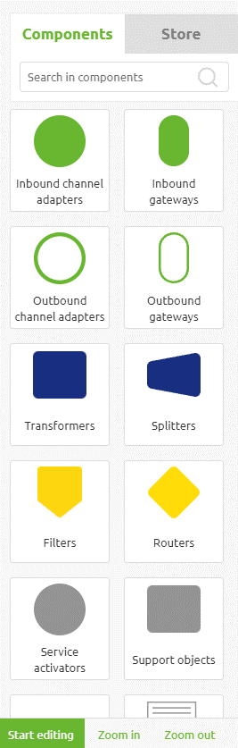
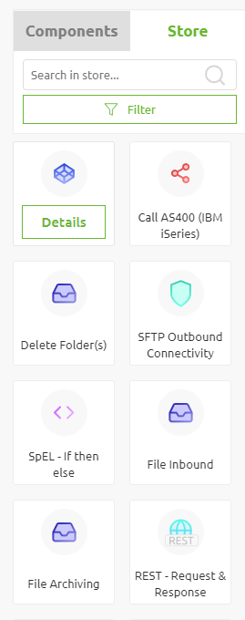
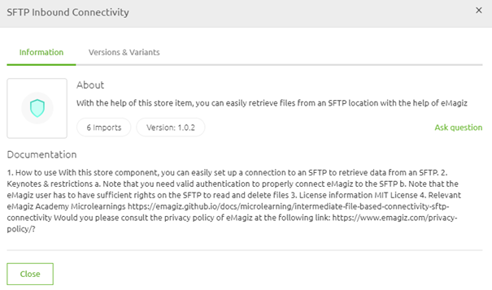

    

        <main class="micro-learning">
        <ul class="doc-nav">
            <li class="doc-nav__item"><a href="../../docs/microlearning/advanced-risk-management-index" class="doc-nav__link">Home</a></li>
            <li class="doc-nav__item"><a href="#intro" class="doc-nav__link">Intro</a></li>
            <li class="doc-nav__item"><a href="#theory" class="doc-nav__link">Theory</a></li>
            <li class="doc-nav__item"><a href="#practice" class="doc-nav__link">Practice</a></li>
            <li class="doc-nav__item"><a href="#solution" class="doc-nav__link">Solution</a></li>
        </ul>

##### Intro

# Selecting Store Items

In this microlearning, we will learn how you can access the eMagiz store and how you can browse the store while developing your integrations in the Create phase of eMagiz. The goal of this microlearning is to get you acquainted with the new eMagiz store and help you on your way to finding what you need quickly.

Should you have any questions, please get in touch with academy@emagiz.com.

- Last update: October 18th, 2021
- Required reading time: 5 minutes

## 1. Prerequisites
- Basic knowledge of the eMagiz platform

## 2. Key concepts
This microlearning centers around selecting store items
With eMagiz Store, we mean: A content library that is available to the community for the selection of re-usable solutions within the eMagiz platform

To summarize, selecting store items gives you:
- A way to browse the complete eMagiz store to find the solution that you need
- A way to learn more about the store item you are about to select

##### Theory

## 3. Selecting Store Items

A crucial part of having a store is finding the correct content without going through many hoops and checks and balances before finding the correct store item for you. Therefore we have opted to embed the store functionality in the user process. As a result, you will have the option to browse the store while being in Create. To do so, you can navigate to the flow in question you would like to edit. On the page that will open, you will see the standard components and the store in the left panel.

By clicking on the store, you will see the various store items, including the option to filter the store items so you can search on your criteria.

When expanding the filter option on store-level, you will see that you can search on the name of the store item, on a system, supported data, and store item type. Each of these options (or a combination of those options) can be used to explore the store further, so you arrive at a more narrowed result set of store items. Note that the search is active while typing. This means that when you start typing, the filter will be applied, and the results you see will change.

When you have narrowed down your selection, you can learn more about each store item that is still available after your search by pressing Details on the store item itself (by hovering over the store item and pressing Details). This will provide you with a pop-up in which you can learn several things:

- Latest version
- Number of imports
- Extended documentation, including references to microlearnings
- Other versions & variants
- Ask a question

When you are satisfied with the store item, you have read the details, for it has become time to import the store item. How you can do that will be explained in our next microlearning.

##### Practice

## 4. Assignment

See if you can find the eMagiz store in Create and see if you can find several items that will filter on the provided options. This assignment can be completed with the help of the (Academy) project that you have created/used in the previous assignment.

## 5. Key takeaways

- eMagiz offers several search options to narrow down the store items that might be relevant to you
- On top of that, eMagiz offers detailed information on each store item that can further aid your decision

##### Solution

## 6. Suggested Additional Readings

There are no suggested additional readings on this topic.

## 7. Silent demonstration video

This video demonstrates how you could have handled the assignment and gives you some context on what you have just learned.

<iframe width="1280" height="720" src="../../vid/microlearning/novice-emagiz-store-selecting-store-items.mp4" frameborder="0" allow="accelerometer; autoplay; clipboard-write; encrypted-media; gyroscope; picture-in-picture" allowfullscreen></iframe>

</main>

