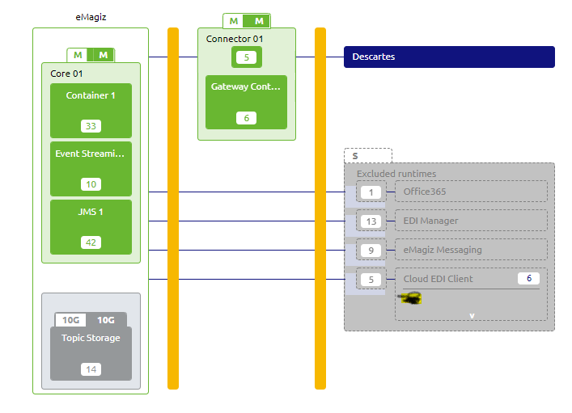
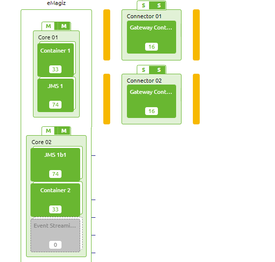
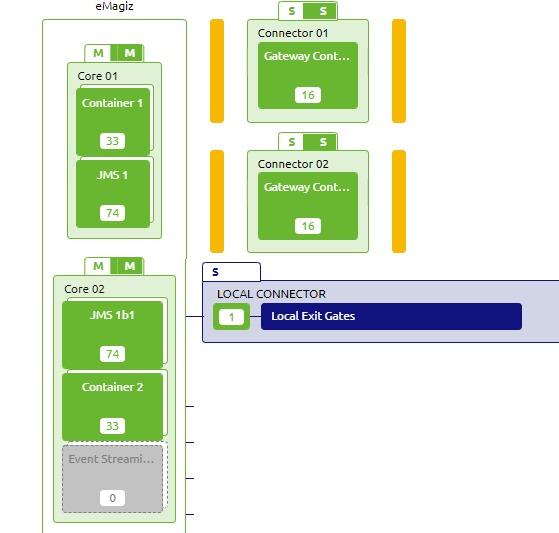

    

        <main class="micro-learning">
        <ul class="doc-nav">
            <li class="doc-nav__item"><a href="../../docs/microlearning/advanced-solution-architecture-index" class="doc-nav__link">Home</a></li>
            <li class="doc-nav__item"><a href="#intro" class="doc-nav__link">Intro</a></li>
            <li class="doc-nav__item"><a href="#theory" class="doc-nav__link">Theory</a></li>
            <li class="doc-nav__item"><a href="#practice" class="doc-nav__link">Practice</a></li>
            <li class="doc-nav__item"><a href="#solution" class="doc-nav__link">Solution</a></li>
        </ul>

##### Intro

# Introduction
This micro-learning will focus on describing the general architecture of the API Gateway. After this microlearning, the background of the API GW architecture should be clear

Should you have any questions, please contact academy@emagiz.com.

- Last update: October 20th, 2021
- Required reading time: 10 minutes

## 1. Prerequisites
- Intermediate knowledge of the eMagiz platform
- Good working experience in the Design phase Architecture and Deploy Architecture
- Created several API gateway integrations

## 2. Key concepts

- Single lane --> Single runtime per types
- Double lane --> Two or more runtime per type to handle failover setups
	

##### Theory

## 3. Architecture considerations

### 3.1 Architecture components API Gateway

The following picture displays a general architecture of the API Gateway. This picture has been taken from the eMagiz Design Architecture section as that illustrates the below key points.

Key notes
1. Gateway runtime
The Gateway has a separate runtime where the associated gateway flows are deployed in. The exit gates and all entry flow are the typical flow types present in this runtime, next to the usual infrastructure flow
2. Location runtime 
The Gateway runtime is located in a Cloud machine, and is specifically put on the Connector machine. The Connector machine has the ability to allow incoming data (secured) traffic from outside the Virtual Private Cloud that each client has. The Core machine does not have this option due to security reasons. The eMagiz Cloud handles the proper and secure routing to the API gateway.
3. Gateway only runtime
These are system that act as application user of 1 or more operations made available in the API Gateway. In case the system is only connected in the Design phase as such an application user, than that system only acts as input for User Management. The system doesn't need to be deployed as a runtime on the Connector machine, and should therefore be placed on an excluded machine. In the picture above, Exact online is such a system.

### 3.2 Single lane Cloud setup

Single lane setup in eMagiz means that all runtimes are provided once in the architecture diagram - there is no failover or clustered approach for the runtimes. For the API Gateway, this means that you have the following machines available. In this example, you have the messaging patterns components as well with the objective to see such cases as well.

- Core 01 		--> holds the JMS Server and the messaging process container
- Connnector 01 --> holds the API Gateway container and the messaging runtimes

### 3.3 Double lane Cloud setup 
Double lane setup in eMagiz means that all runtimes are provided at least twice in the architecture diagram - there is a failover for the JMS runtimes and gateway containers. For the API Gateway, this means that you have the following machines available. In this case you need to make sure that the flows are duplicated properly across the containers in Deploy - Containers. By default eMagiz will spread all flows over both gateway containers.

- Core 01 		--> holds the JMS Server and the 1st messaging process container
- Core 02 		--> holds the backup JMS Server and the 2nd  messaging process container
- Connnector 01 --> holds the 1st API Gateway container
- Connnector 02 --> holds the 2nd API Gateway container

The choice to create a double lane API gateway is to be done where there is a requirement for very high performance around response times and throughput. Please contact eMagiz to discuss such options. 

### 3.4 Hybrid Cloud setup 
In the [microlearning](advanced-api-management-running-part-of-your-api-gateway-solution-on-premise.md) you can find the reasons and configuration for running the exit gates in on-premises runtimes. A view of such a architecture is displayed here:

### 3.5 Memory
For now the memory requirements for API Gateway are the same as for Messaging flows. Please refer to the [microlearning](expert-solution-architecture-determining-needed-memory.md).

##### Practice

## 4. Assignment

There is no specific assignment for now. The correct use of the Design architecture is explained in this [microlearning](crashcourse-platform-design-understanding-design-architecture-basic.md).

## 5. Key takeaways

1. API Gateways can be part of a mixed landscape of Messaging, Event Streaming and API Gateways
2. A single lane setup is usually sufficient for most cases
3. Hybrid setups are possbible but please be sure the ask the right questions before implementing such 

##### Solution

## 6. Suggested Additional Readings

There are no suggested additional readings on this topic

## 7. Silent demonstration video

There is no demonstration video of this functionality. 

##

</main>

