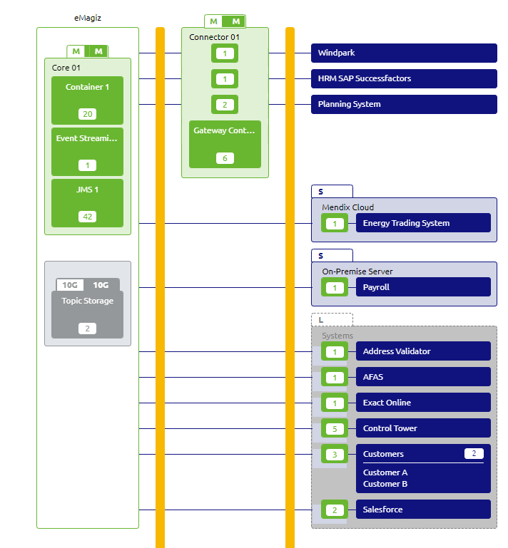

    

        <main class="micro-learning">
        <ul class="doc-nav">
            <li class="doc-nav__item"><a href="../../docs/microlearning/advanced-solution-architecture-index" class="doc-nav__link">Home</a></li>
            <li class="doc-nav__item"><a href="#intro" class="doc-nav__link">Intro</a></li>
            <li class="doc-nav__item"><a href="#theory" class="doc-nav__link">Theory</a></li>
            <li class="doc-nav__item"><a href="#practice" class="doc-nav__link">Practice</a></li>
            <li class="doc-nav__item"><a href="#solution" class="doc-nav__link">Solution</a></li>
        </ul>

##### Introduction

# Introduction
This micro-learning will focus on describing the general architecture of the API Gateway. After this microlearning, the background of the API GW architecture should be clear

Should you have any questions, please contact academy@emagiz.com.

- Last update: October 20th, 2021
- Required reading time: 10 minutes

## 1. Prerequisites
- Intermediate knowledge of the eMagiz platform
- Good working experience in the Design phase Architecture and Deploy Architecture
- Created several API gateway integrations

## 2. Key concepts

##### Theory

## 3. Architecture components API Gateway

The following picture displays a general architecture of the API Gateway. This picture has been taken from the eMagiz Design Architecture section as that illustrates the below key points.

##### Practice

## 4. Assignment

## 5. Key takeaways

##### Solution

## 6. Suggested Additional Readings

There are no suggested additional readings on this topic

## 7. Silent demonstration video

There is no demonstration video of this functionality. 

##

</main>

