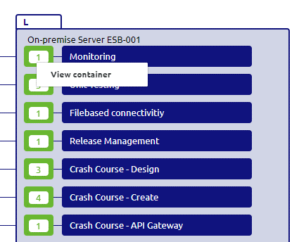
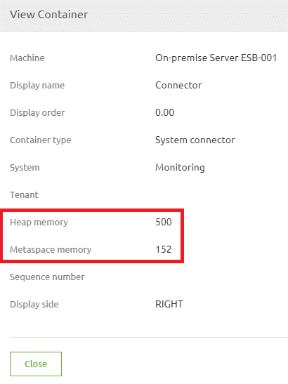

    

        <main class="micro-learning">
        <ul class="doc-nav">
            <li class="doc-nav__item"><a href="../../docs/microlearning/advanced-solution-architecture-index" class="doc-nav__link">Home</a></li>
            <li class="doc-nav__item"><a href="#intro" class="doc-nav__link">Intro</a></li>
            <li class="doc-nav__item"><a href="#theory" class="doc-nav__link">Theory</a></li>
            <li class="doc-nav__item"><a href="#practice" class="doc-nav__link">Practice</a></li>
            <li class="doc-nav__item"><a href="#solution" class="doc-nav__link">Solution</a></li>
        </ul>

##### Intro

# Edit memory for on-premise runtime (Windows)

Sometimes you have runtimes running on-premises. What we mean by that is that the runtimes are running within a data center of the customer instead of running in the eMagiz Cloud. For running a runtime on-premise we support running them on either Windows or Linux as the operating system. In this microlearning, we will learn how you can edit the memory settings of a runtime that is deployed on-premise on Linux.

Should you have any questions, please contact academy@emagiz.com.

- Last update: October 20th, 2021
- Required reading time: 4 minutes

## 1. Prerequisites
- Basic knowledge of the eMagiz platform

## 2. Key concepts
This microlearning centers on editing the memory settings for an on-premise runtime that is running on Linux.  With an on-premise runtime we mean: A runtime that is running within a data center of the customer instead of running in the eMagiz Cloud

The focal point of this microlearning will be to learn how you can safely edit the memory settings for an on-premise runtime running on Linux

- The key aspects are:
    - eMagiz can help you determine the correct size you need to configure via Design -> Architecture
    - You need access to the on-premise location to perform the action
    - Only change the wrapper.conf file. Nothing else

##### Theory
  
## 3. Edit memory for on-premise runtime (Windows)

Sometimes you have runtimes running on-premises. What we mean by that is that the runtimes are running within a data center of the customer instead of running in the eMagiz Cloud. For running a runtime on-premise we support running them on either Windows or Linux as the operating system. In this microlearning, we will learn how you can edit the memory settings of a runtime that is deployed on-premise.

The focal point of this microlearning will be to learn how you can safely edit the memory settings for an on-premise runtime.

- The key aspects are:
    - eMagiz can help you determine the correct size you need to configure via Design -> Architecture
    - You need access to the on-premise location to perform the action
    - Only change the wrapper.conf file. Nothing else

### 3.1 Check adviced size

Within Design Architecture you can see for each connector runtime what the advised sizing of eMagiz is based on how you have configured your integration data model. To do so navigate to Design -> Architecture and open the context menu on connector runtime level via a right mouse click.

When selecting the option View container a pop-up will be shown. Within this pop-up, you will see the advised heap and non-heap memory settings of that particular runtime.

### 3.2 Edit memory on Linux based runtimes

Now that we know what the advised size is we can navigate to our on-premise installation location to edit the memory settings. Below we will detail the various steps needed to make this happen.

1.	Log in via Putty  by typing in the host and the port and press load
2.	When asked for credentials fill in credentials (Be aware, Linux does not accept ctrl+v and does not show the password or an indication of the password). Right mouse click to copy the password and press enter 
3.	Navigate to the directory where you have installed the runtime (Command is: cd {directory structure})
4.	Open the folder related to the runtime you want to change (Command is: cd emagiz_{technicalbusname}-{containertype}-{techincalnameruntime}_{environment}).
5.	Open the etc folder within your runtime installation (Command is: cd etc)
6.	Type in the following command: sudo vi emagiz and press Tab. This way Linux should auto suggest the so called wrapper.conf to be edited and press Enter if so
7.	Type "i" to enter insert mode
8.	Change the values of heap and or metaspace memory you want to change (you can navigate through the document with your arrow keys)
9.	Press ESC and then type ":wq!" then press Enter to save the changes and exit Edit mode. Note: If you would like to exit the file without making any changes press ESC, then type ":q!" and press Enter
10. Restart the runtime by executing the correct restart command:
	-	systemd type: sudo systemctl restart <SERVICE_NAME>
	-	SystemV Type: sudo /etc/init.d/<SERVICE_NAME>-service restart

##### Practice

## 4. Assignment

As this is a more theoretical microlearning we do not have an assignment

## 5. Key takeaways

- The key aspects are:
    - eMagiz can help you determine the correct size you need to configure via Design -> Architecture
    - You need access to the on-premise location to perform the action
    - Only change the wrapper.conf file. Nothing else

##### Solution

## 6. Suggested Additional Readings

None

## 7. Silent demonstration video

As this is a more theoretical microlearning we have no video for this

</main>

