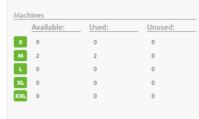
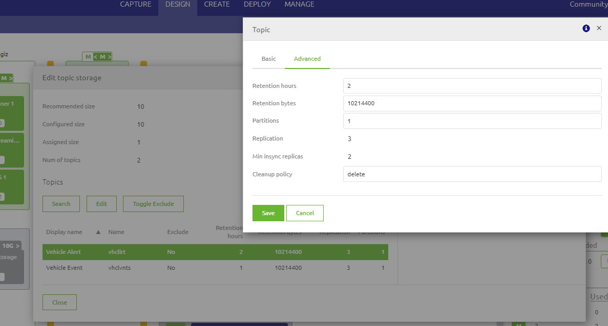

    

        <main class="micro-learning">
        <ul class="doc-nav">
            <li class="doc-nav__item"><a href="../../docs/microlearning/advanced-solution-architecture-index" class="doc-nav__link">Home</a></li>
            <li class="doc-nav__item"><a href="#intro" class="doc-nav__link">Intro</a></li>
            <li class="doc-nav__item"><a href="#theory" class="doc-nav__link">Theory</a></li>
            <li class="doc-nav__item"><a href="#practice" class="doc-nav__link">Practice</a></li>
            <li class="doc-nav__item"><a href="#solution" class="doc-nav__link">Solution</a></li>
        </ul>

##### Intro

# Introduction
This micro-learning will focus on the aspects of eMagiz Cloud and sizing of the Cloud

Should you have any questions, please contact academy@emagiz.com.

- Last update: October 21st, 2021
- Required reading time: 5 minutes

## 1. Prerequisites
- Intermediate knowledge of the eMagiz platform
- Good working experience in the Design & Deploy architecture aspects

## 2. Key concepts
The eMagiz Cloud is the set of services and machines that make up together the engine in which the integrations are made active. Please refer to the eMagiz Cloud Fundamentals to learn about that Cloud infrastructure.

##### Theory

## 3. eMagiz Cloud sizing

eMagiz provides insight into the required sizing of the machines and runtimes in the Design architecture. Objective is to configure the proper size of the Cloud machines so that the designed architecture can actually be effectuated. 

### 3.1 Cloud approval
The eMagiz team will provide approval on what type of Cloud your model has access to. In the figure below you can see the first column where the number of machines for a specific T-shirt size are allowed. The Cloud approval can be done by your eMagiz partner and is based on the licensed eMagiz Cloud. Once in the edit modus of the Design architecture, you can assign the available Cloud machine to a specific Core or Connector machine in the architecture. 

### 3.2 Cloud t-shirt sizing
eMagiz provides the following sizing for the Cloud slots. The memory is mentioned below as that is the key driver for upgrading to bigger sizing.

1.  S size --> 2Gb memory per machine
2.  M size --> 4Gb memory per machine
3.  L size --> 8Gb memory per machine
4. XL size --> 16Gb memory per machine
 
### 3.3 Cloud sizing advice
In the [microlearning](crashcourse-platform-design-understanding-design-architecture-basic.md) you can see how to the current machines can be reviewed for available memory.

### 3.4 Impact of Cloud sizing
The actual assigned machine size will be implemented in the Deploy architecture. In case your total runtime and machines are consuming more than the available memory of that specific size, the runtimes will not properly load and become disfunctional. To determine overcommitted cloud machines, use the following calculation mechnanism

1. Count 762 Mb overhead for the machine
2. Count 100 Mb per runtime on the machine
3. Count the tables for the runtime head and non-heap memory according to NL. See this [microlearning](expert-solution-architecture-determining-needed-memory.md) for more information

This count is also handy when verifying the actual assigned values in Deploy Architecture.

### 3.5 Managing sizing of Event topics
In the Design architecture you can manage your sizing of Event Streaming topics. eMagiz sees the topics as part of the Cloud infrastructure. Right clicking the topic storage in Design Architecture, would lead to the following screen - see fiugure below. Options available are:

1. Change sizing values of topics (retention size).
2. Exclude topics - which effectively means that these no longer count towards the configured size and if effectuated in the Deploy will be deleted. This feature is handy to use in the lifecycle of topics from test to acceptance to production. Topics in test can be excluded in case the topic is already in production.

##### Practice

## 4. Assignment

Please experiment with the options in eMagiz Design architecture to understand the above points.

## 5. Key takeaways
Part of the eMagiz platform is the Cloud which has specific upper limits for sizing. Understanding these helps to understand the impact of the designed architecture and to decide to influence these upper limits by expanding the sizing to a higher range.

##### Solution

## 6. Suggested Additional Readings

There are no suggested additional readings on this topic

## 7. Silent demonstration video

There is no demonstration video of this functionality. 

##

</main>

