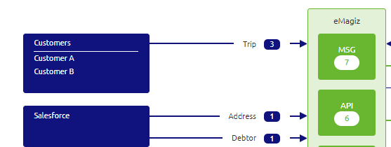
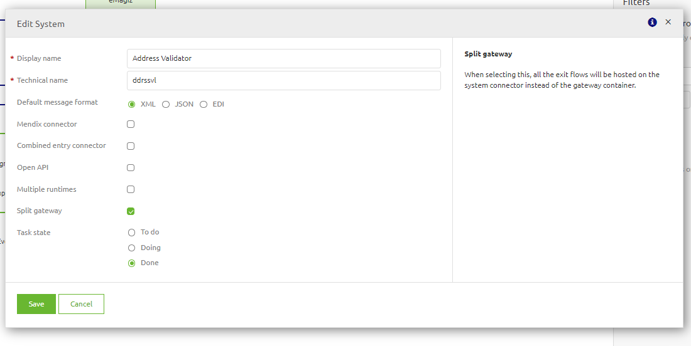

    

        <main class="micro-learning">
        <ul class="doc-nav">
            <li class="doc-nav__item"><a href="../../docs/microlearning/advanced-solution-architecture-index" class="doc-nav__link">Home</a></li>
            <li class="doc-nav__item"><a href="#intro" class="doc-nav__link">Intro</a></li>
            <li class="doc-nav__item"><a href="#theory" class="doc-nav__link">Theory</a></li>
            <li class="doc-nav__item"><a href="#practice" class="doc-nav__link">Practice</a></li>
            <li class="doc-nav__item"><a href="#solution" class="doc-nav__link">Solution</a></li>
        </ul>

##### Intro

# Introduction
This micro-learning will focus on some differences between the Design and Deploy architecture

Should you have any questions, please contact academy@emagiz.com.

- Last update: April 7th, 2022
- Required reading time: 5 minutes

## 1. Prerequisites
- Intermediate knowledge of the eMagiz platform
- Good working experience in the Design & Deploy architecture aspects

## 2. Key concepts
The Design Architecture is the place where the architecture of the integration model is forged. It allows to place Systems to Cloud or On-premises connector machines so that hybrid cloud architectures are possible. The Deploy Architecture is the place where the Design architecture is effectuated. In case a system is added to a Cloud Connector machine for instance, the Deploy architecture will allows to actually deploy that runtime.

##### Theory

## 3. Key differences in views Deploy & Design

The System is the key notion for a eMagiz runtime to get created. The eMagiz runtime is a Java based application container in which flows can be made active or operational. In most cases, all Systems in Design are to be located on a machine to effectuate these runtimes on the machines.

However, in some cases the Deploy architecture looks different compared to the Design architecture. In a sense that some system don't get "created" in Deploy. These are the reasons for Systems not to appear in Deploy architecture:

- System is only used for API Gateway Access
The system acts as a role and user, and no other integrations are used to and from that system. You can recognize the blue lines with blue rounded boxes containing the number of operations. These systems will be displayed in Design yet not in Deploy architecture. No runtime application is needed as no flows are supposed to run inside these systems. Multi-tenant systems that act as role (with tenants being the users) are also not displayed as system in Deploy Architecture. Below an example of such a case:

- System that is used only for Event Streaming integrations
The same applies to systems that are displayed for registering Producers and Consumers for Event Streaming. These systems are not displayed in Deploy Architecture.

- Systems accessed via Exit Gates only
Applications that accessed via API Gateway operations only are also no displayed in the Deploy Architecture. Exit gates are accessing these applications (displayed as systems) yet the exit gate will run on the gateway container runtime. Therefore, these system don't require any flow to deploy on so no runtimes gets created. 

There is an exception for that. In case the exit gate is required to run on the on-premises infrastructure of the client for security reasons, the runtime does get created and will be displayed therefore in the Deploy architecture. Apply to environment will not result in the physical deployment of the runtime, but's displayed so that the Deployment plan can indicate progress on deployment. The option Split Gateway needs to be checked in the Design phase

- Hybrid systems
In case a system will contain not only a user management like integration but also another integration (i.e. Messaging) the runtime will be displayed in Deploy architecture as usual. A flow or series of flows need to be deployed on the runtime 

- Best practice for Design Architecture
In Design Architecture it is adviced to create one or more on-premises machine that is toggled excluded. Each of these machine will act as a location where runtime not used in Deploy are put. So alignment between Design and Deploy is improved.

##### Practice

## 4. Assignment

Please experiment with the options in eMagiz Design & Deploy Architecture to understand the above points.

## 5. Key takeaways
Design and Deploy architecture can differ in view - specific reasons exit which are described in this microlearning.

##### Solution

## 6. Suggested Additional Readings

There are no suggested additional readings on this topic

## 7. Silent demonstration video

There is no demonstration video of this functionality. 

##

</main>

