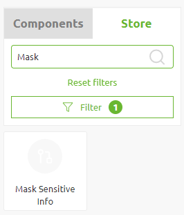

    

        <main class="micro-learning">
        <ul class="doc-nav">
            <li class="doc-nav__item"><a href="../../docs/microlearning/advanced-active-monitoring-index" class="doc-nav__link">Home</a></li>
            <li class="doc-nav__item"><a href="#intro" class="doc-nav__link">Intro</a></li>
            <li class="doc-nav__item"><a href="#theory" class="doc-nav__link">Theory</a></li>
            <li class="doc-nav__item"><a href="#practice" class="doc-nav__link">Practice</a></li>
            <li class="doc-nav__item"><a href="#solution" class="doc-nav__link">Solution</a></li>
        </ul>

##### Intro

# Error Handling in relation to GDPR

In eMagiz, all errors raised when a process fails and for which you want to have some form of logging end up in the Manage phase of eMagiz. The Manage phase of eMagiz is primarily accessible to support employees, employees working on the project, and in some cases, even more, people have at least view rights. You can imagine that when many people have access to potentially sensitive data, you should consider countermeasures. This way, you can reduce the chances of sensitive data ending up in the wrong hands. Some of the potential countermeasures are available within the platform. Some of them are procedural in nature. In this microlearning, we will learn what you can do to keep your data safe within eMagiz.

Should you have any questions, please contact academy@emagiz.com.

- Last update: November 15th, 2021
- Required reading time: 4 minutes

## 1. Prerequisites
- Advanced knowledge of the eMagiz platform

## 2. Key concepts
This microlearning centers around error handling in relation to GDPR
With GDPR, we mean: The law on General Data Protection Regulation.

- The GDPR is a European privacy regulation. It ensures the careful processing of personal data by businesses and organisations.
- eMagiz has various security measures in place to keep your data safe
- You also have a responsibility as user how you use the data of the customer

##### Theory

## 3. Error Handling in relation to GDPR

In eMagiz, all errors raised when a process fails and for which you want to have some form of logging end up in the Manage phase of eMagiz. The Manage phase of eMagiz is primarily accessible to support employees, employees working on the project, and in some cases, even more, people have at least view rights. You can imagine that when many people have access to potentially sensitive data, you should consider countermeasures. This way, you can reduce the chances of sensitive data ending up in the wrong hands. Some of the potential countermeasures are available within the platform. Some of them are procedural in nature. In this microlearning, we will learn what you can do to keep your data safe within eMagiz.

In eMagiz, we value the security of your data. For a detailed overview of how your data is secured within the platform and when data is exchanged can be found in our [Security Guide](../howto/security-guide.md). One of the additional measures you could take on our data models is indicate whether the information stored in those attributes is confidential. More information on how that works exactly can be found in this [microlearning](intermediate-defining-your-message-structures-data-model-attribute-confidentiality.md).

Building on that we have a store component available in the store with which you can replace the values in these attributes (in case the original payload is XML) with ***. This way the error message is still shown in order for an RCA to be performed but the sensitive data is not accessible to the user.

In terms of process you should be aware which data is sensitive in terms of GDPR and **not** store that information in external tools such as Postman and SOAP UI. Futhermore, you should consider how you want to shape the notifications to prevent that sensitive information is willingly distributed to the eMail boxes of recipients.

##### Practice

## 4. Assignment

Identify which attributes, if any, are sensitive in nature within your (Academy) project. This assignment can be completed within the (Academy) project that you have created/used in the previous assignment.

## 5. Key takeaways

- The GDPR is a European privacy regulation. It ensures the careful processing of personal data by businesses and organisations.
- eMagiz has various security measures in place to keep your data safe
- You also have a responsibility as user how you use the data of the customer

##### Solution

## 6. Suggested Additional Readings

There are no suggested additional readings on this topic.

## 7. Silent demonstration video

As this is a more theoretical microlearning, we have no video for this.

</main>

