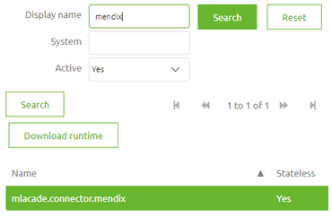

# Configure a eMagiz Mendix Connector

In this microlearning we will focus on configuring a eMagiz Mendix Connector. 
With the help of this Mendix module created by the eMagiz team you can easily connect between Mendix and eMagiz for data integration.

Should you have any questions, please contact academy@emagiz.com.

- Last update: January 27th 2021
- Required reading time: 10 minutes 

## 1. Prerequisites
- Basic knowledge of the eMagiz platform
- Access to a Mendix application
- Access to the Deploy phase of your eMagiz project
- A connection between Mendix and eMagiz Designed and Created
- Using eMagiz Mendix version 4.2.0 or higher. For legacy configuration please see the user guide **Install guide eMagiz Connector for Mendix**

## 2. Key concepts
This micro learning centers around configuring a eMagiz Mendix Connector
With eMagiz Mendix Connector we mean: A Mendix module developed and maintained by eMagiz that simplifies connect a Mendix application to a eMagiz project for data traffic between both systems.

To configure a eMagiz Mendix Connector you need the following:

- Configure the After Startup and Before Shutdown
- Configure the Access rights to the eMagiz Mendix Module
- Configure the constants
- Configure the keystore/truststore

## 3. Configure a eMagiz Mendix Connector

To configure the eMagiz Mendix Connector in a Mendix app, the following steps need to be performed.

### 3.1 Configure the After Startup and Before Shutdown
The first step of configuring your eMagiz Mendix Connector is to connect the After Startup and the Before Shutdown microflow that eMagiz provides you as part of the Use Me folder to the existing
After Startup and Before Shutdown microflow of the project itself.

After you have linked them to the project after startup and the project before shutdown make sure that these microflows are indeed triggered on Project level.
You can verify this by navigating to **Project Settings -> Runtime**

This configuration only needs to happen **once**.
 
###  3.2 Configure the Access rights to the eMagiz Mendix Module
It is recommended that only the administrator user role has access to the eMagiz Mendix Connector module. 
In order to do this follow these steps:

- Navigate to **Project Security**
- Validate that the security of your project is set to Production. If not please select the Production option

- Navigate to **User Roles**
- Edit the Administrator role
- Edit the Module roles
- Check the box of the eMagiz Mendix Connector module and press OK

The configuration before you press OK should look as follows

This configuration only needs to happen **once**.

### 3.3 Configure the constants
The eMagiz Mendix Connector comes with six constants that need to be configured correctly to make sure that a succesfull and stable connection can be established between the Mendix application and eMagiz.

#### 3.3.1 eMagizCustomerPassword

The first constant you need to configure is the password that connects the eMagiz Mendix Connector to the accompanying eMagiz Project.
The correct password can be retrieved from eMagiz. Simply navigate to **Deploy -> On premises -> Runtime connection settings** and copy paste the value for the Customer Password.
This is the value that you need to fill in for the eMagizCustomerPassword. The password in the below picture is removed for security reasons.

This configuration only needs to happen **once**.

#### 3.3.2 eMagizCustomerUsername

The second constant you need to configure is the username that connects the eMagiz Mendix Connector to the accompanying eMagiz Project.
The correct username can be retrieved from eMagiz. Simply navigate to **Deploy -> On premises -> Runtime connection settings** and copy paste the value for the Customer Username.
This is the value that you need to fill in for the eMagizCustomerUsername. The username in the below picture is removed for security reasons.

This configuration only needs to happen **once**.

#### 3.3.3 eMagizRuntimeEnvironment

The third constant you need to configure is a dynamic configuration that depends on the environment (Test, Acceptance or Production) of your eMagiz project you want to connect your Mendix project.
When running the project locally it stands to reason that the Test environment (if available) would be the most logical choice. 
When you deploy your Mendix application to Acceptance or Production make sure to change the value of this constant via the option Mendix offers you for it.

The correct value can either be prod, accp or test.

#### 3.3.4 eMagizRuntimeName

The fourth constant defines which runtime in eMagiz relates to the Mendix application. 
To correctly connect your Mendix application to your eMagiz project you need to fill in the technicalname of the runtime that you have set up in eMagiz.

To find out the technical name of this runtime simply navigate to **Deploy -> Containers**. 
In here you can see the technical name all of your runtimes including the one that connects to your Mendix application. 
The technical name is build up as follows: <busname>.connector.<technical_name of the Mendix system in eMagiz>

If you have found your runtime name you can fill it in for the constant eMagizRuntimeName. This configuration only needs to happen **once**.

#### 3.3.5 eMagizWsUrl

The fifth constant you need to configure is the url from which you can retrieve the property configuration made in eMagiz that you need to succesfully connect to eMagiz and exchange data with eMagiz.
The correct url can be retrieved from eMagiz. Simply navigate to **Deploy -> On premises -> Runtime connection settings** and copy paste the value for the eMagiz WS URL.
This is the value that you need to fill in for the eMagizWsUrl. You can find the url in the picture below.

This configuration only needs to happen **once**.

#### 3.3.6 StartupDelay

The sixth and last constant that needs to be filled in is the startup delay. 
This constant indicates how many milliseconds the process will wait before starting up the infra flow and registering the exit queues. 
In case Mendix has not fully started up yet but the flows have already started up could lead to unexpected behavior and data loss.
Therefore we advice a setting of 30000ms for this constant.

This configuration only needs to happen **once**.

### 3.4 Configure the keystore/truststore

To ensure a proper SSL connection between runtime and eMagiz JMS each runtime needs to have a keystore and truststore that hold the relevant certificates.

For a Mendix application specifically this has to be done by hand. You can find the correct keystore and truststore if you open the infra flow of the Mendix runtime in **Create**

Under the Resources tab you will find the key and truststore. Download these and place them in the resources folder of your Mendix project.

You can access this resources folder in the following manner: **Project -> Show Project Directory in Explorer -> Open the resources folder**

Simply make sure that the keystore and truststore that you have downloaded from eMagiz are placed in this folder **including the unique number prefix eMagiz has given the key- and truststore**

This configuration only needs to happen **once**.

## 4. Assignment

The assignment is simple this time. Configure your eMagiz Mendix Connector.
This assignment can be completed with the help of a associated Mendix project linked to the (Academy) project that you have created/used in the previous assignment.

## 5. Key takeaways

To configure a eMagiz Mendix Connector you need the following:

- Configure the After Startup and Before Shutdown
- Configure the Access rights to the eMagiz Mendix Module
- Configure the constants
- Configure the keystore/truststore

To make a connection in terms of allowing data to travel between A and B you need to fill in the correct constants and setup your keystore and truststore correctly.

## 6. Suggested Additional Readings

If you are interested in this topic and want more information on it please read the release notes provided by eMagiz that accompany the eMagiz Mendix Connector version you have selected.

## 7. Silent demonstration video

As most of this configuration takes place in Mendix and not in eMagiz we have chosen not to make a video on this topic. 
The pictures and text provided above should give you enough guidance to configure the connection between Mendix and eMagiz.