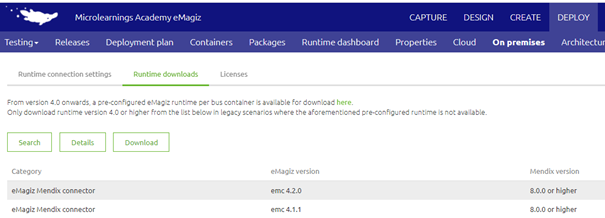
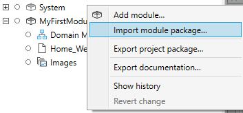

# Install a eMagiz Mendix Connector

In this microlearning we will focus on installing a eMagiz Mendix Connector. 
With the help of this Mendix module created by the eMagiz team you can easily connect between Mendix and eMagiz for data integration.

Should you have any questions, please contact academy@emagiz.com.

- Last update: January 27th 2021
- Required reading time: 2 minutes

## 1. Prerequisites
- Basic knowledge of the eMagiz platform
- Access to a Mendix application
- Access to the Deploy phase of your eMagiz project

## 2. Key concepts
This micro learning centers around installing a eMagiz Mendix Connector
With eMagiz Mendix Connector we mean: A Mendix module developed and maintained by eMagiz that simplifies connect a Mendix application to a eMagiz project for data traffic between both systems.

To install a eMagiz Mendix Connector you need the following:

- The Mendix Module called the eMagiz Mendix Connector (available in eMagiz under Deploy of your project)
- Access to a Mendix project which has no eMagiz Mendix Connector in it at this moment.

## 3. Install a eMagiz Mendix Connector

To install the eMagiz Mendix Connector in a Mendix app, the following steps need to be performed.

### 3.1 Download the eMagiz Mendix connector
- The eMagiz Mendix connector can be downloaded via eMagiz. Log in and then go to one of the busses you have access to.    
- Go to **Deploy -> On Premises -> Runtime Downloads** the eMagiz Mendix connector can be downloaded. 
It is important that you look at the column Mendix version. It must correspond to the Mendix version of the project where you want to use the eMagiz Mendix Connector. 
If you do not do this then the connector will **not** work.

 
 
###  3.2 Importing eMagiz Mendix connector
Now that we have downloaded the correct eMagiz Mendix connector (latest version that is available for the Mendix version of our project) we can open Mendix itself.

If you open your Project in Mendix you can navigate to the left hand panel called "Project Explorer". In this panel you see all modules (box icons) that are currently in the project.
In the Project Explorer, right-click and choose the option "Import module package..."

In the pop-up that follows select the correct eMagiz Mendix Connector version and press Open / Openen (depending on the language settings of your own PC)

As a result Mendix will show you the following pop-up. In this pop-up you press Import and Mendix will import the eMagiz Mendix Connector for you.

In the following microlearnings we will focus on configuring the eMagiz Mendix Connector and updating the eMagiz Mendix Connector.

## 4. Assignment

The assignment is simple this time. Just install a eMagiz Mendix Connector.
This assignment can be completed with the help of a associated Mendix project linked to the (Academy) project that you have created/used in the previous assignment.

## 5. Key takeaways

- The crucial part of installing a eMagiz Mendix Connector is to select the correct version that will work with your Mendix project
	- To select the correct eMagiz Mendix Connector version look at the Mendix version your app is running in (8.0.0+,7.0.0+,etc.) and look at which of the versions eMagiz has released is the newest version.
- The actual installation in Mendix is simply importing a module package and selecting the correct one. As easy as can be.

## 6. Suggested Additional Readings

If you are interested in this topic and want more information on it please read the release notes provided by eMagiz that accompany the eMagiz Mendix Connector version you have selected.

## 7. Silent demonstration video

This video demonstrates how you could have handled the assignment and gives you some context on what you have just learned. Disclaimer, you don't see the pop-up appearing in Mendix but if you follow the above steps you are good to go!

<iframe width="1280" height="720" src="../../vid/microlearning/microlearning-install-emagiz-mendix-connector.mp4" frameborder="0" allow="accelerometer; autoplay; clipboard-write; encrypted-media; gyroscope; picture-in-picture" allowfullscreen></iframe>