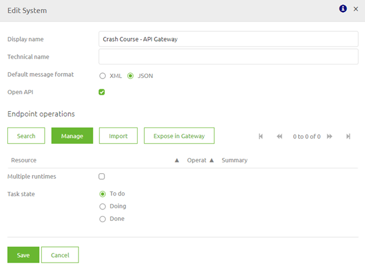
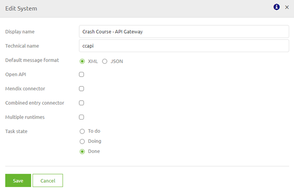
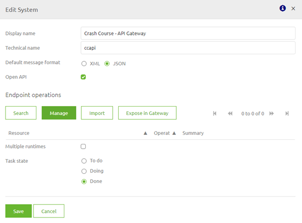
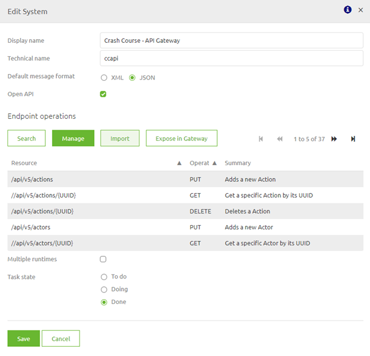
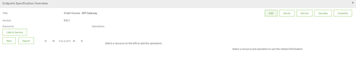
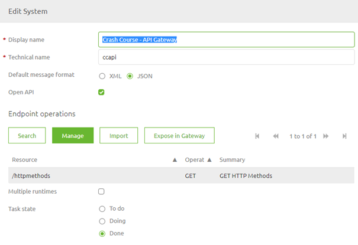

# Configure a backend operation

In this microlearning we will focus on learning about how you can correctly configure the backend operations.
A crucial part of setting up your (API) Gateway with the help of RESTful services is knowing which backend operations you want to expose with the help of the API Gateway.

Should you have any questions, please contact academy@emagiz.com.

- Last update: February 19th 2021
- Required reading time: 6 minutes

## 1. Prerequisites
- Basic knowledge of the eMagiz platform

## 2. Key concepts
This microlearning centers around configuring a backend operation with the API Gateway solution of eMagiz.
With backend operation we mean: Any action that is available to be executed on a internal system that you want to make publicly avaiable via the API Gateway
With API Gateway we mean: A collection of RESTful API operations that can be published to the outside world in order to give them access to applications that are linked to your business process

When setting up your API Gateway integration the process of doing things is to start at the backend operation and based on that expose a operation in the API Gateway.

## 3. Configure a backend operation

When you look at the conceptual idea of the API Gateway, exposing backend operations via a centralized location to the outside world 
it stands to reason that when you setup your API Gateway (i.e. the front-end facing part) start with the backend operation you want to expose. 

To configure the backend system that holds the operation(s) double click on the system to enter the following pop-up

In here you need to fill in the technical name, just as with any other system. Furthermore you have two decisions to make:

- Does the system talk JSON or XML
- Can you specify the backend operations either via a import of the OpenAPI 3.0 spec or via a manual action

If the answer to the above decisions is JSON and yes the default setting are correct and you should continue to either import the OpenAPI 3.0 spec or manually configure atleast one backend operation.
More on that later in this microlearning.

In case the answer to the first decision is XML you should switch the default format to XML and unselect the OpenAPI 3.0 spec. The result should be something like this.

### 3.1 Importing a specification

If the external party can provide you with a OpenAPI 3.0 specification you can manage your backend system by pressing the Import button 
when you are editing the system (double click on the system in question)

After you have pressed the Import button you enter the following pop-up. In here you can select the OpenAPI 3.0 JSON file to be imported in eMagiz.

Press Import and let eMagiz do the heavy lifting for you. eMagiz will now import all backend operations that are specified in the OpenAPI 3.0 JSON file you have selected. 
A result of such a import could be as follows.

Congratulations you have succesfully imported your OpenAPI 3.0 specification.

### 3.2 Creating a specification

It can very well be that the external party has a swagger definition but not a OpenAPI 3.0 standard. 
Or maybe they have other documentation that tells you the resource paths, parameters and http operations that you need. 

In all these cases you can manage your backend system by pressing the Manage button when you are editing the system (double click on the system in question)

When you select the option Manage you will be presented with the following pop-up. The first time this pop-up will be empty. All others times it should contain atleast one backend operation.

Let us manually fill a simple GET call to retrieve all http methods. So we start of at the top left of the screen in the resource section and press New. 
In the pop-up that follows we enter the resource path that is defined in the specification and press Save. The result will be as follows.

Next step will be to add a operation via the option New under Operations in the middle of your screen. The result of that action will be something as follows.

As there are no parameters in this case you have now succesfully configured your first backend operation. When you close this screen you will see the results on system level

Now you can Save or add another operation to add to your specification.

### 3.3 Next steps

After you have correctly configured your backend operation you can start to think how you can best expose the operations via the API Gateway. 
In the next three microlearnings we will delve deeper into the various components and also learn how you can quickly expose these backend operation in your API Gateway.

## 4. Assignment

Manually configure a GET operation with the resource path /httpmethods in a API Gateway system.
This assignment can be completed with the help of the (Academy) project that you have created/used in the previous assignment.

## 5. Key takeaways

- Starting point of setting up your API Gateway is configuring the backend operation(s)
- There are two ways to do so for JSON based systems
	- Import OpenAPI 3.0 specification
	- Manually configure based on other specification
- Other cases such as connecting to XML based systems will be discussed later on

## 6. Suggested Additional Readings

If you are interested in this topic and want more information on it please read the help text provided by eMagiz.

## 7. Silent demonstration video

This video demonstrates how you could have handled the assignment and gives you some context on what you have just learned. Disclaimer, you only see the eMagiz part but if you follow the above steps you are good to go!

<iframe width="1280" height="720" src="../../vid/microlearning/microlearning-configure-backend-operation.mp4" frameborder="0" allow="accelerometer; autoplay; clipboard-write; encrypted-media; gyroscope; picture-in-picture" allowfullscreen></iframe>