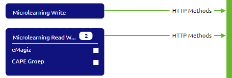
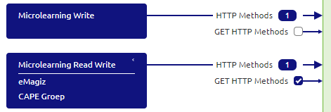

# Configure roles and users

In this microlearning, we will focus on learning how you can configure roles and users for the API Gateway.
A crucial part of setting up your (API) Gateway with the help of RESTful services is defining which client has access to which operation.

Should you have any questions, please contact academy@emagiz.com.

- Last update: February 11th, 2021
- Required reading time: 6 minutes

## 1. Prerequisites
- Basic knowledge of the eMagiz platform

## 2. Key concepts
This microlearning centers around configuring roles and users for the API Gateway solution of eMagiz.
With roles we mean: Any action that is available to be executed on an internal system that you want to make publicly available via the API Gateway
With users we mean: Any action that is available to be executed on an internal system that you want to make publicly available via the API Gateway
With API Gateway we mean: A collection of RESTful API operations that can be published to the outside world to give them access to applications that are linked to your business process

In eMagiz, you have a clear way to define ‘consuming’ entities of an API Gateway and assign the correct roles and rights on role and user level. This is done in a two-part process.
The first part is done in Capture and Design. The second part is done in Deploy

## 3. Configure roles and users

A crucial part of setting up your (API) Gateway with the help of RESTful services is defining which client has access to which operation.
In eMagiz, you have a clear way to define ‘consuming’ entities of an API Gateway and assign the correct roles and rights on role and user level. This is done in a two-part process.
The first part is done in Capture and Design. The second part is done in Deploy

Below we will discuss each of these parts in more detail

### 3.1 Capture

In Capture, you can add a so-called 'consuming' system of an API Gateway. 
To define a 'consuming' system you need to draw a line from the system to eMagiz indicating that an external system is 'consuming' the API Gateway.
The type of system you choose does not matter. Both single tenant and multi-tenant systems can fulfill these purposes.

The choice between creating a standard system or a multi-tenant system is based on what you want to achieve in terms of given access to roles and users.
By choosing the standard system you make the implicit choice that one user (i.e that system) has one specific role. 
By choosing the multi-tenant system you state that multiple users have the same role.

If you choose a multi-tenant system make sure to also define the tenants before you continue.

If you already have a system that also wants to 'consume' an API Gateway you don't have to create a new system but can simply draw a line from the existing system towards eMagiz.

A possible solution of two separate 'consuming' systems of the same resource can be represented as follows

### 3.2 Design

When you add a ‘consuming’ system of type API Gateway in Capture you have the ability in Design to assign rights to that ‘consuming’ system on one or more operations. 
This can be done by activating the checkbox in Design. 

By activating the checkbox in Design you’re telling eMagiz that this particular system (and all underlying users) has the right to access the operation you have just selected.

In the example below, it means that the 'consuming' system (i.e. the role) Microlearning Read Write has access to the GET HTTP Methods operation 
whereas the 'consuming' system (i.e. the role) Microlearning Write has no access to the GET HTTP Methods operation

 
### 3.3 Deploy

Changes made in Design are automatically updated in Deploy when you navigate to the User management tab given that the operation is already available in a Release.
This means that when you open the User management tab you will see all users and roles in the correct configuration based on the checkboxes selected in Design.

After you have verified the settings and are satisfied with how the rights per role and user are configured you can update these settings 
per environment by pressing the Apply to environment button.
By pressing this button you indicate that the choices you made in Design can be actualized in Deploy for that particular environment.

After you have pressed the Apply to environment button you can retrieve the relevant authentication information per user under the corresponding property 
so you can communicate this value with the external party that needs to call the API.

#### 3.3.1 Test the API as portal user

In case you want to test the API operations yourself without breaking the barrier between tests executing by external parties and tests executed by developers you have the option to create an API user based on your portal user. This can be done via the Import button in the User management tab.
This method ensures that you do not mix the authentication and authorization of your test with tests from an external system.

After you have pressed the import button you can select for which user you want to create a User. Here you can only select those users that have access to this project. 

After you have created the User you can assign roles. To Assign a role you select the freshly imported user and select the tab called Assign Roles

Based on your needs you can give the portal user all roles or assign a subset of the roles to the portal user.

After you have verified the settings and are satisfied with how the rights per role and user are configured you can update 
these settings per environment by pressing the Apply to environment button.
By pressing this button you indicate that the choices you made in Design can be actualized in Deploy for that particular environment.

Read the pop-up you get after pressing this button carefully as it says what your next move is. A critical part is restarting the all entry flow.

After you have restarted the all.entry flow you can test the settings via the Swagger UI which you can access via the Runtime Dashboard -> View Swagger UI. More on that in the next microlearning.

## 4. Assignment

Ensure that two separate roles are created. One role should have one user. The other role should have two users.
This assignment can be completed with the help of the (Academy) project that you have created/used in the previous assignment.

## 5. Key takeaways

- In eMagiz, you have a clear way to define ‘consuming’ entities of an API Gateway and assign the correct roles and rights on role and user level. This is done in a two-part process.
- The first part is done in Capture and Design. The second part is done in Deploy
- A 'consuming' system equals a role
- A 'consuming' tenant or system equals a user

## 6. Suggested Additional Readings

If you are interested in this topic and want more information on it please read the help text provided by eMagiz.

## 7. Silent demonstration video

This video demonstrates how you could have handled the assignment and gives you some context on what you have just learned. Disclaimer, you only see the eMagiz part but if you follow the above steps you are good to go!

<iframe width="1280" height="720" src="../../vid/microlearning/microlearning-configure-roles-and-users.mp4" frameborder="0" allow="accelerometer; autoplay; clipboard-write; encrypted-media; gyroscope; picture-in-picture" allowfullscreen></iframe>