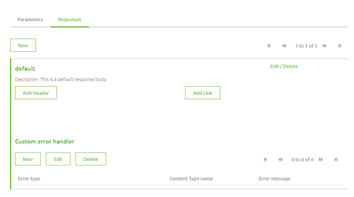
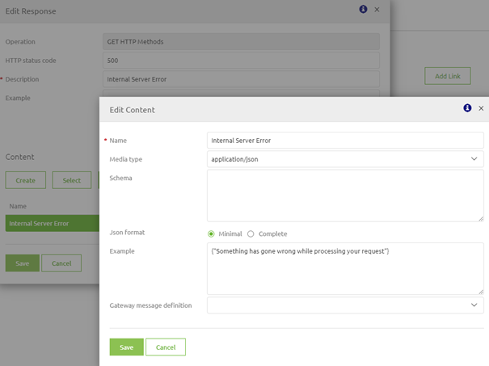
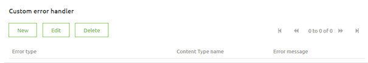
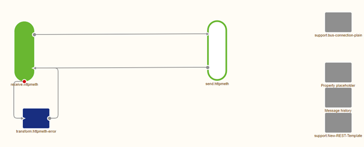

# Error Handling from a Client Perspective

In this microlearning we will focus on understanding how the error handling for the API Gateway works in general sense.
As the API Gateway is synchronous in nature you will get a response for every request you have executed. This works for both OK and NOT OK responses

Therefore the error handling is created in such a way that the client gets told if the response was OK or NOT OK

Should you have any questions, please contact academy@emagiz.com.

- Last update: February 19th 2021
- Required reading time: 7 minutes

## 1. Prerequisites
- Basic knowledge of the eMagiz platform

## 2. Key concepts
This microlearning centers around error handling from a client perspective for the API Gateway solution of eMagiz.
With error handling we mean: Handling the NOT OK responses that occur in transit between API Gateway and backend operation or NOT OK response received from the backend operation
With client perspective we mean: How should I interpret the response from the API Gateway to determine success or failure
With API Gateway we mean: A collection of RESTful API operations that can be published to the outside world in order to give them access to applications that are linked to your business process

The eMagiz API Gateway will always give back HTTP Response codes along the following lines:

- 100-level (Informational) — Server acknowledges a request
- 200-level (Success) — Server completed the request as expected
- 300-level (Redirection) — Client needs to perform further actions to complete the request
- 400-level (Client error) — Client sent an invalid request
- 500-level (Server error) — Server failed to fulfill a valid request due to an error with server

Of these levels the 200-level for Success calls and the 400-level and 500-level are most frequently used within the context of eMagiz.

## 3. Error Handling from a Client Perspective

The eMagiz API Gateway will always give back HTTP Response codes along the following lines:

- 100-level (Informational) — Server acknowledges a request
- 200-level (Success) — Server completed the request as expected
- 300-level (Redirection) — Client needs to perform further actions to complete the request
- 400-level (Client error) — Client sent an invalid request
- 500-level (Server error) — Server failed to fulfill a valid request due to an error with server

Of these levels the 200-level for Success calls and the 400-level and 500-level are most frequently used within the context of eMagiz.
Each request send by the client can return in a Success or a Failure. 

### 3.1 Success
The default response code eMagiz uses for a Success is a 200 HTTP Status Code that could be accompanied by a response body. 
If the backend operation uses a 201 for example to indicate the creation of a resource in the backend eMagiz will give this back to the client making the request.

So in general terms eMagiz gives the status code back to the client that itself has received from the backend operation that is called by eMagiz.

### 3.2 Failure
When we zoom in on the cases where something fails we have to discern multiple scenarios:
- Client calls a non-existing endpoint -> eMagiz will return a 404 Not Found
- Client calls a endpoint without authentication or the wrong authentication -> eMagiz will return a 401 Unauthorized
- eMagiz receives a specific error from the backend operation -> eMagiz will return the HTTP Status Code it received from the backend to the client.
- eMagiz does not receive a response from the backend -> eMagiz will return a 500 Internal Error
- Something goes wrong in transit -> eMagiz will return a 500 Internal Error

### 3.3 Control the information
Apart from giving back the response codes to the client eMagiz, on default also returns the payload the moment things went wrong. 
You can imagine that doing that is not the ideal situation. Therefore eMagiz provides you with the option to define how you handle these specific errors.

To do so navigate to Design and open the catalog. In the catalog select the operation for which you want to configure this and select the tab Responses

In this screen you can select the button New. In the pop-up that follows you can specify the HTTP Status Code response and define the body of the message

To get even more control you can assign standard occurences of errors while in transit to a certain HTTP Status Code. You can do so by pressing New under Custom Error Handler

Select the type, fill in the remainder of the details and press Save. After you have updated your all entry and deployed it this new functionality will be in effect.

### 3.4 eMagiz Monitoring

Apart from sending the response back to the client eMagiz will also write a warning to the log the moment something goes wrong after eMagiz has accepted the request.
This means that cases such a the 404 and 401 do not show up here and should be dealt with by the client exclusively.

In the other scenarios where eMagiz has (attempted to) send data to a backend operation and something fails eMagiz will write a warning to the log. 
On this warning you can set up alerting for (pro-active) monitoring

Each backend operation has a specific exit gate that will handle all incoming traffic, connect to the backend operation and send the response back to the client that is calling the API.
The exit gate can process up to five calls at the same time. The moment the response is delivered to client 1, the exit gate will continue with the message of client 6.

With this setting we already scale the API Gateway in such a way that it can handle concurrency and peaks in traffic. For most use cases these settings will suffice.

eMagiz will generate almost everything for you when you transfer a API integration to Create. 
There are however some things you need to change depending on the choices made in Design and based on the required authentication method.

In case you have a passthrough case and the authentication method can be handled via a REST template (i.e. basic, oauth, azure) you only need to configure this specific authentication mechanism.

In case you have a passthrough case and the authentication cannot be handled via a REST template you need to set up the authentication yourself.

In case you have a transformation case you need to configure the outbound component + the accompanying authentication.

In the most standard case eMagiz will auto generate the following flow for you

Just as with the entry gate we try to auto generate as much as possible to make your life easier the moment you start in the Create phase.

## 4. Assignment

Try to call a endpoint of the API Gateway while not being authorized to see how the error handling of eMagiz works.
This assignment can be completed with the help of the (Academy) project that you have created/used in the previous assignment.

## 5. Key takeaways

- Client calls a non-existing endpoint -> eMagiz will return a 404 Not Found
- Client calls a endpoint without authentication or the wrong authentication -> eMagiz will return a 401 Unauthorized
- eMagiz receives a specific error from the backend operation -> eMagiz will return the HTTP Status Code it received from the backend to the client.
- eMagiz does not receive a response from the backend -> eMagiz will return a 500 Internal Error
- Something goes wrong in transit -> eMagiz will return a 500 Internal Error
- eMagiz also writes errors to the log for monitoring and alerting
- You can control the information the client receives in case of an error

## 6. Suggested Additional Readings

If you are interested in this topic and want more information on it please read the help text provided by eMagiz and read the following link:

- https://www.baeldung.com/rest-api-error-handling-best-practices

## 7. Silent demonstration video

This video demonstrates how you could have handled the assignment and gives you some context on what you have just learned. Disclaimer, you only see the eMagiz part but if you follow the above steps you are good to go!

<iframe width="1280" height="720" src="../../vid/microlearning/microlearning-error-handling-from-a-client-perspective.mp4" frameborder="0" allow="accelerometer; autoplay; clipboard-write; encrypted-media; gyroscope; picture-in-picture" allowfullscreen></iframe>