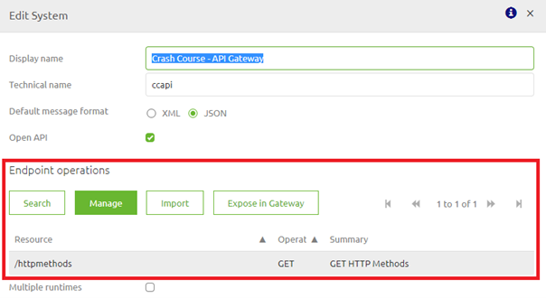
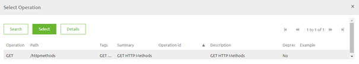

	

		<main class="micro-learning">
		<ul class="doc-nav">
			<li class="doc-nav__item"><a href="../../docs/microlearning/crashcourse-api-gateway-index" class="doc-nav__link">Home</a></li>
			<li class="doc-nav__item"><a href="#intro" class="doc-nav__link">Intro</a></li>
			<li class="doc-nav__item"><a href="#theory" class="doc-nav__link">Theory</a></li>
			<li class="doc-nav__item"><a href="#practice" class="doc-nav__link">Practice</a></li>
			<li class="doc-nav__item"><a href="#solution" class="doc-nav__link">Solution</a></li>
		</ul>

##### Intro

# HTTP Operations

In this microlearning, we will focus on learning about HTTP Operations.
A crucial part of setting up your (API) Gateway with the help of RESTful services is 
knowing what HTTP Operations are and how you can use them to control what parties can change via your (API) Gateway.

Should you have any questions, please contact academy@emagiz.com.

- Last update: February 19th, 2021
- Required reading time: 6 minutes

## 1. Prerequisites
- Basic knowledge of the eMagiz platform

## 2. Key concepts
This microlearning centers around HTTP Operations in conjunction with the API Gateway solution of eMagiz.
With HTTP Operations we mean: Identify the action (i.e. Create, Read, Update or Delete) that needs to be performed on a resource (i.e. Client, Order, Employee)
With API Gateway we mean: A collection of RESTful API operations that can be published to the outside world to give them access to applications that are linked to your business process

Each HTTP Method represents a certain action on a resource. Of the most frequently used ones we can make a nice comparison to the CRUD operations:

HTTP Operations:		CRUD Operations:
- POST					- Create
- GET					- Read
- PUT					- Update
- DELETE				- Delete

So the POST represents a Create action, the GET a read action, etc.

This also means that when you do a GET (a read action) it should **not** alter the resource you are requesting from your backend operation if you want to adhere to the RESTful principles.

##### Theory

## 3. HTTP Operations
A crucial part of setting up your (API) Gateway with the help of RESTful services is 
knowing what HTTP Operations are and how you can use them to control what parties can change via your (API) Gateway.

Each HTTP Method represents a certain action on a resource. Of the most frequently used ones we can make a nice comparison to the CRUD operations:

HTTP Operations:		CRUD Operations:
- POST					- Create
- GET					- Read
- PUT					- Update
- DELETE				- Delete

So the POST represents a Create action, the GET a read action, etc.

This also means that when you do a GET (a read action) it should **not** alter the resource you are requesting from your backend operation if you want to adhere to the RESTful principles.

### 3.1 Determining the HTTP Operations in eMagiz

When you look at the conceptual idea of the API Gateway, exposing backend operations via a centralized location to the outside world 
it stands to reason that when you set up your API Gateway (i.e. the front-end facing part) start with the backend operation you want to expose. 

When the backend operation also adheres to the RESTful principles you can simply reuse that HTTP method. 
For example, if they have a GET operation to an HTTP Operation that you want to expose you should also have a GET operation on the API Gateway side.

To expose a backend operation directly in the API Gateway double click on the backend system and look for the available Endpoint operations

Select one of them and press the button Expose in Gateway. This will lead you to the following pop-up. 
In this pop-up select, the message type (the resource) that you want to link this operation to and press expose.

The result is that you will see the following pop-up (which is also the main configuration and edit screen in case you want to alter something).

The moment you are content with this action press Save and let eMagiz configure the exposed operation correctly.

### 3.2 Editing the HTTP Operation in eMagiz

You can easily do so in eMagiz by editing the API Gateway integration in Design via the context menu or by double-clicking on it.

In this pop-up, you can select the (backend) System Operation you want to expose via the API Gateway.

By pressing the button Select System Operation you will see an overview of all available operations

Select the GET operation and eMagiz will update your integration. The result of this example will be that external clients can execute a 
GET call to retrieve HTTP methods from the system called Crash Course - API Gateway via the help of the eMagiz API Gateway.

In this screen, there are also other things you could edit that will come in handy in other scenarios.

For example, in case the external party does not adhere to the RESTful principle or does not even publish a REST endpoint but a SOAP endpoint or 
something else entirely you need to remember the basic principles when determining the correct HTTP Operation for the job.

For example, when you need to call a backend operation that hosts a SOAP web service from which you can retrieve data (but not create or update it) you should use the GET operation **without** a body.

In future microlearnings, we will discuss these scenarios in more detail. 

##### Practice

## 4. Assignment

Configure a basic GET operation in the eMagiz API Gateway.
This assignment can be completed with the help of an associated Mendix project linked to the (Academy) project that you have created/used in the previous assignment.

## 5. Key takeaways

Each HTTP Method represents a certain action on a resource. Of the most frequently used ones we can make a nice comparison to the CRUD operations:

HTTP Operations:		CRUD Operations:
- POST					- Create
- GET					- Read
- PUT					- Update
- DELETE				- Delete

In eMagiz, you start your thought process at the backend operation and from there you set up your API Gateway.

##### Solution

## 6. Suggested Additional Readings

If you are interested in this topic and want more information on it please read the help text provided by eMagiz and read the following links:
- https://www.restapitutorial.com/lessons/httpOperations.html#:~:text=The%20primary%20or%20most%2Dcommonly,but%20are%20utilized%20less%20frequently.
- https://www.w3.org/Protocols/rfc2616/rfc2616-sec9.html

## 7. Silent demonstration video

This video demonstrates how you could have handled the assignment and gives you some context on what you have just learned. Disclaimer, you only see the eMagiz part but if you follow the above steps you are good to go!

<iframe width="1280" height="720" src="../../vid/microlearning/crashcourse-api-gateway-http-operations.mp4" frameborder="0" allow="accelerometer; autoplay; clipboard-write; encrypted-media; gyroscope; picture-in-picture" allowfullscreen></iframe>

</main>

