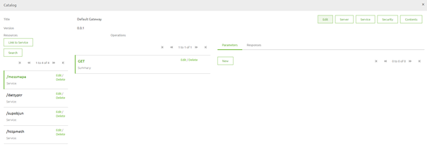

# Parameters (Path, Query)

In this microlearning, we will focus on learning about parameters that can be part of the resource path.
In the previous couple of microlearnings, we learned how to build up the resource path and how to select the correct HTTP method.

In this microlearning, we will expand on this by talking about parameters. 

For API a parameter represents a dynamic part or extension of the resource path

Should you have any questions, please contact academy@emagiz.com.

- Last update: February 11th, 2021
- Required reading time: 9 minutes

## 1. Prerequisites
- Basic knowledge of the eMagiz platform

## 2. Key concepts
This microlearning centers around parameters (Path, Query).
With API we mean: A collection of definitions based on which a client can communicate with applications
With parameters we mean: A dynamic part or extension of the resource path

There are two main parameters when working with APIs:
- Path
	- Part of the path
	- Mandatory
- Query
	- Extension of the resource path
	- Optional (mostly)

## 3. Parameters (Path, Query)

Building on what we learned in the previous microlearnings we now take a look at the dynamic parts of API endpoints.

There are two main parameters when working with APIs:
- Path
	- Part of the path
	- Mandatory
- Query
	- Extension of the resource path
	- Optional (mostly)
	
Below we will discuss both of them and tell you how you should configure them in eMagiz

### 3.1 Path

Let's start with Path parameters. Path parameters are mandatory parts of the resource path that can be filled in dynamically. 
A classic example of using a path parameter is when you execute a GET call to retrieve one specific resource (i.e. Order, Client, Invoice).
The full path, including path parameter, would then look as follows:

- /orders/{uuid}

The notation of a Path parameter is the name of the path parameter encapsulated with curly brackets. In this case, the path parameter label is UUID.
When an external client would call this endpoint they will replace the parameter placeholder with a valid UUID for which they want to retrieve the order information.
An example would be:

- /orders/12345

If an order with that specific UUID exists in our backend we will return the information to the client. 
In case a client does not send this value they will be faced with a 404 not found error because you have to fill in a path parameter as it is mandatory

### 3.2 Query

The second parameter that is used frequently is the query parameter. Query parameters are mostly optional and can help you to filter or sort a collection of resources.
So let us say that apart from making it possible for our external clients to retrieve a single order (via the path parameter option) 
we could also make it possible to limit the result set based on a characteristic, for example, customer via a GET call.

The correct notation of the resource path would then be as follows:

- /orders?customer=eMagiz

This call will return all orders for which the characteristic (customer) is equal to eMagiz. 
By making this optional you can re-use the same endpoint to retrieve all orders and to filter on certain characteristics if there is a need.

So to summarize the difference between path and query parameters:

- Path parameters are always mandatory whereas query parameters are mostly optional
- Path parameters narrow the scope down to a single iteration whereas query parameters offer you the option to filter a result set

### 3.3 Configure parameters

#### 3.3.1 Expose from backend operation

Now that we know what the main differences are let us take a look at how you can implement them in eMagiz. 
As you know from our previous microlearning on HTTP Operations you can expose backend operations. 
Once again if they have a solid base re-use that, eMagiz will include path and query parameters if they exist in the backend operation.

#### 3.3.2 Add/Edit Path Parameters
When that is not the case however you can add and edit the path parameters to your API Gateway Catalog in the following way.
The first step is to open the API Gateway Catalog. 
This can be done through a right-click on the API component in the center of your Design overview to select the option Edit Catalog.

Here you see an overview of all resource paths, operations, and also parameters

In case you want to add a path parameter you need to first change the resource path to identify which part of the resource path is based on the dynamic entry of a parameter value.
In this case, we want to limit the scope of what people can retrieve when calling the HTTP methods endpoint to one specific HTTP method.

To do so we select the resource path and press Edit

In the pop-up that follows you will be able to edit the resource path accordingly. This change should result in something like this. When you are happy you can press Save.

The second step would be to add this parameter and link it to this resource path. You can do that on the same screen. On the right side of the screen, you have the parameters tab

By pressing the button new you can add your parameter with the help of the following pop-up.

The crucial element in this pop-up is the name of the parameter. That should match with the name of the parameter you have changed in the resource path itself. In this example that would be: method

The rest is correct by default. For illustrative purposes, it would be good to add an example of a value that is expected. Save when ready

If you want to change something simply select the parameter and press Edit to edit the parameter

#### 3.3.2 Add/Edit Query Parameters
When that is not the case however you can add and edit the query parameters to your API Gateway Catalog in the following way
The first step is to open the API Gateway Catalog. 
This can be done through a right-click on the API component in the center of your Design overview to select the option Edit Catalog.

Here you see an overview of all resource paths, operations, and also parameters

In the case of a path parameter, we needed to specify where in the path it would end up. 
For query parameters, we don't need to do so because they are always an extension of the resource path at the **end** of a resource path.

On the right side of the screen, you have the parameters tab

By pressing the button new you can add your parameter with the help of the following pop-up.

To add a query parameter you give the parameter a name here and you select the option Query instead of Path. An example of this filled-in looks as follows.

If you want to change something simply select the parameter and press Edit to edit the parameter

## 4. Assignment

Change the exposed endpoint from the last exercise so that it includes a path parameter with the name method.
This assignment can be completed with the help of an associated Mendix project linked to the (Academy) project that you have created/used in the previous assignment.

## 5. Key takeaways

There are two main parameters when working with APIs:
- Path
	- Part of the path
	- Mandatory
- Query
	- Extension of the resource path
	- Optional (mostly)

To summarize the difference between path and query parameters:

- Path parameters are always mandatory whereas query parameters are mostly optional
- Path parameters narrow the scope down to a single iteration whereas query parameters offer you the option to filter a result set

## 6. Suggested Additional Readings

If you are interested in this topic and want more information on it please read the help text provided by eMagiz.

## 7. Silent demonstration video

This video demonstrates how you could have handled the assignment and gives you some context on what you have just learned. Disclaimer, you only see the eMagiz part but if you follow the above steps you are good to go!

<iframe width="1280" height="720" src="../../vid/microlearning/microlearning-api-gateway-parameters.mp4" frameborder="0" allow="accelerometer; autoplay; clipboard-write; encrypted-media; gyroscope; picture-in-picture" allowfullscreen></iframe>