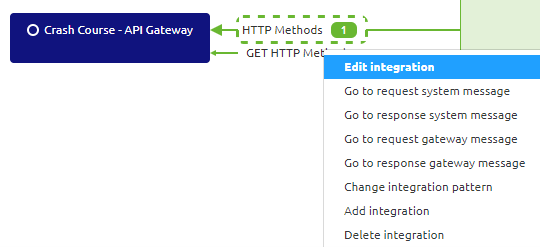
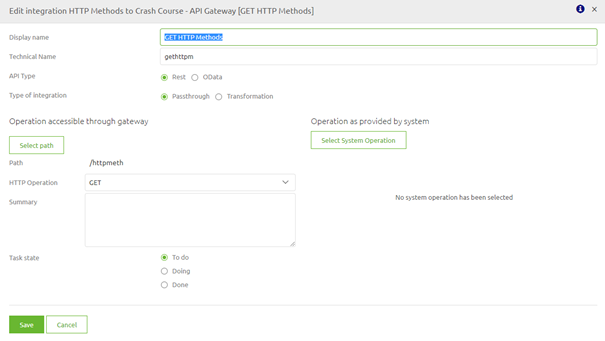

# HTTP Resource (Paths)

In this microlearning we will focus on learning about HTTP Resource (Paths).
A crucial part of setting up your (API) Gateway with the help of RESTful services is 
knowing to which resources (i.e. Order, Client, Employee) you want to give external parties access via your (API) Gateway.

Should you have any questions, please contact academy@emagiz.com.

- Last update: February 11th 2021
- Required reading time: 5 minutes

## 1. Prerequisites
- Basic knowledge of the eMagiz platform

## 2. Key concepts
This microlearning centers around HTTP Resource (Paths) in conjuction with the API Gateway solution of eMagiz.
With HTTP Resource Paths we mean: Identify the resource (i.e. Client, Order, Employee) and define the descriptive path (i.e. /v1/order, /v1/order/{uuid}) a external party can call to execute the operation
With API Gateway we mean: A collection of RESTful API operations that can be published to the outside world in order to give them access to applications that are linked to your business process

When determining the correct resource path to expose to the outside world start at what you want to make publicly available.
For example, when you want to make it possible for external parties to retrieve a collection of orders without any filter a valid resource path can be:
- /orders

If you have multiple resources that you want to make available that all have something to do with the order process you could add each of them to a 'group' to add a extra layer of information:
- /order-management/orders
- /order-management/trips

To determine the correct notation also take into account how the backend system that you want to expose via the API Gateway has determined their HTTP Resource (Paths). 
If this adheres to the best practice simply use that. More on that specific relation in later microlearnings.

A list of best practices can be found here:
https://restfulapi.net/resource-naming/

## 3. HTTP Resource (Paths)
When determining the correct resource path to expose to the outside world start at what you want to make publicly available.
For example, when you want to make it possible for external parties to retrieve a collection of orders without any filter a valid resource path can be:
- /orders

If you have multiple resources that you want to make available that all have something to do with the order process you could add each of them to a 'group' to add a extra layer of information:
- /order-management/orders
- /order-management/trips

To determine the correct notation also take into account how the backend system that you want to expose via the API Gateway has determined their HTTP Resource (Paths). 
If this adheres to the best practice simply use that. More on that specific relation in later microlearnings.

A list of best practices can be found here:
https://restfulapi.net/resource-naming/

### 3.1 Determining the HTTP Operations in eMagiz

When you look at the conceptual idea of the API Gateway, exposing backend operations via a centralized location to the outside world 
it stands to reason that when you setup your API Gateway (i.e. the front-end facing part) start with the backend operation you want to expose. 

When the backend operation also adheres to the RESTful principles you can simply reuse that HTTP method. 
For example if they have a GET operation to request all HTTP Operations you should also have a GET operation on the API Gateway side.

You can easily do so in eMagiz by editing the API Gateway integration in Design via the context menu or by double clicking on it.

In this pop-up you can select the (backend) System Operation you want to expose via the API Gateway.

By pressing the button Select System Operation you will see an overview of all available operations

Select the GET operation and eMagiz will update your integration. The result of this example will be that external clients can execute a 
GET call to retrieve HTTP methods from the system called Crash Course - API Gateway via the help of the eMagiz API Gateway.

Obviously in case the external party does not adhere to the RESTful principle or does not even publish a REST endpoint but a SOAP endpoint or 
something else instead you need to remember the basic principle when determining the correct HTTP Operation for the job.

For example when you need to call a backend operation that hosts a SOAP webservice from which you can retrieve data (but not create or update it) you should use the GET operation **without** a body.

In future microlearnings we will explain how you can use transformations in eMagiz to call such a SOAP webservice with a GET call as a starting point. 

## 4. Assignment

Configure a basic GET operation in the eMagiz API Gateway.
This assignment can be completed with the help of a associated Mendix project linked to the (Academy) project that you have created/used in the previous assignment.

## 5. Key takeaways

Each HTTP Method represents a certain action on a resource. Of the most frequently used ones we can make a nice comparison to the CRUD operations:

HTTP Operations:		CRUD Operations:
- POST					- Create
- GET					- Read
- PUT					- Update
- DELETE				- Delete

In eMagiz you start your thought process at the backend operation and from there you set up your API Gateway.

## 6. Suggested Additional Readings

If you are interested in this topic and want more information on it please read the help text provided by eMagiz and read the following links:
- https://restfulapi.net/resource-naming/

## 7. Silent demonstration video

This video demonstrates how you could have handled the assignment and gives you some context on what you have just learned. Disclaimer, you only see the eMagiz part but if you follow the above steps you are good to go!

<iframe width="1280" height="720" src="../../vid/microlearning/microlearning-http-operations.mp4" frameborder="0" allow="accelerometer; autoplay; clipboard-write; encrypted-media; gyroscope; picture-in-picture" allowfullscreen></iframe>