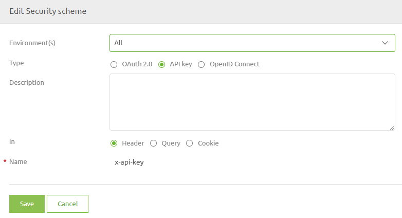

	

		<main class="micro-learning">
		<ul class="doc-nav">
			<li class="doc-nav__item"><a href="../../docs/microlearning/crashcourse-api-gateway-index" class="doc-nav__link">Home</a></li>
			<li class="doc-nav__item"><a href="#intro" class="doc-nav__link">Intro</a></li>
			<li class="doc-nav__item"><a href="#theory" class="doc-nav__link">Theory</a></li>
			<li class="doc-nav__item"><a href="#practice" class="doc-nav__link">Practice</a></li>
			<li class="doc-nav__item"><a href="#solution" class="doc-nav__link">Solution</a></li>
		</ul>

##### Intro

# Security

In this microlearning, we will focus on securing the API Gateway. To ensure that not everyone can access the operations that you have made available you need security.
Security in itself is a broad term.

The focal point of this microlearning is the general security measures that specify how clients should prove to the API Gateway that they are who they say they are.
In other words, the available methods within eMagiz to verify this

In the microlearnings that will follow we will zoom in on configuring roles and users to 
ensure that although a user can access the API Gateway they still cannot perform operations for which they are not authorized.

Should you have any questions, please contact academy@emagiz.com.

- Last update: February 19th, 2021
- Required reading time: 6 minutes

## 1. Prerequisites
- Basic knowledge of the eMagiz platform

## 2. Key concepts
This microlearning centers around securing the API Gateway in general.
With securing we mean: Configuring a method that will be used to validate that the clients are who they say they are
With API Gateway we mean: A collection of RESTful API operations that can be published to the outside world to give them access to applications that are linked to your business process

When you want to set up your security in combination with the eMagiz API Gateway we offer three options out of the box:
- API Key
- OpenID Connect
- OAuth 2.0

All three methods can be supplemented with the requirement that a client needs to send along a client certificate when executing the call.

##### Theory

## 3. Security

To ensure that not everyone can access the operations that you have made available you need security.
Security in itself is a broad term.

The focal point of this microlearning is the general security measures that specify how clients should prove to the API Gateway that they are who they say they are.
In other words, the available methods within eMagiz to verify this.

When you want to set up your security in combination with the eMagiz API Gateway we offer three options out of the box:
- API Key
- OpenID Connect
- OAuth 2.0

All three methods can be supplemented with the requirement that a client needs to send along a client certificate when executing the call.

To choose the security measure for your API Gateway you can navigate to Design and open the context menu on API level (the API segment in the middle of the Design overview)

Choosing this option will lead you to the following screen. Here you can add a New security scheme or edit the existing one. 
Take into account that you should select one security scheme that is in place for all your environments.

Below we will talk about each of these three options.

### 3.1 API Key

The simplest form of authentication is with the help of a so-called API Key. 
This is the most low-level solution available in terms of authorization. 
In this case, the client will send a specific key that they have received from us in a certain header and we will check if the value is correct. 
If not the client will receive a 401 Unauthorized

Best practice is to name the header Authorization. A example of how you can configure this is:

This method is frequently used in a situation that demands less technical complexity and deals with less sensitive data. 
An eMagiz best practice is to always combine this option with the use of a client certificate whenever possible.

### 3.2 OpenID Connect

Both OpenID Connect and OAuth 2.0 work with an authorization server. On this server it is specified if you have rights and if so to what exactly.
To authenticate themselves they first have to send a request to the authorization server. In all subsequent calls, they will have to use the information in the bearer to authenticate themselves.

As you can see this becomes a lot more complex to implement for an outside party. On the flip side, it is a lot better in terms of security.

Within the eMagiz Cloud, we can provide you with such an authorization server that is specifically for implementing your eMagiz API Gateway solution. 
To configure this option simply configure the security scheme as follows:

### 3.3 OAuth 2.0

As said OpenID Connect and OAuth 2.0 are very similar solutions. Only not all OAuth 2.0 providers accept OpenID connect.

Another reason to not use the authorization server that eMagiz can provide you is the fact you already have your authorization server (i.e. Azure AD) in which you already manage this.

For cases that are covered by either of those reasons, we offer the OAuth 2.0 option. 
This is the most complex configuration option for a user to configure as we see the other two as default and this one will take a little bit more configuration.

To configure this option configure the security scheme as follows:

The exact Issuer URL and Token URL will differ based on the OAuth 2.0 provider you want to use.

##### Practice

## 4. Assignment

Add the APIKey security scheme to your API Gateway solution.
This assignment can be completed with the help of the (Academy) project that you have created/used in the previous assignment.

## 5. Key takeaways

- Security in itself is a broad term.
- Focus of this microlearning was on the check if someone was allowed in
- eMagiz support three methods out of the box
	- API Key
	- OpenID Connect
	- OAuth 2.0

##### Solution

## 6. Suggested Additional Readings

If you are interested in this topic and want more information on it please read the help text provided by eMagiz.

## 7. Silent demonstration video

This video demonstrates how you could have handled the assignment and gives you some context on what you have just learned. Disclaimer, you only see the eMagiz part but if you follow the above steps you are good to go!

<iframe width="1280" height="720" src="../../vid/microlearning/crashcourse-api-gateway-security.mp4" frameborder="0" allow="accelerometer; autoplay; clipboard-write; encrypted-media; gyroscope; picture-in-picture" allowfullscreen></iframe>

</main>

