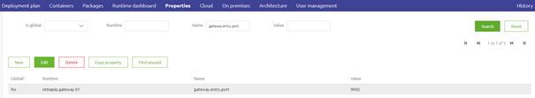
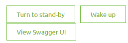
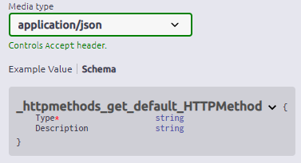
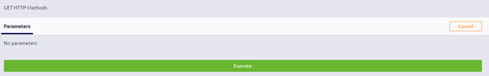

	

		<main class="micro-learning">
		<ul class="doc-nav">
			<li class="doc-nav__item"><a href="../../docs/microlearning/crashcourse-api-gateway-index" class="doc-nav__link">Home</a></li>
			<li class="doc-nav__item"><a href="#intro" class="doc-nav__link">Intro</a></li>
			<li class="doc-nav__item"><a href="#theory" class="doc-nav__link">Theory</a></li>
			<li class="doc-nav__item"><a href="#practice" class="doc-nav__link">Practice</a></li>
			<li class="doc-nav__item"><a href="#solution" class="doc-nav__link">Solution</a></li>
		</ul>

##### Intro

# Swagger UI

In this microlearning, we will focus on learning how you can use the Swagger UI.
To test your API Gateway and more importantly to let others test your API Gateway solution the Swagger UI can play a vital role. Among others it specifies:
- Authorization
- HTTP Resource Paths
- HTTP Operations
- Schema's
- Example messages

Should you have any questions, please contact academy@emagiz.com.

- Last update: February 19th, 2021
- Required reading time: 6 minutes

## 1. Prerequisites
- Basic knowledge of the eMagiz platform

## 2. Key concepts
This microlearning centers around Swagger UI for the API Gateway solution of eMagiz.
With Swagger UI we mean: A user interface that external parties can access via the browser to see the specifications of your API Gateway and test their solutions at the same time
With API Gateway we mean: A collection of RESTful API operations that can be published to the outside world in order to give them access to applications that are linked to your business process

Having a Swagger UI is of great importance to let others test your API Gateway Solution. The Swagger UI comes with:
- Authorization
- HTTP Resource Paths
- HTTP Operations
- Schema's (if defined)
- Example messages (if defined)

##### Theory

## 3. Swagger UI

The Swagger UI is a user interface that external parties can access via the browser to see the specifications of your API Gateway and test their solutions at the same time.
Based on your configuration in the Design phase, eMagiz will generate the Swagger UI for you. The only thing that you need to specify is the port of which the endpoints are hosted.
You can do that by configuring the following property:

- gateway.entry.port

### 3.1 Access Swagger UI

When your solution is running (cloud or on your local device) you can access the Swagger UI. 
In case you are running the gateway in the eMagiz Cloud for all environments you can access the Swagger UI page via the Runtime Dashboard of the Gateway.

Clicking on that button will automatically open a new tab on your browser that will guide you to the Swagger UI.

In case you want to run your API Gateway solution on your local device for testing purposes you can access the Swagger UI by opening a new browser tab and entering the following URL:

- http://localhost:{gateway.entry.port}/swaggerui/swaggerui

Obviously, you need to replace the {gateway.entry.port} with the port that you have configured yourself. So when you choose port 9092 the URL would be:

- http://localhost:9092/swaggerui/swaggerui

### 3.2 Reading Swagger UI

After you have accessed Swagger UI you will see all endpoints that are available for your API Gateway implementation.

As you can see from the overview the first thing you encounter is the Authorize button. 
By clicking on that you get a pop-up where you need to fill in the authorization details. In this case a valid API Key.

Below that, you see all operations grouped per integration. In this simple example case, we only have one operation on one integration as you can see.

By clicking on an operation you can see the detailed information of that operation. Here you can see the Example Value and Schema. 
In the Schema, you can see what is mandatory indicated by the red asterisk icon in front of the attribute or element

 
 

### 3.3 Testing with Swagger UI

Furthermore, there is a try-it-out button. After you have pressed this button you will see a button called Execute appear. 
By pressing this button you will test the API Gateway functionality.

The Swagger UI will give feedback based on what happened after you have pressed the button to execute

##### Practice

## 4. Assignment

Run your API Gateway locally and access the Swagger UI via the browser. Authenticate yourself and test at least one operation.
This assignment can be completed with the help of the (Academy) project that you have created/used in the previous assignment.

## 5. Key takeaways

- Swagger UI gives you information on
	- Authorization
	- HTTP Resource Paths
	- HTTP Operations
	- Schema's (if defined)
	- Example messages (if defined)
- Swagger UI gives the external party a option to test the various operations

##### Solution

## 6. Suggested Additional Readings

If you are interested in this topic and want more information on it please read the help text provided by eMagiz and read the following linked"

- https://swagger.io/docs/specification/2-0/what-is-swagger/

## 7. Silent demonstration video

This video demonstrates how you could have handled the assignment and gives you some context on what you have just learned. Disclaimer, you only see the eMagiz part but if you follow the above steps you are good to go!

<iframe width="1280" height="720" src="../../vid/microlearning/crashcourse-api-gateway-swagger-ui.mp4" frameborder="0" allow="accelerometer; autoplay; clipboard-write; encrypted-media; gyroscope; picture-in-picture" allowfullscreen></iframe>

</main>

