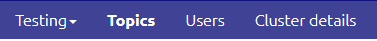
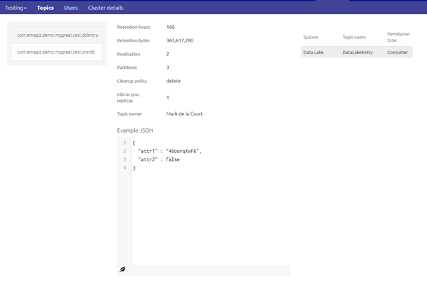
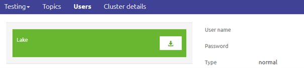
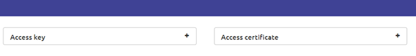
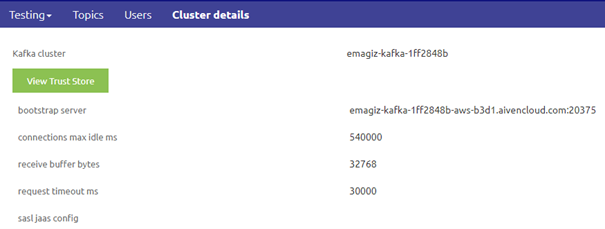
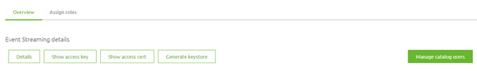
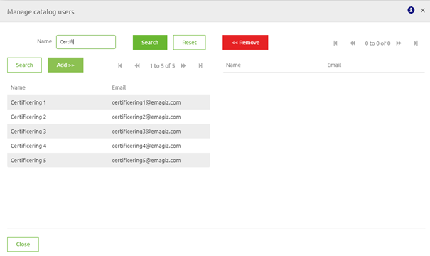
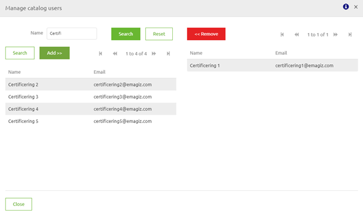
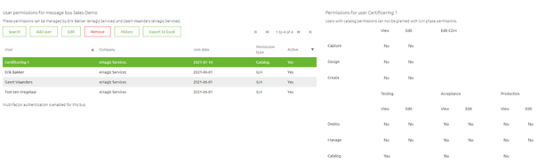

    

        <main class="micro-learning">
        <ul class="doc-nav">
            <li class="doc-nav__item"><a href="../../docs/microlearning/crashcourse-event-streaming-index" class="doc-nav__link">Home</a></li>
            <li class="doc-nav__item"><a href="#intro" class="doc-nav__link">Intro</a></li>
            <li class="doc-nav__item"><a href="#theory" class="doc-nav__link">Theory</a></li>
            <li class="doc-nav__item"><a href="#practice" class="doc-nav__link">Practice</a></li>
            <li class="doc-nav__item"><a href="#solution" class="doc-nav__link">Solution</a></li>
        </ul>

##### Intro

# Catalog

In this microlearning, we will focus on the catalog that is available for the Event Streaming pattern in eMagiz. The catalog depicts the relevant information on the topic and user level for any external party that is connecting or wants to connect to the eMagiz event streaming cluster. With the help of such a catalog, it will become easy for external parties to connect to your eMagiz event streaming cluster.

Should you have any questions, please contact academy@emagiz.com.

- Last update: July 14th, 2021
- Required reading time: 8 minutes

## 1. Prerequisites
- Basic knowledge of the eMagiz platform
- Understanding of Event Streaming concept
- An active Event Streaming license

## 2. Key concepts
This microlearning centers around explaining the catalog for event streaming.
With catalog we mean: A place within eMagiz that shows all relevant information on the topic and user level for your eMagiz Event Streaming cluster to external parties.

Knowing what the catalog is and how you can properly communicate with external parties via the catalog is of the utmost importance when dealing with a complex Event Streaming integration model that spans across a multitude of topics that interchange data.

The catalog provides the following:
- Topic overview
- Rights overview on user level
- Message structure on topic level (if available)
- Connection details

##### Theory

## 3. Catalog

In this microlearning, we will focus on the catalog that is available for the Event Streaming pattern in eMagiz. The catalog depicts the relevant information on the topic and user level for any external party that is connecting or wants to connect to the eMagiz event streaming cluster. With the help of such a catalog, it will become easy for external parties to connect to your eMagiz event streaming cluster.

Knowing what the catalog is and how you can properly communicate with external parties via the catalog is of the utmost importance when dealing with a complex Event Streaming integration model that spans across a multitude of topics that interchange data.

The catalog provides the following:
- Topic overview
- Rights overview on user level
- Message structure on topic level (if available)
- Connection details

### 3.1 Catalog View

One part of the equation is the catalog view that your external parties will see when logging in. The other part, inviting catalog users, will be discussed later on. When a catalog user logs in he/she sees a different view compared to a regular user. The catalog user only sees the catalog page. So the first thing that is noticeable is the fact that instead of seeing the various ILM phases (Capture, Design, Create, Deploy and Manage) the user only sees the Catalog page.

Furthermore, on this page, the user will see three levels:
- Topics
- Users
- Cluster Details

Note that this view is separated per environment.

#### 3.1.1 Topics

On the first level, you see relevant information on a per-topic basis. Here you see the topic configuration, such as the retention bytes and the retention hours. Furthermore, you see an example of how the message that is placed on the topic will look like. On top of those, you will see which rights your system has on the topic (i.e. are you a producer, consumer, or both).

Armed with this information you can easily execute the first steps of the configuration that are needed to connect to a topic.

#### 3.1.2 Users

The next step is located in the user section. In here you will see all Event Streaming Users to which you as a catalog user have access. For more info on what Event Streaming users are please check out the previous microlearning. In this tab, you can download the keystore that is needed to properly authenticate yourself to the cluster in order to produce or consume a message. Furthermore, you will see the username and password that are needed to unlock your unique Keystore. Note that the username and password in the example are hidden due to security reasons.

In case you do not want to use the Keystore but the separate components that make up the Keystore you can access them individually on this page as well.

#### 3.1.3 Cluster Details

Last but not least step that is needed to successfully configure the connection between your system(s) and specific topics on the eMagiz Event Streaming Cluster is defining the bootstrap server URL and getting the truststore. Both information elements can be found under the Cluster Details tab.

As you can see the bootstrap server URL is depicted on the top of the list of configuration settings for the cluster. Above that, there is a button called View Truststore. By clicking this button you will see a pop-up that allows you to download your truststore and that shows you the accompanying password. Once again note that the password is not shown due to security reasons.

### 3.2 Configure Catalog Users

In the previous section, we learned what a catalog user will see when he/she logs in. However to allow this the catalog user(s) first need to be configured. This is a two-step process for which you need a company contact to assist you with the first step. To configure a catalog user the first step is to ask your company contact to add one (or more) portal user(s) to your company. This is necessary so you can select said portal user as a catalog user within your specific integration data model. This is what we call linking the catalog user to the event streaming user.

To link a catalog user to an event streaming user simply navigate to the Deploy phase of your integration data model and select User Management. Here you can select an Event Streaming user. Assuming the Event Streaming user is already configured (if not please press Apply to Environment) you will see the following option appear on the user level under event streaming details.

By pressing the Manage catalog users button you will be prompted with a pop-up in which you can select which portal user should become a catalog user and with that automatically be linked to the event streaming user.

You can add catalog users by pressing the Add button in this pop-up. After you are satisfied with your work you can press Close. Note that you need to define this link per environment (Test, Acceptance, Production).

As a result, this user has received 'catalog rights' on this integration data model.

This user can now log onto the platform and will see the catalog overview discussed above for this integration data model. 

##### Practice

## 4. Assignment

Configure one catalog user for your project and subsequently log in as said catalog user to view the catalog related to your project.
This assignment can be completed with the help of the Topic you have created/used in the previous assignment on your (Academy) project.

## 5. Key takeaways

- Portal users can become 'catalog users' on integration data model level
- A catalog user only sees the catalog view nothing else
- The catalog is very useful for external parties to quickly gather the relevant information needed to connect to the eMagiz Event Streaming Cluster

##### Solution

## 6. Suggested Additional Readings

If you are interested in this topic and want more information on it please read the help text provided by eMagiz when executing these actions.

## 7. Silent demonstration video

<iframe width="1280" height="720" src="../../vid/microlearning/crashcourse-eventstreaming-catalog.mp4" frameborder="0" allow="accelerometer; autoplay; clipboard-write; encrypted-media; gyroscope; picture-in-picture" allowfullscreen></iframe>

</main>

