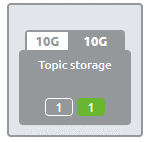
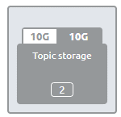

    

        <main class="micro-learning">
        <ul class="doc-nav">
            <li class="doc-nav__item"><a href="../../docs/microlearning/crashcourse-event-streaming-index" class="doc-nav__link">Home</a></li>
            <li class="doc-nav__item"><a href="#intro" class="doc-nav__link">Intro</a></li>
            <li class="doc-nav__item"><a href="#theory" class="doc-nav__link">Theory</a></li>
            <li class="doc-nav__item"><a href="#practice" class="doc-nav__link">Practice</a></li>
            <li class="doc-nav__item"><a href="#solution" class="doc-nav__link">Solution</a></li>
        </ul>

##### Intro

# Create your Topic

In this microlearning, we will focus on creating your topic based on what you have designed.

Should you have any questions, please get in touch with academy@emagiz.com.

- Last update: February 8th, 2022
- Required reading time: 5 minutes

## 1. Prerequisites
- Basic knowledge of the eMagiz platform
- Understanding of Event Streaming concept
- An active Event Streaming license

## 2. Key concepts
This microlearning centers around creating your topic based on what you have designed.
By topic, we mean A category/feed name to which event records are stored and published.

Knowing how to create a topic via the eMagiz platform makes it possible to gradually make specific topics available for others to produce and consume data via that topic.

Creating a topic in eMagiz is very easy. Below we will detail how you can create a topic via eMagiz.

##### Theory

## 3. Create your Topic

Based on what you have designed in the Capture and Design phase, eMagiz will make your topic automatically available to be deployed per environment. To deploy a particular topic in an environment, you need to navigate towards Deploy Architecture.

### 3.1 Register the topic on the cluster

Within Deploy Architecture, you will see your Topic Storage, including the newly added topic in green.

To ensure that the topic is created in that environment, enter "Start Editing" mode and press Apply to Environment. As a result, eMagiz will make the topic on the Event Streaming cluster and communicate the impact back to you. Once the topic has been created, the widget will show the result. In this example, the green icon will disappear, and the number of grey topics increases with one. The result should look similar as below.

##### Practice

## 4. Assignment

Register your topic on the cluster. This assignment can be completed with the help of the topic you have created/used in the previous assignment on your (Academy) project.

## 5. Key takeaways

- eMagiz will automatically create your topic for you; you only need to register it.
- It is easy to register a topic in eMagiz; navigate to Deploy Architecture and press Apply to environment in "Start Editing" mode.

##### Solution

## 6. Suggested Additional Readings

If you are interested in this topic and want more information, please read the help text provided by eMagiz when executing these actions.

## 7. Silent demonstration video

This video demonstrates how you could have handled the assignment and gives you some context on what you have just learned.

<iframe width="1280" height="720" src="../../vid/microlearning/crashcourse-eventstreaming-create-your-topic.mp4" frameborder="0" allow="accelerometer; autoplay; clipboard-write; encrypted-media; gyroscope; picture-in-picture" allowfullscreen></iframe>

</main>

