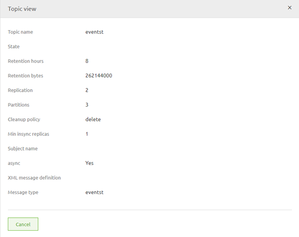
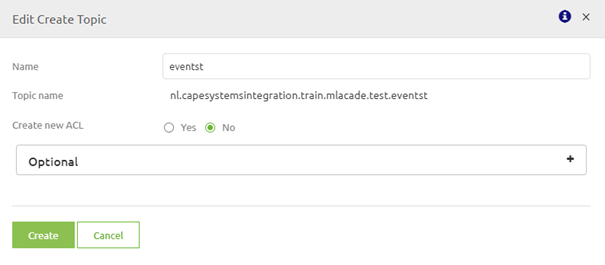

# Create your Topic

In this microlearning we will focus on how you can create your topic based on what you have designed.

Should you have any questions, please contact academy@emagiz.com.

- Last update: January 22th 2021
- Required reading time: 5 minutes

## 1. Prerequisites
- Basic knowledge of the eMagiz platform
- Understanding of Event Streaming concept
- An active Event Streaming license

## 2. Key concepts
This micro learning centers around how you can create your topic based on what you have designed.
With topic we mean: A category/feed name to which event records are stored and published.

Knowing how to create a topic via the eMagiz platform makes it possible to granually make certain topics available for others to produce data on and consume data from.

Creating a topic in eMagiz is very easy. Below we will detail the specifics of how you can create a topic via eMagiz.

## 3. Create your Topic

Based on what you have designed in the Capture and Design phase you are now at the brink of Creating a topic via the eMagiz platform.

### 3.1 Transfer topic to Create

When you navigate to the Create phase of eMagiz you have the option to Add integrations to Create. This button is located on the right bottom of your screen.
If you click on this button you will arrive at a page that looks something like this:

If you want to create a certain topic you simply select the checkbox that is still available (white background, green border) for both the producing and consuming side.

The moment you are satisfied with your choice you can Press Save Selection to tell eMagiz that you want to Create the topic(s) you have just selected.

### 3.2 Set up the Infra for Event Streaming

The first time you add a topic to the Create phase of eMagiz, as a best practice, you should also configure the Infra flow.
You can do so by accessing the context menu when you navigate to the Stream overview in Create and right click in the center of the screen but not on the topic(s) themselve(s).

After you have selected the option called Open stream Infra you only have to press Stop editing and give a description of what you have changed.
Simply fill in that this was a mandatory step to successfully setup your Event Streaming config.

### 3.3 Register the topic on the cluster

After you have created the topic in Create you can access the topic information of your topic with the help of the context menu on topic level.
If you go to the Create overview of the Stream pattern you can right click on the topic itself to retrieve the topic information.

In the pop-up that is opened when you select the option you can see the details of your configuration. For this step the crucial part is the topic name. In this example eventst

You can copy or remember this name. If you have done so you can close the pop-up and navigate to Deploy. 
In Deploy there is a specific Event Streaming section which you can access in the top bar on the left.

This overview holds the cluster configuration, the users that have been registered at cluster level, the topics on the cluster and defines which user has what rights on what topic.

To register the topic we will for now focus on the Topic tab of this overview.

We want to add a topic, therefore we press the Add Topic button. 
In the pop-up that follows we fill in the Topic Name that we have copied / remembered from our Create settings and we say we don't want to create an ACL just yet. More on that in the next Microlearning.

After you have pressed save you will have successfully registered the topic on your cluster.

## 4. Assignment

Add your topic to Create. This assignment can be completed with the help of the Topic you have created/used in the previous assignment on your (Academy) project.

## 5. Key takeaways

- It is easy to Create a topic in eMagiz, simply select the topic you want and press Save Selection
- Don't forget to set up your infra the first time you start working with Event Streaming
- After you have created your topic you can register the topic via Deploy.

## 6. Suggested Additional Readings

If you are interested in this topic and want more information on it please read the helptext provided by eMagiz when executing these actions.

## 7. Silent demonstration video

This video demonstrates how you could have handled the assignment and gives you some context on what you have just learned.

<iframe width="1280" height="720" src="../../vid/microlearning/microlearning-create-your-topic.mp4" frameborder="0" allow="accelerometer; autoplay; clipboard-write; encrypted-media; gyroscope; picture-in-picture" allowfullscreen></iframe>