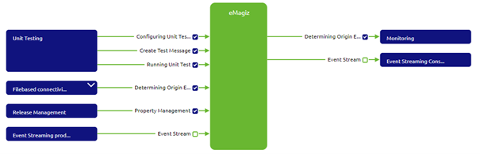
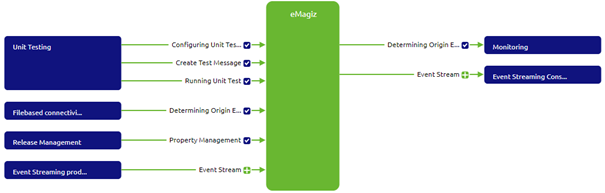
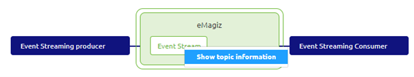
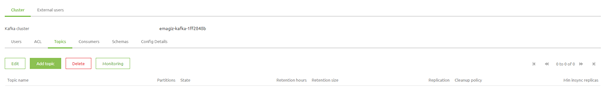

	

		<main class="micro-learning">
		<ul class="doc-nav">
			<li class="doc-nav__item"><a href="../../docs/microlearning/crashcourse-event-streaming-index" class="doc-nav__link">Home</a></li>
			<li class="doc-nav__item"><a href="#intro" class="doc-nav__link">Intro</a></li>
			<li class="doc-nav__item"><a href="#theory" class="doc-nav__link">Theory</a></li>
			<li class="doc-nav__item"><a href="#practice" class="doc-nav__link">Practice</a></li>
			<li class="doc-nav__item"><a href="#solution" class="doc-nav__link">Solution</a></li>
		</ul>

##### Intro

# Create your Topic

In this microlearning, we will focus on how you can create your topic based on what you have designed.

Should you have any questions, please contact academy@emagiz.com.

- Last update: January 22th 2021
- Required reading time: 5 minutes

## 1. Prerequisites
- Basic knowledge of the eMagiz platform
- Understanding of Event Streaming concept
- An active Event Streaming license

## 2. Key concepts
This microlearning centers around how you can create your topic based on what you have designed.
By topic we mean: A category/feed name to which event records are stored and published.

Knowing how to create a topic via the eMagiz platform makes it possible to gradually make certain topics available for others to produce data on and consume data from.

Creating a topic in eMagiz is very easy. Below we will detail the specifics of how you can create a topic via eMagiz.

##### Theory

## 3. Create your Topic

Based on what you have designed in the Capture and Design phase you are now at the brink of Creating a topic via the eMagiz platform.

### 3.1 Transfer topic to Create

When you navigate to the Create phase of eMagiz you have the option to add integrations to Create. This button is located at the right bottom of your screen.
If you click on this button you will arrive at a page that looks something like this:

If you want to create a certain topic you simply select the checkbox that is still available (white background, green border) for both the producing and consuming side.

The moment you are satisfied with your choice you can Press Save Selection to tell eMagiz that you want to Create the topic(s) you have just selected.

### 3.2 Register the topic on the cluster

After you have created the topic in Create you can access the topic information of your topic with the help of the context menu on topic level.
If you go to the Create overview of the Stream pattern you can right-click on the topic itself to retrieve the topic information.

In the pop-up that is opened when you select the option, you can see the details of your configuration. This name will be used by eMagiz to register the topic on the cluster.

To tell eMagiz to register the cluster navigate to Deploy -> Releases. Here you can open the context menu on the Create phase

In this context menu, you have the option called Batch Update. By selecting this option eMagiz will automatically register all new topics to your cluster.

You can check the results of this action in the Event streaming section in Deploy by opening the Topic tab.

##### Practice

## 4. Assignment

Add your topic to Create. This assignment can be completed with the help of the Topic you have created/used in the previous assignment on your (Academy) project.

## 5. Key takeaways

- It is easy to create a topic in eMagiz, simply select the topic you want and press Save Selection
- After you have created your topic you can register the topic via Deploy.

##### Solution

## 6. Suggested Additional Readings

If you are interested in this topic and want more information on it please read the help text provided by eMagiz when executing these actions.

## 7. Silent demonstration video

This video demonstrates how you could have handled the assignment and gives you some context on what you have just learned.

<iframe width="1280" height="720" src="../../vid/microlearning/crashcourse-eventstreaming-create-your-topic.mp4" frameborder="0" allow="accelerometer; autoplay; clipboard-write; encrypted-media; gyroscope; picture-in-picture" allowfullscreen></iframe>

</main>

