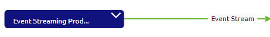
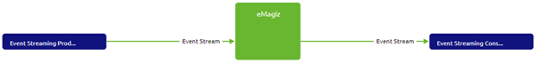
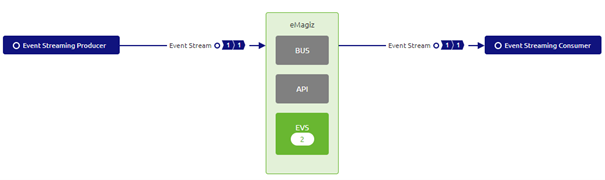
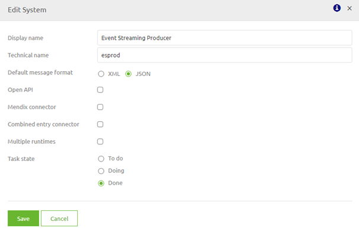

# Designing an Event Stream

In this microlearning, we will focus on how you can design an Event Streaming Solution with the help of the first two phases of eMagiz (i.e Capture and Design).

Should you have any questions, please contact academy@emagiz.com.

- Last update: January 22th 2021
- Required reading time: 6 minutes

## 1. Prerequisites
- Basic knowledge of the eMagiz platform
- Understanding of Event Streaming concept

## 2. Key concepts
This microlearning centers around designing an event stream.
By event stream we mean: A decoupled service that works best within a microservices architecture with each application having its core function for high volumes.

To design an event stream you must do the following:

- Define the system(s) in Capture that you want to connect
- Define the data object you want to exchange with the help of an event stream, name this accordingly and draw lines indicating the flow of data between these systems
- Check your work in Design via the Design overview.

Below we will discuss each of these steps separately.

## 3. Designing an Event Stream

Within the eMagiz platform, you can easily design an event stream.
In this section we will discuss how you can design an event stream by following these steps:

- Define the system(s) in Capture that you want to connect
- Define the data object you want to exchange with the help of an event stream, name this accordingly and draw lines indicating the flow of data between these systems
- Check your work in Design via the Design overview.

### 3.1 Define the system(s) in Capture

As with all integration patterns the process starts in Capture. In Capture, you have the option to add systems to the canvas that can connect to a topic.
To indicate this ability on the system-level you have the option to select Event Streaming as the default integration pattern on the system level.

### 3.2 Define the data object you want to exchange

After you have created the system and filled the details in you can add integrations from and to eMagiz. When looking at Event Streaming within the scope of eMagiz the integration (in messaging) equals a topic (in event streaming).
If you draw a line from a system to eMagiz you define that the system from which you have drawn the line is a 'producing' system. A 'producing' system is a system that writes data to one or more topics. If a systems write to more topics you draw more lines.

If you draw a line from eMagiz to a system you define that the system to which you have drawn the line is a 'consuming' system. A 'consuming' system is a system that reads data from one or more topics. If a system reads from more topics you draw more lines.

The moment you have captured these systems you will end up with something like this.

### 3.2 Check your work in Design

Design is the crucial phase when it comes to Event Streaming. More on all of the specific functionalities Design offers you in other microlearnings. 
In this microlearning, we will focus on the Design overview and how you can use this to verify what you have captured

#### 3.2.1 Design overview

In Design, you see an overview of your landscape including all first-class integration patterns (messaging, API gateway, and event streaming).

For Event Streaming integrations you see one or more numbers per integration. These numbers mean as follows (left to right):

- Number of 'producers' on a topic
- Number of event processors for which this data of the topic (integration) is the input of the event processor
- Number of event processors for which this data of the topic (integration) is the output of the event processor
- Number of 'consumers' on a topic

##### 3.2.1.1 Technical config system

If you have configured your system in such a way that you have specified that this system has a default integration pattern of Event Streaming you only need to fill in the technical name in Design
as eMagiz already has set the message format to JSON. This is done because the defacto standard of Event Streaming messages is JSON.

##### 3.2.1.2 Red background in Design on integration level

If you see a red background behind the number this indicates that you have indicated that a system is consuming data from a specific topic (integration) 
but have not yet indicated how the data will be produced on the topic.

There are two ways to set this straight:

1. Go back to Capture and draw a line to indicate that a specific system directly produces messages on that topic. For more information on this revisit the section surrounding Capture in this microlearning
2. Add an Event processor. More on this later in the course

## 4. Assignment

As an assignment on this subject please execute the following steps:
- Add one producing and one consuming system to eMagiz
- Connect these systems by drawing a line between them via eMagiz
- Verify your work with the help of the Design overview (i.e. no red background) and fill in the technical details of both systems.

This assignment can be completed within the Capture and Design phase of your (Academy) project that you have created/used in the previous assignment.

## 5. Key takeaways

- To design an event stream you must do the following:
	- Define the system(s) in Capture that you want to connect
	- Define the data object you want to exchange with the help of an event stream, name this accordingly and draw lines indicating the flow of data between these systems
	- Check your work in Design via the Design overview.
- To verify whether there are mismatches you can use the visual queues eMagiz provides you within the Design overview
- Based on the Design overview you can see in one view the metadata related to your data flow

## 6. Suggested Additional Readings

If you are interested in this topic and want more information on it please read the help text provided by eMagiz when executing these actions and read the user guide provided on this topic.

## 7. Silent demonstration video

This video demonstrates how you could have handled the assignment and gives you some context on what you have just learned.

<iframe width="1280" height="720" src="../../vid/microlearning/microlearning-designing-a-event-stream.mp4" frameborder="0" allow="accelerometer; autoplay; clipboard-write; encrypted-media; gyroscope; picture-in-picture" allowfullscreen></iframe>