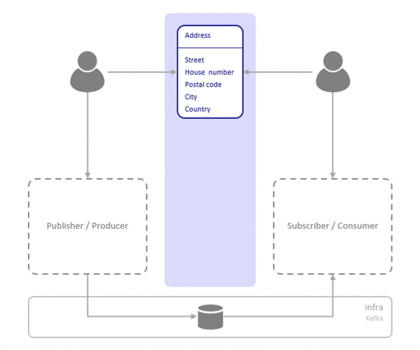

	

		<main class="micro-learning">
		<ul class="doc-nav">
			<li class="doc-nav__item"><a href="../../docs/microlearning/crashcourse-eventstreaming-index" class="doc-nav__link">Home</a></li>
			<li class="doc-nav__item"><a href="#intro" class="doc-nav__link">Intro</a></li>
			<li class="doc-nav__item"><a href="#theory" class="doc-nav__link">Theory</a></li>
			<li class="doc-nav__item"><a href="#practice" class="doc-nav__link">Practice</a></li>
			<li class="doc-nav__item"><a href="#solution" class="doc-nav__link">Solution</a></li>
		</ul>

##### Intro

# Event Streaming - Introduction

In this microlearning, we will give an introduction to Event Streaming and look a little bit into how this is implemented in eMagiz.

Should you have any questions, please contact academy@emagiz.com.

- Last update: January 22th 2021
- Required reading time: 6 minutes

## 1. Prerequisites
- Basic knowledge of the eMagiz platform

## 2. Key concepts
This microlearning gives an introduction to Event Streaming.

Below you find several key concepts that define (parts of) event streaming:

- With event streaming, you can publish data without building specific data integration between one or more applications
- Publisher and subscriber are de-coupled and don't need to be aware of each other specifically
- Data is stored inside the platform for a certain amount of time (retention)
- Event data is continuous being sent or made available

We will elaborate on these concepts a bit more so you have a good introduction before we start linking Event Streaming to eMagiz in the upcoming microlearnings.

##### Theory

## 3. Event Streaming - Introduction

In this microlearning, we want to take you on a short journey to explain the fundamental concepts of what Event Streaming is. 
In the microlearnings that follow we will guide you in implementing event streaming within the eMagiz platform.

We will explain what Event Streaming is based on the following perspectives:

- With event streaming, you can publish data without building specific data integration between one or more applications
- Publisher and subscriber are de-coupled and don't need to be aware of each other specifically
- Data is stored inside the platform for a certain amount of time (retention)
- Event data is continuous being sent or made available

### 3.1 Publish data without building a data integration

Event Streaming revolves around a cluster of topics that contain data. External parties can write data to said topics without having to know who will consume the data.
Compare it to a news item that gets published on a news website. The editor publishes the data on the news site without 
knowing who will consume the data and when they will consume the data.

The same principle applies to other types of data. By having a centralized point where authorized parties can publish their data for others to consume you have enough to exchange that data between parties.
Subsequently, it is up to the consuming entities to read the data and process the data in a way that aids their business process.

### 3.2 Publisher and subscriber are de-coupled

Because there is a centralized managed cluster of topics to which a producer can write data without having to wait for acknowledgment of the consumer(s) 
you can de-couple all publishers and subscribers. This makes sure that your microservices landscape can be strongly decoupled.

By being de-coupled from one another it makes it easier to develop on certain applications in parallel without having to constantly communicate on the shared integration that transfers data from application A to application B.

In this way, it has become the sole responsibility of the producer to publish data on a certain topic. After he has done so his job is finished.

It is further up to the consumer to subscribe to that data and process it in a way that adds value to their specific business application.

### 3.3 Data is retained inside the platform

Because publishers and subscribers are unaware of each other a centralized piece 
of the puzzle needs to make sure that data is kept at that centralized location (the topic) for a certain amount of time. 

This way you can ensure that data can be consumed at will by those who subscribed to a topic without having to navigate to the 
transactional nature of delivering a specific message to each consumer as you would with messaging.

Correctly determining the retention policy in terms of event streaming is, therefore, one of the crucial parts of a successful implementation of event streaming.

### 3.4 Event data is continuous in nature

The 'streaming' part of the event stream says it all. In this scenario, the data (compiled of a continuous series of events) keeps on being sent to the topic and is therefore continuously available for consumers to process.

For example, if you want to monitor the temperature in a certain building on a room by room basis to send out an alert when the temperature passes a certain threshold you can facilitate this easily with Event Streaming.

Simply make sure that all monitors send their data to the topic continuously and check whether or not a value of a monitor exceeds a value. 
If so, please the message on a different topic from which a third application can read the data and send an SMS to a concerned party.

This is a very rudimentary scenario that can be optimized a lot but it gives an idea of what Event Streaming can do for you.

### 3.5 Example situations Event Streaming

- Sensors in vehicles, industrial equipment, and farm machinery send data to a streaming application. The application monitors performance detects any potential defects in advance and places a spare part order automatically preventing equipment downtime.
- A financial institution tracks changes in the stock market in real-time, computes value-at-risk, and automatically rebalances portfolios based on stock price movements.
- A real-estate website tracks a subset of data from consumers’ mobile devices and makes real-time property recommendations of properties to visit based on their geo-location.
- A solar power company has implemented a streaming data application that monitors all of the panels in the field, and schedules service in real-time, thereby minimizing the periods of low throughput from each panel and the associated penalty payouts.
- A media publisher streams billions of clickstream records from its online properties, aggregates and enriches the data with demographic information about users, and optimizes content placement on its site, delivering relevancy and a better experience to its audience.
- An online gaming company collects streaming data about player-game interactions and feeds the data into its gaming platform. It then analyzes the data in real-time, offers incentives and dynamic experiences to engage its players.

##### Practice

## 4. Assignment

For this microlearning there is no assignment.

## 5. Key takeaways

Event Streaming is a decoupled service that works best within a microservices architecture with each application having its core function for high volumes.

Critical perspectives when looking at Event Streaming are:

- With event streaming, you can publish data without building specific data integration between one or more applications
- Publisher and subscriber are de-coupled and don't need to be aware of each other specifically
- Data is stored inside the platform for a certain amount of time (retention)
- Event data is continuous being sent or made available

##### Solution

## 6. Suggested Additional Readings

If you are interested in this topic and want more information on it please see the following links:

- https://www.emagiz.com/event-streaming/
- https://www.confluent.io/learn/kafka-tutorial/
- https://www.oreilly.com/radar/the-world-beyond-batch-streaming-101/
- 

## 7. Silent demonstration video

This video gives a nice introduction to Event Streaming concerning the eMagiz platform.

<iframe width="560" height="315" src="https://www.youtube.com/embed/VRGz3z_T3mw" frameborder="0" allow="accelerometer; autoplay; clipboard-write; encrypted-media; gyroscope; picture-in-picture" allowfullscreen></iframe>

</main>

