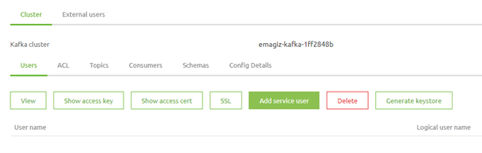
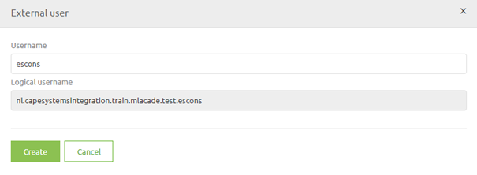
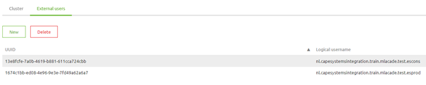
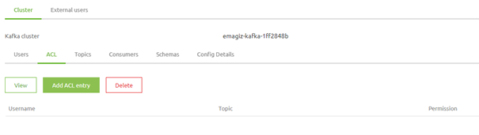
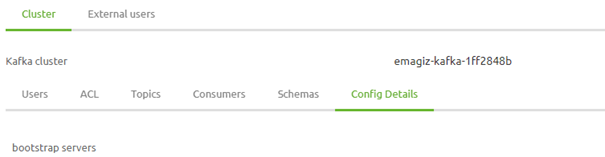

# External Users - Event Streaming

In this microlearning we will focus on how the registration of external users within the context of Event Streaming and how to give these users the correct rights on a topic level basis.

Should you have any questions, please contact academy@emagiz.com.

- Last update: January 22th 2021
- Required reading time: 5 minutes

## 1. Prerequisites
- Basic knowledge of the eMagiz platform
- Understanding of Event Streaming concept
- An active Event Streaming license

## 2. Key concepts
This micro learning centers around how you can register external users via the eMagiz platform and hand out the correct rights for these users so they can access the topic(s) they need to access.
With external user we mean: A system outside of eMagiz that is interested in producing or consuming data from a topic that is available via the eMagiz topic cluster.

Having the knowledge to register external users and give them the correct rights makes it possible to control which parties have access to which data via a controlled and managed environment.

Registering external users in eMagiz and handing out rights is very easy. Below we will detail the specifics of how you can create a topic via eMagiz.

## 3. External Users and their rights

Based on what you have created in the Create phase you can now infer from that setup which external users need to be created. 
Each system that is drawn within eMagiz represents a external user within the context of Event Streaming.

### 3.1 Configure external Users

When you navigate to the Deploy phase of eMagiz you have the option to Add External Users for Event Streaming. You can do this by navigating to the Event Streaming section in Deploy.

In this overview you can select the tab called External users

On this page you can add a external user by selecting the New button and giving the external user a name. 

Best practice would be to use the technical name or the display name of the systems you have created in the phases before.

Obviously if you want to get rid of a certain user you can select it and press Delete. After that the user is gone.

The result of adding two external users that fit our use case will look as follows:

### 3.2 Handing out rights to a user

With the help of the Access Control List (ACL) you can define which user has access to which topic and even specify whether a user can:

- write
- read
- writeread

This way you can make sure that a party that is supposed to only consume data only gets read access on a topic to prevent that this party inadvertently starts writing data to the topic.

When you press Add ACL entry you can fill in the following pop-up. In this pop-up you select the user, the topic and the rights said user must have on a topic.

The moment you are happy with your choices you can press Save and eMagiz will make sure that the user has access to that topic from that point on.

### 3.3 Sharing the connection details

Now that you have given a certain user certain rights on a certain topic the ball is in the court of the external party. They now need to set up a connection to the eMagiz cluster.

To make sure they will succeed in this they will have to have the following four pieces of information from you to set up a connection to the eMagiz cluster.

1. eMagiz bootstrap server url. This can be found under the Config tab of Deploy -> Event Streaming

		Be aware that in this example the actual bootstrap server url is wiped clean for security reasons
2. Truststore containing the CA of the eMagiz Cluster. You can request this via productmanagement@emagiz.com
3. Keystore containing the client certificate information. You can download this keystore from the portal at User level (Generate keystore). The accompanying password can be found when you select the user and press view.
4. The topic name

If you hand these four pieces of information over to the external party that wants to connect to a certain topic they should be able to connect to the topic.

## 4. Assignment

Add two external users to your project and make sure the producing systems has only rights to produce and the consuming system only has rights to consume. 
This assignment can be completed with the help of the Topic you have created/used in the previous assignment on your (Academy) project.

## 5. Key takeaways

- First create a topic, afterwards create a external user and give them the correct rights (assuming everything is new)
- Don't give systems rights they should not have
- Collect all relevant information so you can easily tell the external party how to connect to the eMagiz cluster

## 6. Suggested Additional Readings

If you are interested in this topic and want more information on it please read the helptext provided by eMagiz when executing these actions.

## 7. Silent demonstration video

This video demonstrates how you could have handled the assignment and gives you some context on what you have just learned.

<iframe width="1280" height="720" src="../../vid/microlearning/microlearning-external-users-es.mp4" frameborder="0" allow="accelerometer; autoplay; clipboard-write; encrypted-media; gyroscope; picture-in-picture" allowfullscreen></iframe>