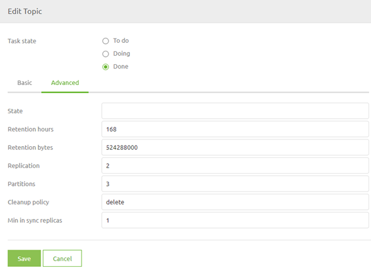
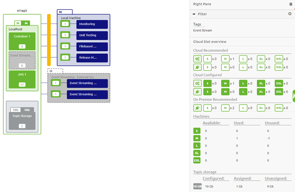
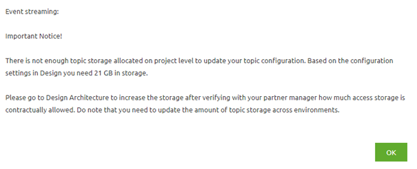

    

        <main class="micro-learning">
        <ul class="doc-nav">
            <li class="doc-nav__item"><a href="../../docs/microlearning/crashcourse-event-streaming-index" class="doc-nav__link">Home</a></li>
            <li class="doc-nav__item"><a href="#intro" class="doc-nav__link">Intro</a></li>
            <li class="doc-nav__item"><a href="#theory" class="doc-nav__link">Theory</a></li>
            <li class="doc-nav__item"><a href="#practice" class="doc-nav__link">Practice</a></li>
            <li class="doc-nav__item"><a href="#solution" class="doc-nav__link">Solution</a></li>
        </ul>

##### Intro

# Topic and Topic Properties

In this microlearning, we will focus on topics and the properties of these topics.

Should you have any questions, please contact academy@emagiz.com.

- Last update: January 22th 2021
- Required reading time: 7 minutes

## 1. Prerequisites
- Basic knowledge of the eMagiz platform
- Understanding of Event Streaming concept

## 2. Key concepts
This microlearning centers around topics and the properties of these topics. By topic we mean: A category/feed name to which event records are stored and published. With topic properties we mean: A piece of the whole configuration of a topic

Knowing what topics are and which properties of these topics you can and should think about before creating them is a crucial part of successfully implementing an event streaming pattern via the eMagiz platform.

With regards to the properties of a topic, two crucial properties can significantly impact the cost of your implementation. These properties are: 
- Retention Hours
- Retention Bytes

Below we will discuss what a topic is in more depth and we will zoom in on the topic properties, especially on the retention hours and the retention bytes.

After you have configured your topic(s) the way you had in mind you can check your work via the Design Architecture overview. 
In this overview, you can see whether there is enough room available in terms of GB's of Topic Storage.

##### Theory

## 3. Topic and Topic Properties

Within the eMagiz platform, you can use the Event Streaming pattern to help solve your business case. A crucial part of that solution is the topics and the accompanying properties.
In this section we will discuss the following:

- What are topics and how can I use them
- Topic properties and their configuration

### 3.1 What are topics and how can I use them

Based on the lines you drew in Capture eMagiz automatically generates a topic. In other words, for each line you drew in Capture eMagiz will create an accompanying topic.

As a reminder, a topic is a category/feed name to which event records are stored and published.

As said before, all Kafka records are organized into topics. Producer applications write data to topics and consumer applications read from topics. 
Records published to the cluster stay in the cluster until a configurable retention period has passed by.

Within eMagiz, you can use topics to temporarily store data to make sure that consumers can consume the data at a specific moment in time. 
Four characteristics related to topics are:

- Publish/subscribe mechanism
- Asynchronous, realtime 
- Dumb broker, smart consumer: Each subscriber can read at their own pace
- Retention

### 3.2 Topic properties and their configuration

Apart from the naming of the topic eMagiz also provides you with a set of default settings for your topic. Of these settings you should not touch the default settings for replication and partitioning, the default values for these work correctly. Two of these settings need a closer look from you. These settings are:

- Retention Hours
- Retention Bytes

These two settings mainly determine the amount of GB in storage is necessary on the eMagiz Event Streaming cluster to run all topics. 
As you can imagine the longer you retain data and the more data you retain the higher the costs will be.
You have the option to change these properties by right-clicking on the integration to show the context menu so you can select the topic properties option.

In the pop-up, you will see a Basic and Advanced tab. In the Advanced tab, you can configure these settings. 

See below for what these settings mean and how you can determine them.

#### 3.2.1 Retention Hours

Retention Hours is the number of hours data can reside on the topic before a FiFo principle of removing the first entry in the log kicks in. The moment data is still on the topic beyond this threshold it will automatically start deleting the data.
The default setting eMagiz provides you is 168 hours (7 days). For your use case, it might be that there is no need to retain the data for such an extensive period. Instead, you only want to retain the data for 72 hours (3 days) for example because all consumers can pick up data within that timeframe and all messages older than three days will be obsolete anyway.

#### 3.2.2 Retention Bytes

Retention Bytes is the number of bytes available per partition on that topic before a FiFo principle of removing the first entry in the log kicks in. The moment your topic holds more bytes as compared to the retention byte setting it will automatically start deleting the data.
The default setting eMagiz provides you is roughly 500 MB. This might be too low for you if you have millions of messages passing over your topic a day. If so you need to adjust this setting here. Calculating the correct value is explained in the following two sections.

#### 3.2.3 Calculating Storage Capacity of a Topic

A calculation example to derive how much storage capacity of your cluster is being reserved for this specific topic is shown below:

- 100000 messages per day
- 3 days retention
- 5 kB average size of a message placed on the topic

Results in 100000 * 3 * 5 = 1.5 GB in Storage capacity per topic.

#### 3.2.4 Calculating Retention Bytes based on Storage Capacity

Based on the previous calculation and the number of partitions (more partitions equals higher throughput) on your topic you can calculate the Retention Bytes setting

- 1.5 GB Storage capacity
- 1 partition

Results in 1.5 / 1 = 1.5 GB in Retention Bytes. As the name indicates this value needs to be added in bytes. For this example, we end up with 1524288000 bytes. Please note that this number will be replicated by the replication factor to get to the actual correct amount of storage that you could theoretically write to our Event Streaming Cluster.

### 3.3 Check available topic storage

When you are finished with configuring the properties per topic you can validate whether the expected data storage based on your configuration fits within the available amount of topic storage.
You can do this with the help of Design Architecture.

As you can see in the picture above the Design Architecture represents not only the runtimes needed to run your flows 
but also defines the amount of configured and the amount of recommended topic storage by eMagiz.

If we zoom in on the right-hand panel you can see on the bottom of that panel an entry that is relevant for Event Streaming. 
With this entry, you can easily see the amount of GB that is configured (based on the topic property settings) and see how much GB is still available based on your current contractual agreements.

If you are exceeding your contractually allowed storage eMagiz will prevent you from deploying any new topics.

##### Practice

## 4. Assignment

Set the retention hours to 8 hours and the number of retention bytes to 262144000
This assignment can be completed within the Design phase of your (Academy) project that you have created/used in the previous assignment.

## 5. Key takeaways

- A topic is a category/feed name to which event records are stored and published:
    - Retention on this topic is based on a FIFO principle (start at the beginning of the log)
    - The amount of GB needed for your solution is the biggest cost driver
    - Topics are automatically generated in eMagiz when you draw the line in Capture
- Think about your retention policy when implementing the Event Streaming solution to get a grip on the cost aspect of Event Streaming
- Check your configuration with the help of Design Architecture to make sure that the configured amount of GB is allowed under your current contract

##### Solution

## 6. Suggested Additional Readings

If you are interested in this topic and want more information on it please read the help text provided by eMagiz when executing these actions and browse through the following links:

- https://www.cloudkarafka.com/blog/2016-11-30-part1-kafka-for-beginners-what-is-apache-kafka.html

## 7. Silent demonstration video

This video demonstrates how you could have handled the assignment and gives you some context on what you have just learned.

<iframe width="1280" height="720" src="../../vid/microlearning/crashcourse-eventstreaming-topic-and-topic-properties.mp4" frameborder="0" allow="accelerometer; autoplay; clipboard-write; encrypted-media; gyroscope; picture-in-picture" allowfullscreen></iframe>

</main>

