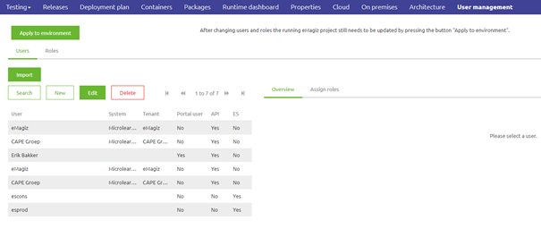
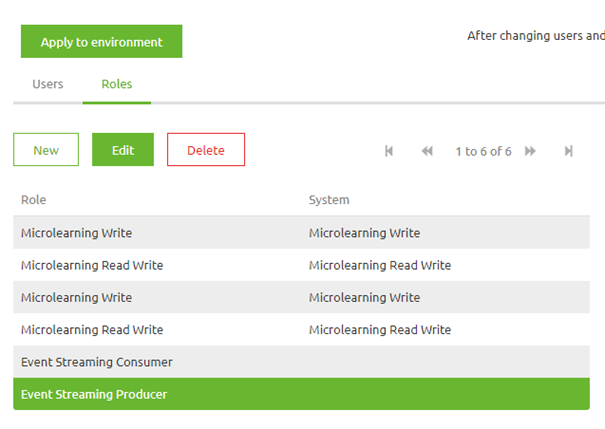
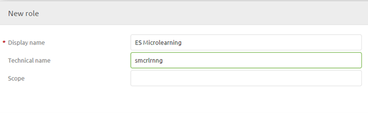
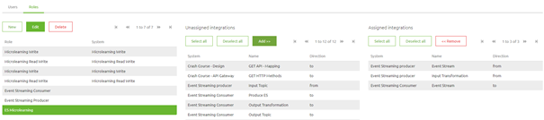
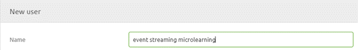

    

        <main class="micro-learning">
        <ul class="doc-nav">
            <li class="doc-nav__item"><a href="../../docs/microlearning/crashcourse-event-streaming-index" class="doc-nav__link">Home</a></li>
            <li class="doc-nav__item"><a href="#intro" class="doc-nav__link">Intro</a></li>
            <li class="doc-nav__item"><a href="#theory" class="doc-nav__link">Theory</a></li>
            <li class="doc-nav__item"><a href="#practice" class="doc-nav__link">Practice</a></li>
            <li class="doc-nav__item"><a href="#solution" class="doc-nav__link">Solution</a></li>
        </ul>

##### Intro

# User Management - Event Streaming

In this microlearning, we will focus on how the registration of users within the context of Event Streaming and how to give these users the correct rights on a topic-level basis.

Should you have any questions, please contact academy@emagiz.com.

- Last update: June 24th, 2021
- Required reading time: 6 minutes

## 1. Prerequisites
- Basic knowledge of the eMagiz platform
- Understanding of Event Streaming concept
- An active Event Streaming license

## 2. Key concepts
This microlearning centers around how you can register users via the eMagiz platform and hand out the correct rights for these users so they can access the topic(s) they need to access.
With users we mean: A system outside of eMagiz that is interested in producing or consuming data from a topic that is available via the eMagiz topic cluster.

Knowing how to register users and give them the correct rights makes it possible to control which parties have access to which data via a controlled and managed environment.

Registering users in eMagiz and handing out rights is very easy. Below we will detail the specifics of how you can configure the user and its accompanying rights.

##### Theory

## 3. Users and their rights

Based on what you have designed for your Event Streaming solution you can infer from how the lines have been drawn 
Based on what you have created in the Create phase you can now infer from that setup which users need to be created. 
Each system, to which you have drawn at least one Event Streaming integration, within eMagiz represents a user within the context of Event Streaming.

### 3.1 Configure Roles

When you navigate to the Deploy phase of eMagiz you have a tab called User Management (assuming you have the correct licensing agreement).

In this overview, you see the Users and the Roles. The role defines which rights that role has on certain topics. So let us open the Roles tab.

Here you can simply add Roles based on the system you have drawn in Design (note that we want to improve this to do this automatically). For now, to create a Role simply press the New button and give it a name. Note that the technical name will be auto-generated by eMagiz. When you are satisfied press Save.

The result is that a new role has been created. Now we need to assign the correct rights on role level. You can do this by assigning integrations to the role by selecting it and pressing the Add button.

Note that when the integration direction is from the role gets write rights on a topic. When the integration direction is to the role gets read rights on a topic.

- From = write
- To = read

By simply adding integrations one by one to a role you give rights to that role in a step-by-step manner. Each newly added integration increases the rights for the role you have selected. A result could be something like this:

### 3.2 Configure Users

Now we need to switch back to the user tab. Here we can create a new user (or edit an existing user). When creating a user simply fill in a descriptive name.

After you have created the user you can assign roles to the user. With this link, you give user-specific rights. Note that multiple users can have the same rights. You can add roles in the same manner as you can add integrations under Roles.

With this, we have configured the roles and users to confirm what we designed in the Design phase of eMagiz.

### 3.3 Apply to Environment

One last thing to do is to actualize the state of the eMagiz cloud in terms of users and roles. This action can be achieved via the Apply to environment button. In the case where this action won't work, you will get a warning from eMagiz telling you what went wrong.

##### Practice

## 4. Assignment

Define one role that has reading rights on one topic and writing rights on another. After that add two users and give them the same role.
This assignment can be completed with the help of the Topic you have created/used in the previous assignment on your (Academy) project.

## 5. Key takeaways

- First, define the role and the correct rights
- Second, create the user and give them one or more roles
- Don't give systems (role) rights they should not have

##### Solution

## 6. Suggested Additional Readings

If you are interested in this topic and want more information on it please read the help text provided by eMagiz when executing these actions.

## 7. Silent demonstration video

This video demonstrates how you could have handled the assignment and gives you some context on what you have just learned.

<iframe width="1280" height="720" src="../../vid/microlearning/crashcourse-eventstreaming-user-management.mp4" frameborder="0" allow="accelerometer; autoplay; clipboard-write; encrypted-media; gyroscope; picture-in-picture" allowfullscreen></iframe>

</main>

